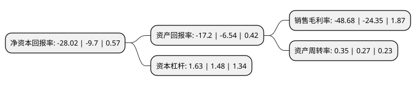

> 本页面由自动化程序生成于 2022年5月20日 01:02
> 内容可能存在错误，如有bug请提交issue至：https://github.com/Eroleice/doc-pi/issues
{.is-warning}

# 上市公司基本情况

## 基本资料

中福海峡(平潭)发展股份有限公司（以下简称“平潭发展”）成立于1993年09月08日，福州市。于1996年03月27日在深交所主板上市。

平潭发展注册资本193,178.089万元，主要业务:造林营林，林木产品加工与销售，以烟草化肥销售为主的农资贸易业务与平潭综合实验区开放开发的有关业务。以下是详细信息：

- 公司名称: 中福海峡(平潭)发展股份有限公司
- 股票代码: 000592.SZ
- 所在地: 福建 - 福州市
- 成立日期: 1993年09月08日
- 注册资本: 193,178.089万元
- 法定代表人: 刘平山
- 主营业务: 造林营林，林木产品加工与销售，以烟草化肥销售为主的农资贸易业务与平潭综合实验区开放开发的有关业务
- 公司官网: www.000592.com
- 公司介绍: 公司经营领域涵盖造林营林、林木产品加工与销售、种苗培育、园林景观、建筑材料制造与销售、房产租赁、典当与小额贷款、医疗保健等多个行业领域。林木产品加工与销售是公司的传统业务，主要产品为不同规格的中高密度纤维板。公司自2014年10月起新增设农资贸易业务，主要从事向全国各地烟草公司销售烟草化肥，现已实现全国各地区烟草招标、采货、供货、售后服务集为一体的烟草化肥销售业务。公司下属全资子公司漳州中福木业有限公司被评为“福建名牌产品”、“中国十大纤维板品牌”、“中国板材行业最具影响力(品牌)制造企业”，公司控股子公司福建省福人林业有限公司拥有FSC认证资格。

## 股东及高管情况

上市公司第一大股东为福建山田实业发展有限公司，持股333,266,723股，占比17.2518%，**疑似为**上市公司实际控制人。

截至2022年05月11日，上市公司的前十大股东中，共有5名自然人股东，1名机构股东，3个产品账户，1个海外主体，其中5%以上大股东共有1名。上市公司前十大股东明细如下：

> 未能通过持股比例判定出上市公司实际控制人（持股30%以上）
> 可能存在通过间接持股、联合持股、协议控制等方式拥有实际控制权的主体，具体请参考上市公司定期公告！
{.is-warning}

> 截至2022年05月11日，上市公司前十大股东信息如下：

| 股东名称 | 持股数量（股） | 持股比例 |
| --- | --- | --- |
| 福建山田实业发展有限公司 | 333,266,723 | 17.2518% |
| 香港中央结算有限公司(陆股通) | 14,144,143 | 0.73% |
| 王晖 | 6,406,000 | 0.33% |
| 陈潮怀 | 5,501,600 | 0.28% |
| 陈明 | 5,300,000 | 0.27% |
| 高仁波 | 5,000,000 | 0.26% |
| 郑敏佳 | 4,929,700 | 0.26% |
| 中欧基金-农业银行-中欧中证金融资产管理计划 | 4,685,200 | 0.24% |
| 广发基金-农业银行-广发中证金融资产管理计划 | 4,685,200 | 0.24% |
| 易方达基金-农业银行-易方达中证金融资产管理计划 | 4,685,200 | 0.24% |

## 利润表分析

上市公司2021年总收入为16.06亿元，净利润为-7.83亿元，**未实现盈利**。

## 杜邦分析

> 数据列示周期：2021年 | 2020年 | 2019年
{.is-info}

上市公司的净资产收益率在近一年有所上升，上升幅度为188.87%，其变化情况分解如下：
- 上市公司的销售毛利率在近一年上升了99.92%，可能是生产效率的提升、商品原材料价格下跌或商品价格的上涨所致。
- 上市公司的资产周转率在近一年上升了29.63%，可能是源自于更快的销售回款或库存管理效果提升。
- 上市公司的财务杠杆比率在近一年上升了10.14%，可能是增加负债扩大生产规模。

