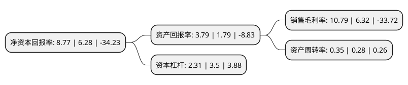

> 本页面由自动化程序生成于 2022年5月20日 01:02
> 内容可能存在错误，如有bug请提交issue至：https://github.com/Eroleice/doc-pi/issues
{.is-warning}

# 上市公司基本情况

## 基本资料

福建省永安林业(集团)股份有限公司（以下简称“永安林业”）成立于1994年01月06日，三明市。于1996年12月06日在深交所主板上市。

永安林业注册资本33,668.393万元，主要产品:木材及二次加工产品，甲醛，浸渍纸，胶粘剂，林化产品。以下是详细信息：

- 公司名称: 福建省永安林业(集团)股份有限公司
- 股票代码: 000663.SZ
- 所在地: 福建 - 三明市
- 成立日期: 1994年01月06日
- 注册资本: 33,668.393万元
- 法定代表人: 朱成庆
- 主营业务: 主要产品:木材及二次加工产品，甲醛，浸渍纸，胶粘剂，林化产品
- 公司官网: www.yonglin.com
- 公司介绍: 公司是全国首家以森林资源为主要经营对象的上市公司，自1994年成立后专注于林业行业，经过多年的经营，公司已发展成为林板一体化集团企业。公司主要业务为：林木经营、人造板生产及销售，公司完成重大资产重组，新增定制家具生产及销售业务。公司坚持以“森林资源为基础，因地制宜做好森林资源分类经营，做强人造板，努力拓展家具装饰装修等延伸领域，致力把公司打造成以木质材料为主的全产业链企业集团”的发展战略和“品牌化经营、规范化管理、市场化运作”的经营理念，努力克服行业环境不利影响，抓住资本市场有利时机，持续推进内部改革、优化产品结构、强化财务管理等措施保证公司生产经营稳定。

## 股东及高管情况

上市公司第一大股东为中林(永安)控股有限公司，持股64,884,600股，占比19.27%，**疑似为**上市公司实际控制人。

截至2022年03月31日，上市公司的前十大股东中，共有4名自然人股东，5名机构股东，1名其他股东，其中5%以上大股东共有2名。上市公司前十大股东明细如下：

> 未能通过持股比例判定出上市公司实际控制人（持股30%以上）
> 可能存在通过间接持股、联合持股、协议控制等方式拥有实际控制权的主体，具体请参考上市公司定期公告！
{.is-warning}

> 截至2022年03月31日，上市公司前十大股东信息如下：

| 股东名称 | 持股数量（股） | 持股比例 |
| --- | --- | --- |
| 中林(永安)控股有限公司 | 64,884,600 | 19.27% |
| 天风证券股份有限公司 | 41,372,005 | 12.29% |
| 永安市财政局 | 13,549,565 | 4.02% |
| 永安市远兴曹远城镇建设有限公司 | 12,611,300 | 3.75% |
| 苏加旭 | 7,256,973 | 2.16% |
| 黄江畔 | 5,555,465 | 1.65% |
| 李建强 | 4,270,278 | 1.27% |
| 福建南安雄创投资中心(有限合伙) | 4,001,529 | 1.19% |
| 黄江河 | 3,424,005 | 1.02% |
| 福建乐祥投资有限公司 | 3,332,281 | 0.99% |

## 利润表分析

上市公司2021年总收入为5.06亿元，净利润为0.54亿元，实现盈利。

## 杜邦分析

> 数据列示周期：2021年 | 2020年 | 2019年
{.is-info}

上市公司的净资产收益率在近一年有所上升，上升幅度为39.65%，其变化情况分解如下：
- 上市公司的销售毛利率在近一年上升了70.73%，可能是生产效率的提升、商品原材料价格下跌或商品价格的上涨所致。
- 上市公司的资产周转率在近一年上升了25%，可能是源自于更快的销售回款或库存管理效果提升。
- 上市公司的财务杠杆比率在近一年下降了-34%，可能是减少负债降低财务费用。

