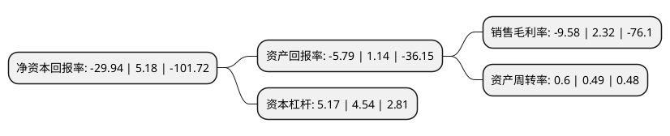

> 本页面由自动化程序生成于 2022年5月20日 01:08
> 内容可能存在错误，如有bug请提交issue至：https://github.com/Eroleice/doc-pi/issues
{.is-warning}

# 上市公司基本情况

## 基本资料

珠海市乐通化工股份有限公司（以下简称“乐通股份”）成立于1996年11月13日，珠海市。于2009年12月11日在深交所中小板上市。

乐通股份注册资本20,000万元，主营生产和销售自产的各类油墨，涂料及相关配套产品。以下是详细信息：

- 公司名称: 珠海市乐通化工股份有限公司
- 股票代码: 002319.SZ
- 所在地: 广东 - 珠海市
- 成立日期: 1996年11月13日
- 注册资本: 20,000万元
- 法定代表人: 周宇斌
- 主营业务: 主营生产和销售自产的各类油墨，涂料及相关配套产品
- 公司官网: www.letongink.com
- 公司介绍: 公司是国内包装印刷油墨行业的龙头企业，我国珠三角地区唯一同时拥有省名牌产品、省著名商标的油墨厂家，美国Pantone公司的特许印刷油墨生产商。公司具有十余年研究开发、生产经营包装印刷油墨的历史，产品以中高档凹印油墨为主，类别涵盖印刷油墨的全部领域，主要应用于饮料包装、食品包装和卷烟包装的印刷，少量产品用于电子制品、建筑装潢等行业。目前现有油墨产品5大类，近50个系列，细分品种约1000个，其中PVC收缩膜油墨和珍珠膜凹印油墨为采用国际标准产品，属国家级新产品。公司还是“可口可乐”、“百事可乐”、“达能”、“联合利华”、“康师傅”、“统一”等标签所用油墨的油墨供应商。

## 股东及高管情况

上市公司第一大股东为深圳市大晟资产管理有限公司，持股51,999,959股，占比26%，**疑似为**上市公司实际控制人。

截至2022年03月31日，上市公司的前十大股东中，共有9名自然人股东，1名机构股东，其中5%以上大股东共有1名。上市公司前十大股东明细如下：

> 未能通过持股比例判定出上市公司实际控制人（持股30%以上）
> 可能存在通过间接持股、联合持股、协议控制等方式拥有实际控制权的主体，具体请参考上市公司定期公告！
{.is-warning}

> 截至2022年03月31日，上市公司前十大股东信息如下：

| 股东名称 | 持股数量（股） | 持股比例 |
| --- | --- | --- |
| 深圳市大晟资产管理有限公司 | 51,999,959 | 26% |
| 吴才苗 | 5,612,200 | 2.81% |
| 徐海仙 | 4,609,714 | 2.3% |
| 吴建龙 | 4,118,800 | 2.06% |
| 李晓 | 3,957,900 | 1.98% |
| 吴建新 | 3,220,800 | 1.61% |
| 李高文 | 2,795,000 | 1.4% |
| 沈汉江 | 2,588,000 | 1.29% |
| 王少梅 | 2,587,400 | 1.29% |
| 韩秀琴 | 2,506,700 | 1.25% |

## 利润表分析

上市公司2021年总收入为3.87亿元，净利润为-0.38亿元，**未实现盈利**。

## 杜邦分析

> 数据列示周期：2021年 | 2020年 | 2019年
{.is-info}

上市公司的净资产收益率在近一年有所下降，下降幅度为-677.99%，其变化情况分解如下：
- 上市公司的销售毛利率在近一年下降了-512.93%，可能是生产效率的下降、商品原材料价格上涨或商品价格的下跌所致。
- 上市公司的资产周转率在近一年上升了22.45%，可能是源自于更快的销售回款或库存管理效果提升。
- 上市公司的财务杠杆比率在近一年上升了13.88%，可能是增加负债扩大生产规模。

