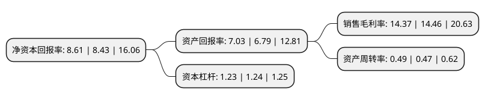

> 本页面由自动化程序生成于 2022年5月20日 01:09
> 内容可能存在错误，如有bug请提交issue至：https://github.com/Eroleice/doc-pi/issues
{.is-warning}

# 上市公司基本情况

## 基本资料

浙江闰土股份有限公司（以下简称“闰土股份”）成立于1998年05月14日，绍兴市。于2010年07月06日在深交所中小板上市。

闰土股份注册资本115,050万元，本公司主要从事纺织染料，印染助剂和化工原料的研发，生产和销售。公司的产包括纺织染料，印染助剂以及化工原料三大类，纺织染料是公司的主要产品，主要包括分散染料，活性染料，阳离子染料，还原染料，硫化染料，直接染料等六个具体产品类别，印染助剂包括保险粉，纺织染料助剂等产品，化工原料主要包括硫酸，亚硫酸钠等产品。以下是详细信息：

- 公司名称: 浙江闰土股份有限公司
- 股票代码: 002440.SZ
- 所在地: 浙江 - 绍兴市
- 成立日期: 1998年05月14日
- 注册资本: 115,050万元
- 法定代表人: 阮静波
- 主营业务: 本公司主要从事纺织染料，印染助剂和化工原料的研发，生产和销售公司的产包括纺织染料，印染助剂以及化工原料三大类，纺织染料是公司的主要产品，主要包括分散染料，活性染料，阳离子染料，还原染料，硫化染料，直接染料等六个具体产品类别，印染助剂包括保险粉，纺织染料助剂等产品，化工原料主要包括硫酸，亚硫酸钠等产品
- 公司官网: www.runtuchem.com
- 公司介绍: 公司是一家专业生产和经营分散、活性、直接、混纺、阳离子、还原等系列染料及化工中间体、纺织印染助剂、保险粉、硫酸、氯碱的大型股份制企业，系国家重点高新技术企业，中国染料工业协会副理事长单位，中国制造业企业500强，全国民营企业500强，浙江省百强企业，省AAA级纳税企业。公司先后通过了ISO9001:2008国际质量体系认证和ISO14001:2004环境管理体系认证，并且通过了浙江省省级清洁生产验收。产品注册“闰土”、“龙宇”和“DRAGONPERS”等商标，其中“闰土”商标、“瑞华素”商标被国家工商行政管理总局认定为“中国驰名商标”，“嘉成”等四个商标为浙江省著名商标，“闰土”牌分散染料、活性染料为浙江名牌产品，“闰土”商号及“瑞华”商号为浙江省知名商号，“闰土”品牌被评为浙江省出口名牌。

## 股东及高管情况

上市公司第一大股东为张爱娟，持股192,454,893股，占比16.73%，**疑似为**上市公司实际控制人。

截至2022年03月31日，上市公司的前十大股东中，共有8名自然人股东，2个产品账户，其中5%以上大股东共有3名。上市公司前十大股东明细如下：

> 未能通过持股比例判定出上市公司实际控制人（持股30%以上）
> 可能存在通过间接持股、联合持股、协议控制等方式拥有实际控制权的主体，具体请参考上市公司定期公告！
{.is-warning}

> 截至2022年03月31日，上市公司前十大股东信息如下：

| 股东名称 | 持股数量（股） | 持股比例 |
| --- | --- | --- |
| 张爱娟 | 192,454,893 | 16.73% |
| 阮静波 | 181,331,054 | 15.76% |
| 阮靖淅 | 64,151,863 | 5.58% |
| 阮加春 | 51,457,827 | 4.47% |
| 朱霄萍 | 18,612,643 | 1.62% |
| 徐万福 | 12,742,412 | 1.11% |
| 阮华林 | 12,130,000 | 1.05% |
| 乔正华 | 11,908,306 | 1.04% |
| 工银瑞信基金-农业银行-工银瑞信中证金融资产管理计划 | 11,860,200 | 1.03% |
| 嘉实基金-农业银行-嘉实中证金融资产管理计划 | 11,667,350 | 1.01% |

## 利润表分析

上市公司2021年总收入为55.72亿元，净利润为8亿元，实现盈利。

## 杜邦分析

> 数据列示周期：2021年 | 2020年 | 2019年
{.is-info}

上市公司的净资产收益率在近一年有所上升，上升幅度为2.14%，其变化情况分解如下：
- 上市公司的销售毛利率在近一年下降了-0.62%，可能是生产效率的下降、商品原材料价格上涨或商品价格的下跌所致。
- 上市公司的资产周转率在近一年上升了4.26%，可能是源自于更快的销售回款或库存管理效果提升。
- 上市公司的财务杠杆比率在近一年下降了-0.81%，可能是减少负债降低财务费用。

