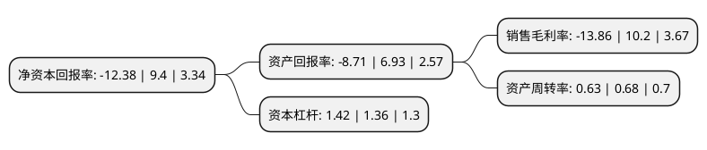

> 本页面由自动化程序生成于 2022年5月20日 01:15
> 内容可能存在错误，如有bug请提交issue至：https://github.com/Eroleice/doc-pi/issues
{.is-warning}

# 上市公司基本情况

## 基本资料

上海金力泰化工股份有限公司（以下简称“金力泰”）成立于1993年12月30日，上海市。于2011年05月31日在深交所创业板上市。

金力泰注册资本48,920.53万元，主营业务是电泳涂料(阴极电泳涂料和阳极电泳涂料)，面漆，陶瓷涂料等高性能涂料的研发，生产和销售。以下是详细信息：

- 公司名称: 上海金力泰化工股份有限公司
- 股票代码: 300225.SZ
- 所在地: 上海 - 上海市
- 成立日期: 1993年12月30日
- 注册资本: 48,920.53万元
- 法定代表人: 袁翔
- 主营业务: 主营业务是电泳涂料(阴极电泳涂料和阳极电泳涂料)，面漆，陶瓷涂料等高性能涂料的研发，生产和销售
- 公司官网: www.knt.cn
- 公司介绍: 公司是集科研、生产、销售和服务于一体的工业涂料自主品牌领军企业和上市公司(SZ.300225)，也是中国自主品牌中唯一一家能向汽车工业同时大规模提供阴极电泳及面漆涂料的全系列供应商，立足于发展符合环保节能要求的新型高性能涂料产品。公司专注提供涂料产品，种类丰富，包括底材前处理试剂、阴极电泳涂料、水性及溶剂型汽车面漆涂料、汽车低温涂料、汽车内外饰件涂料、水性及溶剂型工程机械涂料、水性及溶剂型防腐涂料、水性陶瓷涂料，旨在为客户提供专业的涂装解决方案。目前，公司拥有近千家客户，汽车涂料产销量居国内前列，阴极电泳涂料的市场占有率处于领先地位，陶瓷涂料的应用技术处于领导地位，其他工业涂料呈强劲发展趋势。

## 股东及高管情况

上市公司第一大股东为海南大禾企业管理有限公司，持股73,576,600股，占比15.04%，**疑似为**上市公司实际控制人。

截至2022年04月08日，上市公司的前十大股东中，共有5名自然人股东，3名机构股东，1个产品账户，1个海外主体，其中5%以上大股东共有1名。上市公司前十大股东明细如下：

> 未能通过持股比例判定出上市公司实际控制人（持股30%以上）
> 可能存在通过间接持股、联合持股、协议控制等方式拥有实际控制权的主体，具体请参考上市公司定期公告！
{.is-warning}

> 截至2022年04月08日，上市公司前十大股东信息如下：

| 股东名称 | 持股数量（股） | 持股比例 |
| --- | --- | --- |
| 海南大禾企业管理有限公司 | 73,576,600 | 15.04% |
| 绍兴柯桥领英实业有限公司 | 20,172,500 | 4.12% |
| 吴国政 | 16,861,926 | 3.45% |
| 高秀忠 | 8,347,300 | 1.71% |
| 石河子怡科股权投资合伙企业(有限合伙) | 7,577,034 | 1.55% |
| 胡晓珅 | 5,725,100 | 1.17% |
| 景总法 | 3,727,725 | 0.76% |
| 香港中央结算有限公司(陆股通) | 3,353,201 | 0.69% |
| 严家华 | 3,123,990 | 0.64% |
| 上海子午投资管理有限公司-子午潜道六号私募证券投资基金 | 2,899,900 | 0.59% |

## 利润表分析

上市公司2021年总收入为8.57亿元，净利润为-1.19亿元，**未实现盈利**。

## 杜邦分析

> 数据列示周期：2021年 | 2020年 | 2019年
{.is-info}

上市公司的净资产收益率在近一年有所下降，下降幅度为-231.7%，其变化情况分解如下：
- 上市公司的销售毛利率在近一年下降了-235.88%，可能是生产效率的下降、商品原材料价格上涨或商品价格的下跌所致。
- 上市公司的资产周转率在近一年下降了-7.35%，可能是源自于更慢的销售回款或库存管理效果下降。
- 上市公司的财务杠杆比率在近一年上升了4.41%，可能是增加负债扩大生产规模。

