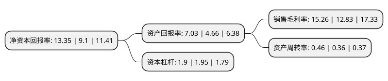

> 本页面由自动化程序生成于 2022年5月20日 01:17
> 内容可能存在错误，如有bug请提交issue至：https://github.com/Eroleice/doc-pi/issues
{.is-warning}

# 上市公司基本情况

## 基本资料

上海飞凯材料科技股份有限公司（以下简称“飞凯材料”）成立于2002年04月26日，上海市。于2014年10月09日在深交所创业板上市。

飞凯材料注册资本52,868.206万元，主营业务为高科技领域适用的紫外固化材料等新材料的研究，生产和销售，主要产品为紫外固化光纤光缆涂覆材料。以下是详细信息：

- 公司名称: 上海飞凯材料科技股份有限公司
- 股票代码: 300398.SZ
- 所在地: 上海 - 上海市
- 成立日期: 2002年04月26日
- 注册资本: 52,868.206万元
- 法定代表人: 苏斌
- 主营业务: 主营业务为高科技领域适用的紫外固化材料等新材料的研究，生产和销售，主要产品为紫外固化光纤光缆涂覆材料
- 公司官网: www.phichem.com.cn
- 公司介绍: 公司是一家研究、生产、销售高科技制造中使用的材料和特种化学品的专业公司。作为我国主要的光纤光缆涂覆材料供应商之一，公司率先打破国外巨头对紫外固化光纤光缆涂覆材料的技术垄断，抢占市场先机，逐步树立了公司在紫外固化光纤光缆涂覆材料行业的领先地位。公司的产品还广泛应用于IC制造、IC封装、LED制造，TFT-LCD、PCB、SMT等诸多电子制造领域。多年来，公司秉承客户、质量、研发、员工的经营理念，始终致力于高科技制造材料行业的创新与突破，为高科技制造提供优质配套材料。

## 股东及高管情况

上市公司第一大股东为飞凯控股有限公司，持股130,077,504股，占比24.6%，**疑似为**上市公司实际控制人。

截至2022年04月27日，上市公司的前十大股东中，共有1名自然人股东，3名机构股东，5个产品账户，1个海外主体，其中5%以上大股东共有2名。上市公司前十大股东明细如下：

> 未能通过持股比例判定出上市公司实际控制人（持股30%以上）
> 可能存在通过间接持股、联合持股、协议控制等方式拥有实际控制权的主体，具体请参考上市公司定期公告！
{.is-warning}

> 截至2022年04月27日，上市公司前十大股东信息如下：

| 股东名称 | 持股数量（股） | 持股比例 |
| --- | --- | --- |
| 飞凯控股有限公司 | 130,077,504 | 24.6% |
| 上海半导体装备材料产业投资管理有限公司-上海半导体装备材料产业投资基金合伙企业(有限合伙) | 35,846,210 | 6.78% |
| 上海国盛资本管理有限公司-上海国盛海通股权投资基金合伙企业(有限合伙) | 26,000,000 | 4.92% |
| 上海康奇投资有限公司 | 8,496,731 | 1.61% |
| 中国建设银行股份有限公司-广发科技创新混合型证券投资基金 | 8,471,441 | 1.6% |
| 中国农业银行股份有限公司-广发均衡优选混合型证券投资基金 | 8,395,465 | 1.59% |
| 香港中央结算有限公司(陆股通) | 7,474,432 | 1.41% |
| 北京联科斯凯物流软件有限公司 | 7,185,436 | 1.36% |
| 蔡鉴灿 | 6,437,400 | 1.22% |
| 中国工商银行股份有限公司-广发价值优势混合型证券投资基金 | 5,154,016 | 0.97% |

## 利润表分析

上市公司2021年总收入为26.27亿元，净利润为4亿元，实现盈利。

## 杜邦分析

> 数据列示周期：2021年 | 2020年 | 2019年
{.is-info}

上市公司的净资产收益率在近一年有所上升，上升幅度为46.7%，其变化情况分解如下：
- 上市公司的销售毛利率在近一年上升了18.94%，可能是生产效率的提升、商品原材料价格下跌或商品价格的上涨所致。
- 上市公司的资产周转率在近一年上升了27.78%，可能是源自于更快的销售回款或库存管理效果提升。
- 上市公司的财务杠杆比率在近一年下降了-2.56%，可能是减少负债降低财务费用。

