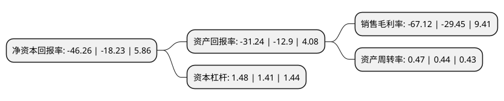

> 本页面由自动化程序生成于 2022年5月20日 01:18
> 内容可能存在错误，如有bug请提交issue至：https://github.com/Eroleice/doc-pi/issues
{.is-warning}

# 上市公司基本情况

## 基本资料

江苏广信感光新材料股份有限公司（以下简称“广信材料”）成立于2006年05月12日，无锡市。于2016年08月30日在深交所创业板上市。

广信材料注册资本19,302.758万元，主要从事专用油墨的研发，生产和销售。高性能专用油墨为公司主要产品。以下是详细信息：

- 公司名称: 江苏广信感光新材料股份有限公司
- 股票代码: 300537.SZ
- 所在地: 江苏 - 无锡市
- 成立日期: 2006年05月12日
- 注册资本: 19,302.758万元
- 法定代表人: 李有明
- 主营业务: 主要从事专用油墨的研发，生产和销售高性能专用油墨为公司主要产品
- 公司官网: www.kuangshun.com
- 公司介绍: 公司致力于开发生产高品位、高科技含量的感光新材料。公司经过多年不懈的努力，结合国外先进的技术及工艺，生产的PCB油墨已达世界同类产品技术水平，符合RoHS环保指令的要求，以优良的品质和优质的服务深得广大用户的信赖，其中包括苹果iPhone5手机的制造商富士康的认可。公司通过了ISO9001资质标准认证和ISO14000环境体系认证，是国家高新技术企业。公司取得了多方面的荣誉，其中包括：中国感光学会辐射固化专业委员会副理事长单位、第九届全国印制电路专委会副主任委员单位、全国印制电路标准化技术委员会副主任单位、中国印制电路行业第二届“民族”品牌企业、江阴市生态建设和环境保护先进单位等。

## 股东及高管情况

上市公司第一大股东为李有明，持股73,354,862股，占比38%，为上市公司实际控制人。

截至2022年03月31日，上市公司的前十大股东中，共有9名自然人股东，1名机构股东，其中5%以上大股东共有1名。上市公司前十大股东明细如下：

> 截至2022年03月31日，上市公司前十大股东信息如下：

| 股东名称 | 持股数量（股） | 持股比例 |
| --- | --- | --- |
| 李有明 | 73,354,862 | 38% |
| 无锡市金禾创业投资有限公司 | 3,683,523 | 1.91% |
| 翁凌 | 1,385,000 | 0.72% |
| 林强 | 1,012,900 | 0.52% |
| 王茂松 | 917,846 | 0.48% |
| 安雁霞 | 701,700 | 0.36% |
| 吕雨涛 | 610,000 | 0.32% |
| 许仁贤 | 601,872 | 0.31% |
| 朱民 | 573,750 | 0.3% |
| 杨海舰 | 487,200 | 0.25% |

## 利润表分析

上市公司2021年总收入为6.18亿元，净利润为-4.16亿元，**未实现盈利**。

## 杜邦分析

> 数据列示周期：2021年 | 2020年 | 2019年
{.is-info}

上市公司的净资产收益率在近一年有所上升，上升幅度为153.76%，其变化情况分解如下：
- 上市公司的销售毛利率在近一年上升了127.91%，可能是生产效率的提升、商品原材料价格下跌或商品价格的上涨所致。
- 上市公司的资产周转率在近一年上升了6.82%，可能是源自于更快的销售回款或库存管理效果提升。
- 上市公司的财务杠杆比率在近一年上升了4.96%，可能是增加负债扩大生产规模。

