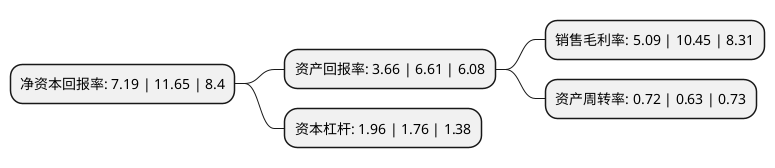

> 本页面由自动化程序生成于 2022年5月20日 01:18
> 内容可能存在错误，如有bug请提交issue至：https://github.com/Eroleice/doc-pi/issues
{.is-warning}

# 上市公司基本情况

## 基本资料

深圳市容大感光科技股份有限公司（以下简称“容大感光”）成立于1996年06月25日，深圳市。于2016年12月20日在深交所创业板上市。

容大感光注册资本19,404.978万元，主要产品“容大”牌PCB感光油墨和光刻胶均系公司自主研发的产品。主营业务为PCB感光油墨，光刻胶及配套化学品，特种油墨等电子化学材料的研发，生产和销售。以下是详细信息：

- 公司名称: 深圳市容大感光科技股份有限公司
- 股票代码: 300576.SZ
- 所在地: 广东 - 深圳市
- 成立日期: 1996年06月25日
- 注册资本: 19,404.978万元
- 法定代表人: 黄勇
- 主营业务: 主要产品“容大”牌PCB感光油墨和光刻胶均系公司自主研发的产品主营业务为PCB感光油墨，光刻胶及配套化学品，特种油墨等电子化学材料的研发，生产和销售
- 公司官网: www.szrd.com
- 公司介绍: 公司为国家级高新技术企业，掌握了PCB油墨、光刻胶等电子化学产品生产过程中的树脂合成、光敏剂合成、配方设计及制造等关键核心技术，拥有多项发明专利。公司主要产品“容大”牌PCB感光油墨和光刻胶均系公司自主研发的产品，可应用于PCB、显示屏、触摸屏、精密金属加工等领域，在市场上拥有较高的品牌知名度。公司近年来先后荣获中国电子电路百强企业、中国印制电路行业百强企业、广东省著名商标等一系列荣誉。公司凭借先进的技术、完整的产品系列及稳定的产品性能，与多家PCB大中型客户建立了长期、稳定的合作关系，公司主要客户包括无锡健鼎、奥士康、悦虎电路、川亿公司、金像电子等国内较为知名的PCB制造企业。

## 股东及高管情况

上市公司第一大股东为林海望，持股25,457,286股，占比13.12%，**疑似为**上市公司实际控制人。

截至2022年05月10日，上市公司的前十大股东中，共有10名自然人股东，其中5%以上大股东共有8名。上市公司前十大股东明细如下：

> 未能通过持股比例判定出上市公司实际控制人（持股30%以上）
> 可能存在通过间接持股、联合持股、协议控制等方式拥有实际控制权的主体，具体请参考上市公司定期公告！
{.is-warning}

> 截至2022年05月10日，上市公司前十大股东信息如下：

| 股东名称 | 持股数量（股） | 持股比例 |
| --- | --- | --- |
| 林海望 | 25,457,286 | 13.12% |
| 林海望 | 25,457,286 | 13.12% |
| 杨遇春 | 23,869,504 | 12.3% |
| 杨遇春 | 23,869,504 | 12.3% |
| 黄勇 | 23,299,502 | 12.01% |
| 黄勇 | 23,299,502 | 12.01% |
| 刘启升 | 20,237,844 | 10.43% |
| 刘群英 | 13,365,118 | 6.8875% |
| 袁毅 | 1,522,631 | 0.78% |
| 蔡彦 | 599,700 | 0.31% |

## 利润表分析

上市公司2021年总收入为7.85亿元，净利润为0.4亿元，实现盈利。

## 杜邦分析

> 数据列示周期：2021年 | 2020年 | 2019年
{.is-info}

上市公司的净资产收益率在近一年有所下降，下降幅度为-38.28%，其变化情况分解如下：
- 上市公司的销售毛利率在近一年下降了-51.29%，可能是生产效率的下降、商品原材料价格上涨或商品价格的下跌所致。
- 上市公司的资产周转率在近一年上升了14.29%，可能是源自于更快的销售回款或库存管理效果提升。
- 上市公司的财务杠杆比率在近一年上升了11.36%，可能是增加负债扩大生产规模。

