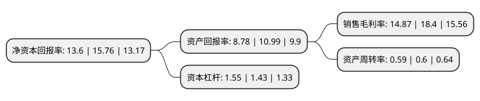

> 本页面由自动化程序生成于 2022年5月20日 01:20
> 内容可能存在错误，如有bug请提交issue至：https://github.com/Eroleice/doc-pi/issues
{.is-warning}

# 上市公司基本情况

## 基本资料

鞍山七彩化学股份有限公司（以下简称“七彩化学”）成立于2006年06月12日，鞍山市。于2019年02月22日在深交所创业板上市。

七彩化学注册资本41,023.737万元，公司主营业务为高性能有机颜料，溶剂染料的研发，生产与销售。主要产品包括苯并咪唑酮系列，大分子系列，异吲哚啉系列，偶氮颜料，溶剂染料，以及相关染，颜料中间体。以下是详细信息：

- 公司名称: 鞍山七彩化学股份有限公司
- 股票代码: 300758.SZ
- 所在地: 辽宁 - 鞍山市
- 成立日期: 2006年06月12日
- 注册资本: 41,023.737万元
- 法定代表人: 徐惠祥
- 主营业务: 公司主营业务为高性能有机颜料，溶剂染料的研发，生产与销售主要产品包括苯并咪唑酮系列，大分子系列，异吲哚啉系列，偶氮颜料，溶剂染料，以及相关染，颜料中间体
- 公司官网: www.hifichem.com
- 公司介绍: 公司专注于煤焦油精细化学品开发和生产、以高性能有机颜料开发为核心，现为国内最大的1，8－萘酐和苯并咪唑酮系列高性能有机颜料及大分子系列高性能有机颜料研发生产及深加工基地，产品远销欧洲、美国、日本、东南亚国家及地区，与多家世界500强企业有着紧密的经贸合作。公司具有雄厚研发能力，和国内多所知名院校建立了良好的合作关系，拥有省级企业技术中心和国家级博士后科研工作站，在站博士4人、科技人员100余人，多项产品成为国家级重点新产品和多项技术填补国内空白，整体技术水平处于国内领先国外先进。已形成了拥有独立研究开发体系、具有强大的技术支持可持续发展的良好局面。引领行业科技进步，创中国高档着色剂名牌。

## 股东及高管情况

上市公司第一大股东为鞍山惠丰投资集团有限公司，持股87,800,580股，占比21.4%，**疑似为**上市公司实际控制人。

截至2022年04月22日，上市公司的前十大股东中，共有8名自然人股东，2名机构股东，其中5%以上大股东共有5名。上市公司前十大股东明细如下：

> 未能通过持股比例判定出上市公司实际控制人（持股30%以上）
> 可能存在通过间接持股、联合持股、协议控制等方式拥有实际控制权的主体，具体请参考上市公司定期公告！
{.is-warning}

> 截至2022年04月22日，上市公司前十大股东信息如下：

| 股东名称 | 持股数量（股） | 持股比例 |
| --- | --- | --- |
| 鞍山惠丰投资集团有限公司 | 87,800,580 | 21.4% |
| 徐惠祥 | 63,342,246 | 15.44% |
| 徐惠祥 | 63,342,246 | 15.44% |
| 臧婕 | 29,825,208 | 7.27% |
| 黄伟汕 | 23,929,200 | 5.83% |
| 王烁凯 | 15,300,000 | 3.73% |
| 淮安银海企业管理中心(有限合伙) | 9,180,000 | 2.24% |
| 蔡一一 | 7,985,204 | 1.95% |
| 蔡广志 | 6,521,744 | 1.59% |
| 宋奇亿 | 3,464,134 | 0.84% |

## 利润表分析

上市公司2021年总收入为13.46亿元，净利润为2亿元，实现盈利。

## 杜邦分析

> 数据列示周期：2021年 | 2020年 | 2019年
{.is-info}

上市公司的净资产收益率在近一年有所下降，下降幅度为-13.71%，其变化情况分解如下：
- 上市公司的销售毛利率在近一年下降了-19.18%，可能是生产效率的下降、商品原材料价格上涨或商品价格的下跌所致。
- 上市公司的资产周转率在近一年下降了-1.67%，可能是源自于更慢的销售回款或库存管理效果下降。
- 上市公司的财务杠杆比率在近一年上升了8.39%，可能是增加负债扩大生产规模。

