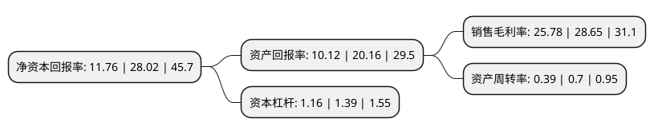

> 本页面由自动化程序生成于 2022年5月20日 01:23
> 内容可能存在错误，如有bug请提交issue至：https://github.com/Eroleice/doc-pi/issues
{.is-warning}

# 上市公司基本情况

## 基本资料

九江善水科技股份有限公司（以下简称“善水科技”）成立于2012年05月07日，九江市。于2021年12月24日在深交所创业板上市。

善水科技注册资本21,463.65万元，公司主营业务为染料中间体，农药和医药中间体的研发，生产和销售。染料中间体主要产品包括6-硝体，氧体，5-硝体;农药和医药中间体主要包括2-氯吡啶等氯代吡啶系列。以下是详细信息：

- 公司名称: 九江善水科技股份有限公司
- 股票代码: 301190.SZ
- 所在地: 江西 - 九江市
- 成立日期: 2012年05月07日
- 注册资本: 21,463.65万元
- 法定代表人: 黄国荣
- 主营业务: 公司主营业务为染料中间体，农药和医药中间体的研发，生产和销售染料中间体主要产品包括6-硝体，氧体，5-硝体;农药和医药中间体主要包括2-氯吡啶等氯代吡啶系列
- 公司官网: www.jjsskj.com
- 公司介绍: 公司主营业务为染料中间体、农药和医药中间体的研发、生产和销售。染料中间体主要产品包括6-硝体、氧体、5-硝体；农药和医药中间体主要包括2-氯吡啶等氯代吡啶系列。公司目前形成以“生产为核心，工艺技术创新为引领，精细化管理为驱动”的发展格局，业务内容涵盖产品研发、工艺优化开发、规模化生产等完整的精细化工业务体系，是国内具有一流竞争力的精细化学品专业生产企业之一。公司以生产为核心。公司竞争优势主要体现在生产过程中，包括产品品质、生产效率、成本管控、环保安全。公司通过技术工艺创新，持续技改、优化设备，提高公司产品质量、降低产品成本，提升产品竞争力。同时以精细化管理为驱动，不断优化生产管控，确保企业的高效运行和本质安全。技术工艺创新是公司持续发展的突破口。公司作为高新技术企业，一贯重视产品研发和技术创新，在主要产品方面积累了自主、完善的核心技术。公司及其子公司拥有国内授权专利30项，其中发明专利8项，实用新型专利22项。

## 股东及高管情况

上市公司第一大股东为黄国荣，持股40,000,000股，占比18.64%，**疑似为**上市公司实际控制人。

截至2022年03月31日，上市公司的前十大股东中，共有7名自然人股东，3名机构股东，其中5%以上大股东共有5名。上市公司前十大股东明细如下：

> 未能通过持股比例判定出上市公司实际控制人（持股30%以上）
> 可能存在通过间接持股、联合持股、协议控制等方式拥有实际控制权的主体，具体请参考上市公司定期公告！
{.is-warning}

> 截至2022年03月31日，上市公司前十大股东信息如下：

| 股东名称 | 持股数量（股） | 持股比例 |
| --- | --- | --- |
| 黄国荣 | 40,000,000 | 18.64% |
| 吴新艳 | 25,000,000 | 11.65% |
| 共青城正祥投资管理合伙企业(有限合伙) | 21,580,000 | 10.05% |
| 赣州泽祥睿宝投资管理合伙企业(有限合伙) | 17,844,000 | 8.31% |
| 刘杰 | 17,100,000 | 7.97% |
| 共青城家安睿投资管理合伙企业(有限合伙) | 9,738,100 | 4.54% |
| 沈伟峰 | 5,630,000 | 2.62% |
| 周军 | 5,000,000 | 2.33% |
| 阮环宇 | 4,710,000 | 2.19% |
| 吴秀荣 | 4,000,000 | 1.86% |

## 利润表分析

上市公司2021年总收入为5.52亿元，净利润为1.42亿元，实现盈利。

## 杜邦分析

> 数据列示周期：2021年 | 2020年 | 2019年
{.is-info}

上市公司的净资产收益率在近一年有所下降，下降幅度为-58.03%，其变化情况分解如下：
- 上市公司的销售毛利率在近一年下降了-10.02%，可能是生产效率的下降、商品原材料价格上涨或商品价格的下跌所致。
- 上市公司的资产周转率在近一年下降了-44.29%，可能是源自于更慢的销售回款或库存管理效果下降。
- 上市公司的财务杠杆比率在近一年下降了-16.55%，可能是减少负债降低财务费用。

