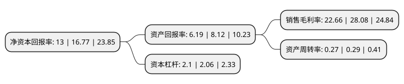

> 本页面由自动化程序生成于 2022年5月20日 01:26
> 内容可能存在错误，如有bug请提交issue至：https://github.com/Eroleice/doc-pi/issues
{.is-warning}

# 上市公司基本情况

## 基本资料

浙江龙盛集团股份有限公司（以下简称“浙江龙盛”）成立于1998年03月23日，绍兴市。于2003年08月01日在上交所主板上市。

浙江龙盛注册资本325,333.186万元，主要业务:分散染料，活性染料，酸性染料，化工中间体及染料助剂的开发，制造，销售。以下是详细信息：

- 公司名称: 浙江龙盛集团股份有限公司
- 股票代码: 600352.SH
- 所在地: 浙江 - 绍兴市
- 成立日期: 1998年03月23日
- 注册资本: 325,333.186万元
- 法定代表人: 阮伟祥
- 主营业务: 分散染料，活性染料，酸性染料，化工中间体及染料助剂的开发，制造，销售
- 公司官网: www.longsheng.com
- 公司介绍: 公司综合性跨国企业集团，主要从事化工、钢铁汽配、房地产、金融投资。目前制造业业务以染料、助剂、中间体等特殊化学品为主，以纯碱、硫酸等基础化学品为辅。公司通过启动债转股控股德司达全球公司，开始掌控染料行业的话语权。在全球的主要染料市场，浙江龙盛拥有多个销售实体，占全球市场份额高，在所有的关键市场都有着销售和技术的支持，在多个国家设有代理机构和工厂。公司以更加专业化的产品和定制服务为尽可能多的消费者和客户带来更加欣喜的体验。公司通过科技创新，以可持续发展为原则，努力缔造全球专用化学品领域的领导者形象。

## 股东及高管情况

上市公司第一大股东为阮水龙，持股389,653,992股，占比11.98%，**疑似为**上市公司实际控制人。

截至2022年04月26日，上市公司的前十大股东中，共有5名自然人股东，4个产品账户，1个海外主体，其中5%以上大股东共有2名。上市公司前十大股东明细如下：

> 未能通过持股比例判定出上市公司实际控制人（持股30%以上）
> 可能存在通过间接持股、联合持股、协议控制等方式拥有实际控制权的主体，具体请参考上市公司定期公告！
{.is-warning}

> 截至2022年04月26日，上市公司前十大股东信息如下：

| 股东名称 | 持股数量（股） | 持股比例 |
| --- | --- | --- |
| 阮水龙 | 389,653,992 | 11.98% |
| 阮伟祥 | 346,321,538 | 10.65% |
| 香港中央结算有限公司(陆股通) | 76,901,188 | 2.36% |
| 浙江龙盛集团股份有限公司-2020年员工持股计划 | 70,000,070 | 2.15% |
| 潘小成 | 42,905,207 | 1.32% |
| 浙江龙盛集团股份有限公司-2021年员工持股计划 | 35,832,685 | 1.1% |
| 阮兴祥 | 34,238,202 | 1.05% |
| 基本养老保险基金一零零三组合 | 31,605,216 | 0.97% |
| 师和平 | 31,592,204 | 0.97% |
| 中泰星元价值优选灵活配置混合型证券投资基金 | 25,900,562 | 0.8% |

## 利润表分析

上市公司2021年总收入为166.59亿元，净利润为37.75亿元，实现盈利。

## 杜邦分析

> 数据列示周期：2021年 | 2020年 | 2019年
{.is-info}

上市公司的净资产收益率在近一年有所下降，下降幅度为-22.48%，其变化情况分解如下：
- 上市公司的销售毛利率在近一年下降了-19.3%，可能是生产效率的下降、商品原材料价格上涨或商品价格的下跌所致。
- 上市公司的资产周转率在近一年下降了-6.9%，可能是源自于更慢的销售回款或库存管理效果下降。
- 上市公司的财务杠杆比率在近一年上升了1.94%，可能是增加负债扩大生产规模。

