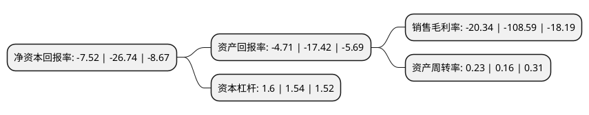

> 本页面由自动化程序生成于 2022年5月20日 01:33
> 内容可能存在错误，如有bug请提交issue至：https://github.com/Eroleice/doc-pi/issues
{.is-warning}

# 上市公司基本情况

## 基本资料

江苏亚邦染料股份有限公司（以下简称“亚邦股份”）成立于2006年02月24日，常州市。于2014年09月09日在上交所主板上市。

亚邦股份注册资本57,017万元，主要产品:蒽醌结构分散染料和还原染料，报告期内超过95%的销售收入来源于蒽醌结构分散染料，还原染料及相关中间体。主营业务:纺织染料和染料中间体的研发，生产，销售和服务。以下是详细信息：

- 公司名称: 江苏亚邦染料股份有限公司
- 股票代码: 603188.SH
- 所在地: 江苏 - 常州市
- 成立日期: 2006年02月24日
- 注册资本: 57,017万元
- 法定代表人: 许芸霞
- 主营业务: 主要产品:蒽醌结构分散染料和还原染料，报告期内超过95%的销售收入来源于蒽醌结构分散染料，还原染料及相关中间体主营业务:纺织染料和染料中间体的研发，生产，销售和服务
- 公司官网: www.yabangdyes.com
- 公司介绍: 公司是全球较大的蒽醌系列染料及中间体的生产基地。公司主要从事纺织染料及染料中间体的研发、生产、销售和服务，其中1-氨基蒽醌、分散红92、分散兰60、还原蓝4、还原黑25、还原橄榄T等产品产销量居世界前列。销售分公司和办事处遍布全国，产品远销至全球各地，是多家全球同业著名跨国公司的战略合作伙伴。公司注重品牌、质量与环保，已通过ISO9001：2008质量管理、ISO14001:2004环境管理、OHSAS18001:2007职业健康安全管理等多个体系的认证。公司主要产品目前都已通过英国天祥公司的安全环保及生态检测认证，主导产品都通过了欧盟的REACH法规的预注册工作。亚邦牌分散染料是江苏省名牌产品，亚邦商标是国内染料行业唯一的中国驰名商标。公司先后被认定为国家高新技术企业，被中国石油化工协会评为“中国化工科技创新示范企业”，被评为“江苏省优秀民营科技企业”，亚邦染料在国内外同行业享有较高的知名度和美誉度。

## 股东及高管情况

上市公司第一大股东为亚邦投资控股集团有限公司，持股166,112,000股，占比29.13%，**疑似为**上市公司实际控制人。

截至2022年03月31日，上市公司的前十大股东中，共有5名自然人股东，3名机构股东，2个产品账户，其中5%以上大股东共有1名。上市公司前十大股东明细如下：

> 未能通过持股比例判定出上市公司实际控制人（持股30%以上）
> 可能存在通过间接持股、联合持股、协议控制等方式拥有实际控制权的主体，具体请参考上市公司定期公告！
{.is-warning}

> 截至2022年03月31日，上市公司前十大股东信息如下：

| 股东名称 | 持股数量（股） | 持股比例 |
| --- | --- | --- |
| 亚邦投资控股集团有限公司 | 166,112,000 | 29.13% |
| 许旭东 | 21,900,000 | 3.84% |
| 杭柯达 | 17,344,225 | 3.04% |
| 河南羚锐制药股份有限公司 | 16,000,000 | 2.81% |
| 杨建泽 | 5,030,000 | 0.88% |
| 刘培兴 | 4,985,000 | 0.87% |
| 广东德汇投资管理有限公司 | 4,167,424 | 0.73% |
| 广东德汇投资管理有限公司-德汇尊享九号私募证券投资基金 | 4,090,200 | 0.72% |
| 卢建平 | 3,047,250 | 0.53% |
| 广东德汇投资管理有限公司-德汇尊享六号私募证券投资基金 | 2,590,200 | 0.45% |

## 利润表分析

上市公司2021年总收入为8.4亿元，净利润为-1.71亿元，**未实现盈利**。

## 杜邦分析

> 数据列示周期：2021年 | 2020年 | 2019年
{.is-info}

上市公司的净资产收益率在近一年有所下降，下降幅度为-71.88%，其变化情况分解如下：
- 上市公司的销售毛利率在近一年下降了-81.27%，可能是生产效率的下降、商品原材料价格上涨或商品价格的下跌所致。
- 上市公司的资产周转率在近一年上升了43.75%，可能是源自于更快的销售回款或库存管理效果提升。
- 上市公司的财务杠杆比率在近一年上升了3.9%，可能是增加负债扩大生产规模。

