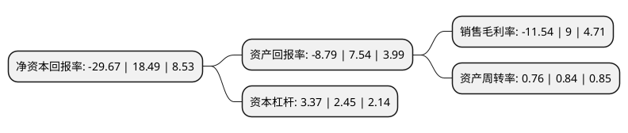

> 本页面由自动化程序生成于 2022年5月20日 01:34
> 内容可能存在错误，如有bug请提交issue至：https://github.com/Eroleice/doc-pi/issues
{.is-warning}

# 上市公司基本情况

## 基本资料

亚士创能科技(上海)股份有限公司（以下简称“亚士创能”）成立于2009年02月13日，上海市。于2017年09月28日在上交所主板上市。

亚士创能注册资本29,880.661万元，主营业务:建筑保温装饰一体化产品，建筑保温材料，功能型建筑涂料及其应用系统的研发，生产，销售及服务。主要产品:保温装饰板，真金防火保温板，功能型建筑涂料三大类。以下是详细信息：

- 公司名称: 亚士创能科技(上海)股份有限公司
- 股票代码: 603378.SH
- 所在地: 上海 - 上海市
- 成立日期: 2009年02月13日
- 注册资本: 29,880.661万元
- 法定代表人: 李金钟
- 主营业务: 主营业务:建筑保温装饰一体化产品，建筑保温材料，功能型建筑涂料及其应用系统的研发，生产，销售及服务主要产品:保温装饰板，真金防火保温板，功能型建筑涂料三大类
- 公司官网: www.cuanon.com
- 公司介绍: 公司是一家集功能型建筑涂料、保温装饰板、防火保温新材料研发、制造和服务于一体的高新技术企业，是中国建筑节能保温与装饰材料行业的领导型企业。公司在上海、安徽、天津、西安、新疆等地建有生产基地，营销网络覆盖全国。公司坚守“以客户为中心，不断满足客户需求，持续为客户创造价值”的理念，凭借丰富的产品、专业的服务和自主创新能力，成为万科、恒大等全国多家百强地产企业的战略集采供应商。公司是上海市首批“院士专家企业工作站”单位，先后荣获“上海制造业企业100强”、“上海市科学技术奖”、“上海市企业认定技术中心”、“上海市文明单位”、“全国讲理想、比贡献先进集体”等荣誉称号。

## 股东及高管情况

上市公司第一大股东为上海创能明投资有限公司，持股78,300,000股，占比26.2%，**疑似为**上市公司实际控制人。

截至2022年03月31日，上市公司的前十大股东中，共有3名自然人股东，4名机构股东，2个产品账户，1个海外主体，其中5%以上大股东共有6名。上市公司前十大股东明细如下：

> 未能通过持股比例判定出上市公司实际控制人（持股30%以上）
> 可能存在通过间接持股、联合持股、协议控制等方式拥有实际控制权的主体，具体请参考上市公司定期公告！
{.is-warning}

> 截至2022年03月31日，上市公司前十大股东信息如下：

| 股东名称 | 持股数量（股） | 持股比例 |
| --- | --- | --- |
| 上海创能明投资有限公司 | 78,300,000 | 26.2% |
| 上海润合同生投资有限公司 | 28,710,000 | 9.61% |
| 上海润合同泽投资有限公司 | 26,100,000 | 8.73% |
| 上海润合同彩资产管理有限公司 | 21,663,000 | 7.25% |
| 李金钟 | 18,660,962 | 6.25% |
| 赵孝芳 | 15,529,500 | 5.2% |
| 沈刚 | 9,136,500 | 3.06% |
| 富达基金(香港)有限公司-客户资金 | 7,042,897 | 2.36% |
| 香港中央结算有限公司(陆股通) | 3,784,095 | 1.27% |
| 中信证券股份有限公司-社保基金17051组合 | 3,255,885 | 1.09% |

## 利润表分析

上市公司2021年总收入为47.15亿元，净利润为-5.44亿元，**未实现盈利**。

## 杜邦分析

> 数据列示周期：2021年 | 2020年 | 2019年
{.is-info}

上市公司的净资产收益率在近一年有所下降，下降幅度为-260.47%，其变化情况分解如下：
- 上市公司的销售毛利率在近一年下降了-228.22%，可能是生产效率的下降、商品原材料价格上涨或商品价格的下跌所致。
- 上市公司的资产周转率在近一年下降了-9.52%，可能是源自于更慢的销售回款或库存管理效果下降。
- 上市公司的财务杠杆比率在近一年上升了37.55%，可能是增加负债扩大生产规模。

