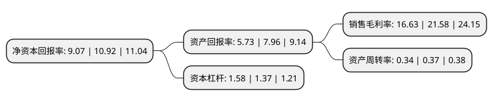

> 本页面由自动化程序生成于 2022年5月20日 01:35
> 内容可能存在错误，如有bug请提交issue至：https://github.com/Eroleice/doc-pi/issues
{.is-warning}

# 上市公司基本情况

## 基本资料

福建坤彩材料科技股份有限公司（以下简称“坤彩科技”）成立于2005年11月25日，福州市。于2017年04月14日在上交所主板上市。

坤彩科技注册资本46,800万元，主要产品:按基材分，可划分为以天然云母为基材的珠光材料，以合成云母为基材的珠光材料和以玻璃为基材的珠光材料等产品;按用途分，可划分为工业级珠光材料系列，汽车级珠光材料系列，化妆品级珠光材料系列等产品。主营业务:珠光材料的研发，生产和销售。以下是详细信息：

- 公司名称: 福建坤彩材料科技股份有限公司
- 股票代码: 603826.SH
- 所在地: 福建 - 福州市
- 成立日期: 2005年11月25日
- 注册资本: 46,800万元
- 法定代表人: 谢秉昆
- 主营业务: 主要产品:按基材分，可划分为以天然云母为基材的珠光材料，以合成云母为基材的珠光材料和以玻璃为基材的珠光材料等产品;按用途分，可划分为工业级珠光材料系列，汽车级珠光材料系列，化妆品级珠光材料系列等产品主营业务:珠光材料的研发，生产和销售
- 公司官网: www.fjkuncai.com
- 公司介绍: 公司自成立以来，一直专注于珠光材料的生产、研发和销售，公司提供的工业级珠光材料、汽车级珠光材料、化妆品级珠光材料等系列产品，被广泛应用于涂料、塑料、汽车、化妆品、油墨、皮革、陶瓷、建材、种子包衣等行业。公司研发中心被认定为省级工程技术研究中心、省级企业技术中心。公司被国家科技部认定为国家火炬重点高新技术企业。公司研发生产的“合成晶体基材珠光材料”被国家科技部等认定为“国家重点新产品”。

## 股东及高管情况

上市公司第一大股东为谢超，持股41,019,137股，占比8.76%，**疑似为**上市公司实际控制人。

截至2022年03月31日，上市公司的前十大股东中，共有5名自然人股东，2名机构股东，1个产品账户，2个海外主体，其中5%以上大股东共有1名。上市公司前十大股东明细如下：

> 未能通过持股比例判定出上市公司实际控制人（持股30%以上）
> 可能存在通过间接持股、联合持股、协议控制等方式拥有实际控制权的主体，具体请参考上市公司定期公告！
{.is-warning}

> 上市公司第一大股东持股不超过10%，请检查是否存在公司控制权风险！
{.is-danger}

> 截至2022年03月31日，上市公司前十大股东信息如下：

| 股东名称 | 持股数量（股） | 持股比例 |
| --- | --- | --- |
| 谢超 | 41,019,137 | 8.76% |
| 尤素芳 | 19,718,400 | 4.21% |
| 邓巧蓉 | 15,954,545 | 3.41% |
| 榕坤投资(福建)有限公司 | 15,954,545 | 3.41% |
| 谢良 | 15,954,545 | 3.41% |
| MORGAN STANLEY  & CO. INTERNATIONAL PLC. | 6,685,499 | 1.43% |
| MORGAN STANLEY & CO.INTERNATIONAL PLC. | 6,685,499 | 1.43% |
| 瀚川投资管理(珠海)有限公司-瀚川一号私募投资基金 | 4,749,068 | 1.01% |
| 国信证券股份有限公司 | 3,388,020 | 0.72% |
| 游天松 | 2,980,500 | 0.64% |

## 利润表分析

上市公司2021年总收入为8.93亿元，净利润为1.48亿元，实现盈利。

## 杜邦分析

> 数据列示周期：2021年 | 2020年 | 2019年
{.is-info}

上市公司的净资产收益率在近一年有所下降，下降幅度为-16.94%，其变化情况分解如下：
- 上市公司的销售毛利率在近一年下降了-22.94%，可能是生产效率的下降、商品原材料价格上涨或商品价格的下跌所致。
- 上市公司的资产周转率在近一年下降了-8.11%，可能是源自于更慢的销售回款或库存管理效果下降。
- 上市公司的财务杠杆比率在近一年上升了15.33%，可能是增加负债扩大生产规模。

