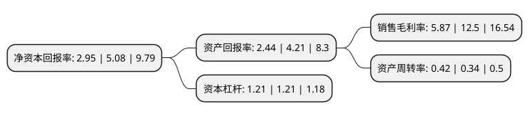

> 本页面由自动化程序生成于 2022年5月20日 01:36
> 内容可能存在错误，如有bug请提交issue至：https://github.com/Eroleice/doc-pi/issues
{.is-warning}

# 上市公司基本情况

## 基本资料

浙江吉华集团股份有限公司（以下简称“吉华集团”）成立于2003年08月15日，杭州市。于2017年06月15日在上交所主板上市。

吉华集团注册资本70,000万元，主营业务:染料，染料中间体及其他化工产品的研发，生产和销售;主要产品:染料产品主要包括分散染料，活性染料等，染料中间体主要包括H酸，合成蒽醌等。以下是详细信息：

- 公司名称: 浙江吉华集团股份有限公司
- 股票代码: 603980.SH
- 所在地: 浙江 - 杭州市
- 成立日期: 2003年08月15日
- 注册资本: 70,000万元
- 法定代表人: 邵辉
- 主营业务: 主营业务:染料，染料中间体及其他化工产品的研发，生产和销售;主要产品:染料产品主要包括分散染料，活性染料等，染料中间体主要包括H酸，合成蒽醌等
- 公司官网: www.jihuadyes.com
- 公司介绍: 公司系业内公认的全球领先的染料生产基地之一。主要产业有染料、染料中间体、聚氨酯海绵、特种涂料等产品，硫酸、热电等基础原料(工业)，涉及助剂、医药产业和金融业。公司分别在杭州萧山临江工业园区、江苏沿海经济技术开发区等地建有生产基地。主要产品有染料(分散、活性、酸性、直接、硫化等系列)、H酸、合成蒽醌、工业硫酸及延伸产品、聚氨酯海绵、特种涂料、配套建有多个“三废处理中心”。

## 股东及高管情况

上市公司第一大股东为杭州锦辉机电设备有限公司，持股196,000,000股，占比28%，**疑似为**上市公司实际控制人。

截至2022年03月31日，上市公司的前十大股东中，共有6名自然人股东，4名机构股东，其中5%以上大股东共有1名。上市公司前十大股东明细如下：

> 未能通过持股比例判定出上市公司实际控制人（持股30%以上）
> 可能存在通过间接持股、联合持股、协议控制等方式拥有实际控制权的主体，具体请参考上市公司定期公告！
{.is-warning}

> 截至2022年03月31日，上市公司前十大股东信息如下：

| 股东名称 | 持股数量（股） | 持股比例 |
| --- | --- | --- |
| 杭州锦辉机电设备有限公司 | 196,000,000 | 28% |
| 杭州辽通鼎能股权投资合伙企业(有限合伙) | 33,929,240 | 4.85% |
| 江海证券有限公司 | 25,600,000 | 3.66% |
| 徐杏花 | 25,394,000 | 3.63% |
| 邵辉 | 25,234,866 | 3.6% |
| 陈柳瑛 | 17,584,000 | 2.51% |
| 深圳市前海宏亿资产管理有限公司 | 11,200,000 | 1.6% |
| 张珊珊 | 9,694,000 | 1.38% |
| 缪茶芬 | 9,210,000 | 1.32% |
| 杨泉明 | 9,020,029 | 1.29% |

## 利润表分析

上市公司2021年总收入为22.53亿元，净利润为1.32亿元，实现盈利。

## 杜邦分析

> 数据列示周期：2021年 | 2020年 | 2019年
{.is-info}

上市公司的净资产收益率在近一年有所下降，下降幅度为-41.93%，其变化情况分解如下：
- 上市公司的销售毛利率在近一年下降了-53.04%，可能是生产效率的下降、商品原材料价格上涨或商品价格的下跌所致。
- 上市公司的资产周转率在近一年上升了23.53%，可能是源自于更快的销售回款或库存管理效果提升。
- 上市公司的财务杠杆比率在近一年下降了0%，可能是减少负债降低财务费用。

