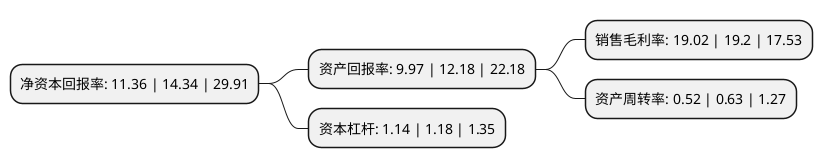

> 本页面由自动化程序生成于 2022年5月20日 01:38
> 内容可能存在错误，如有bug请提交issue至：https://github.com/Eroleice/doc-pi/issues
{.is-warning}

# 上市公司基本情况

## 基本资料

东来涂料技术(上海)股份有限公司（以下简称“东来技术”）成立于2005年04月20日，上海市。于2020年10月23日在上交所科创板上市。

东来技术注册资本12,000万元，主营业务为提供基于先进石化化工新材料研发的高性能涂料产品，包括汽车售后修补涂料，新车内外饰件及车身涂料，3C消费电子领域涂料，并全方位提供专业的现场颜色调配，定制色漆开发，喷涂技术指导，效率提升优化等技术服务，管理服务。以下是详细信息：

- 公司名称: 东来涂料技术(上海)股份有限公司
- 股票代码: 688129.SH
- 所在地: 上海 - 上海市
- 成立日期: 2005年04月20日
- 注册资本: 12,000万元
- 法定代表人: 朱忠敏
- 主营业务: 主营业务为提供基于先进石化化工新材料研发的高性能涂料产品，包括汽车售后修补涂料，新车内外饰件及车身涂料，3C消费电子领域涂料，并全方位提供专业的现场颜色调配，定制色漆开发，喷涂技术指导，效率提升优化等技术服务，管理服务
- 公司官网: www.onwings.com.cn
- 公司介绍: 公司是中国汽车漆行业的领导者，主营业务为提供基于先进石化化工新材料研发的高性能涂料产品，包括汽车售后修补涂料、新车内外饰件及车身涂料、3C消费电子领域涂料，并全方位提供专业的现场颜色调配、定制色漆开发、喷涂技术指导、效率提升优化等技术服务、管理服务，根据终端客户类别，分为三个品类：汽车售后修补涂料、新车内外饰件及车身涂料、3C消费电子领域涂料，公司下属onwings/onwaves、高飞品牌获得了全球大多数主流汽车品牌原厂认证。在中国市场，高飞品牌是欧美主流汽车品牌原厂认证的唯一亚洲品牌；日本主流汽车品牌原厂认证的唯一中国品牌，是一汽大众、一汽奥迪、东风日产、长安福特、上汽通用、沃尔沃、林肯中国、英菲尼迪、神龙汽车、东风雷诺、北京现代摩比斯、长安汽车、奇瑞汽车、吉利汽车、上汽通用五菱、东风柳汽、一汽轿车、东南汽车、宇通客车、小鹏汽车、领克汽车、蔚来汽车、东风启辰、东风裕隆、郑州日产、爱驰汽车等汽车品牌的一级供应商。

## 股东及高管情况

上市公司第一大股东为上海东来科技有限公司，持股53,352,000股，占比44.46%，为上市公司实际控制人。

截至2022年03月31日，上市公司的前十大股东中，共有2名自然人股东，8名机构股东，其中5%以上大股东共有2名。上市公司前十大股东明细如下：

> 截至2022年03月31日，上市公司前十大股东信息如下：

| 股东名称 | 持股数量（股） | 持股比例 |
| --- | --- | --- |
| 上海东来科技有限公司 | 53,352,000 | 44.46% |
| 朱忠敏 | 20,718,000 | 17.27% |
| 宁波梅山保税港区悦顺投资管理合伙企业(有限合伙) | 4,500,000 | 3.75% |
| 云南大博文化投资有限公司 | 2,700,000 | 2.25% |
| 杭州先锋基石股权投资合伙企业(有限合伙) | 2,276,510 | 1.9% |
| 上海亿宸投资管理有限公司-日照宸睿联合一期股权投资管理中心(有限合伙) | 2,250,000 | 1.88% |
| 济宁先锋基石股权投资企业(有限合伙) | 1,918,498 | 1.6% |
| 上海东方证券创新投资有限公司 | 1,328,000 | 1.11% |
| 上海浩鋆投资管理中心(有限合伙) | 900,000 | 0.75% |
| 陈峰 | 373,190 | 0.31% |

## 利润表分析

上市公司2021年总收入为4.93亿元，净利润为0.93亿元，实现盈利。

## 杜邦分析

> 数据列示周期：2021年 | 2020年 | 2019年
{.is-info}

上市公司的净资产收益率在近一年有所下降，下降幅度为-20.78%，其变化情况分解如下：
- 上市公司的销售毛利率在近一年下降了-0.94%，可能是生产效率的下降、商品原材料价格上涨或商品价格的下跌所致。
- 上市公司的资产周转率在近一年下降了-17.46%，可能是源自于更慢的销售回款或库存管理效果下降。
- 上市公司的财务杠杆比率在近一年下降了-3.39%，可能是减少负债降低财务费用。

