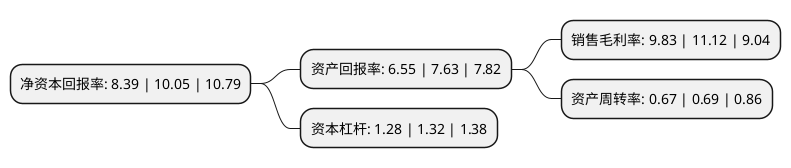

> 本页面由自动化程序生成于 2022年5月20日 01:40
> 内容可能存在错误，如有bug请提交issue至：https://github.com/Eroleice/doc-pi/issues
{.is-warning}

# 上市公司基本情况

## 基本资料

杭华油墨股份有限公司（以下简称“杭华股份”）成立于1988年12月05日，杭州市。于2020年12月11日在上交所科创板上市。

杭华股份注册资本32,000万元，主要从事符合国家环保战略方向的节能环保型油墨产品及数码材料，功能材料的研发，生产和销售，为客户提供完整的油墨相关产品和印刷解决方案。以下是详细信息：

- 公司名称: 杭华油墨股份有限公司
- 股票代码: 688571.SH
- 所在地: 浙江 - 杭州市
- 成立日期: 1988年12月05日
- 注册资本: 32,000万元
- 法定代表人: 邱克家
- 主营业务: 主要从事符合国家环保战略方向的节能环保型油墨产品及数码材料，功能材料的研发，生产和销售，为客户提供完整的油墨相关产品和印刷解决方案
- 公司官网: www.hhink.com
- 公司介绍: 公司作为国内领先的综合性油墨产品及印刷解决方案服务商，公司产品已覆盖国内市场的主要节能环保型油墨品种，报告期内市场占有率始终保持在同行业前列；尤其是在UV油墨方面，公司是国内少数拥有完整全套核心技术的生产企业，引领国内UV油墨行业的技术进步。公司已培养出各个层次的技术人才和管理人才，拥有多项发明专利并掌握UV油墨、胶印油墨、液体油墨的核心技术，以及行业内首家印刷技术研究室和行业领先的国家CNAS认证的分析检测中心，共主持/参与起草油墨产品相关国家/行业标准三十余项。2020年3月，公司入选浙江省科学技术厅评定的“2019年度浙江省创新型领军企业培育名单”，符合《浙江省创新型领军企业培育工作方案》中要求的“创新能力强、引领作用大、研发水平高、发展潜力好”的特点。

## 股东及高管情况

上市公司第一大股东为杭州市实业投资集团有限公司，持股120,000,000股，占比37.5%，为上市公司实际控制人。

截至2022年03月31日，上市公司的前十大股东中，共有6名自然人股东，3名机构股东，1个海外主体，其中5%以上大股东共有2名。上市公司前十大股东明细如下：

> 截至2022年03月31日，上市公司前十大股东信息如下：

| 股东名称 | 持股数量（股） | 持股比例 |
| --- | --- | --- |
| 杭州市实业投资集团有限公司 | 120,000,000 | 37.5% |
| 株式会社T&K TOKA | 107,208,000 | 33.5% |
| 杭州协丰投资管理合伙企业(有限合伙) | 12,792,000 | 4% |
| 浙商证券投资有限公司 | 3,630,200 | 1.13% |
| 李胜军 | 2,124,116 | 0.66% |
| 陈亚东 | 1,088,800 | 0.34% |
| 谢天 | 875,019 | 0.27% |
| 荆文 | 860,000 | 0.27% |
| 刘竞涛 | 816,696 | 0.26% |
| 陈峰 | 527,158 | 0.16% |

## 利润表分析

上市公司2021年总收入为11.48亿元，净利润为1.12亿元，实现盈利。

## 杜邦分析

> 数据列示周期：2021年 | 2020年 | 2019年
{.is-info}

上市公司的净资产收益率在近一年有所下降，下降幅度为-16.52%，其变化情况分解如下：
- 上市公司的销售毛利率在近一年下降了-11.6%，可能是生产效率的下降、商品原材料价格上涨或商品价格的下跌所致。
- 上市公司的资产周转率在近一年下降了-2.9%，可能是源自于更慢的销售回款或库存管理效果下降。
- 上市公司的财务杠杆比率在近一年下降了-3.03%，可能是减少负债降低财务费用。

