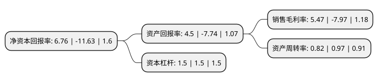

> 本页面由自动化程序生成于 2022年5月20日 01:07
> 内容可能存在错误，如有bug请提交issue至：https://github.com/Eroleice/doc-pi/issues
{.is-warning}

# 上市公司基本情况

## 基本资料

上海宏达新材料股份有限公司（以下简称“ST宏达”）成立于2002年04月24日，上海市。于2008年02月01日在深交所中小板上市。

ST宏达注册资本43,247.578万元，主营业务:高温硅橡胶系列产品的研究，生产和销售，可根据用户需要生产近200个牌号的高温硅橡胶系列产品，是国内高温硅橡胶行业位居前列的生产企业。以下是详细信息：

- 公司名称: 上海宏达新材料股份有限公司
- 股票代码: 002211.SZ
- 所在地: 上海 - 上海市
- 成立日期: 2002年04月24日
- 注册资本: 43,247.578万元
- 法定代表人: 黄俊
- 主营业务: 主营业务:高温硅橡胶系列产品的研究，生产和销售，可根据用户需要生产近200个牌号的高温硅橡胶系列产品，是国内高温硅橡胶行业位居前列的生产企业
- 公司官网: www.002211sh.com
- 公司介绍: 公司主要从事高温硅橡胶系列产品的研究、生产和销售，是国内首家硅橡胶行业的上市公司。公司拥有230多个高温硅橡胶品种牌号，可向市场提供高、中、低档全系列产品，除可生产普通性能制品外，还可用于生产阻燃、绝缘、耐高温、耐低温、耐水蒸汽、高抗撕、高弹性、低压缩、永不变形的特种硅橡胶制品，能够满足不同客户的多样化需求。公司通过ISO9001质量体系认证、ISO14001环境体系认证。公司是国家高新技术企业，有江苏省科技厅批准设立的“江苏省有机硅工程技术研究中心”和国家人事部批准设立的“企业博士后科研工作站”等高水平研发及创新平台；被科技部认定为“国家级国际合作基地”。

## 股东及高管情况

上市公司第一大股东为江苏伟伦投资管理有限公司，持股125,735,743股，占比29.07%，**疑似为**上市公司实际控制人。

截至2022年03月31日，上市公司的前十大股东中，共有7名自然人股东，3名机构股东，其中5%以上大股东共有2名。上市公司前十大股东明细如下：

> 未能通过持股比例判定出上市公司实际控制人（持股30%以上）
> 可能存在通过间接持股、联合持股、协议控制等方式拥有实际控制权的主体，具体请参考上市公司定期公告！
{.is-warning}

> 截至2022年03月31日，上市公司前十大股东信息如下：

| 股东名称 | 持股数量（股） | 持股比例 |
| --- | --- | --- |
| 江苏伟伦投资管理有限公司 | 125,735,743 | 29.07% |
| 杭州科立企业管理合伙企业(有限合伙) | 34,440,000 | 7.96% |
| 夏重阳 | 4,520,000 | 1.05% |
| 李山青 | 3,427,900 | 0.79% |
| 王玉 | 3,314,600 | 0.77% |
| 侯辉兰 | 3,266,400 | 0.76% |
| 龚锦娣 | 2,276,542 | 0.53% |
| 华泰证券股份有限公司 | 1,451,401 | 0.34% |
| 郭喆 | 1,292,950 | 0.3% |
| 徐榴明 | 1,217,900 | 0.28% |

## 杜邦分析

> 数据列示周期：2020年 | 2019年 | 2018年
{.is-info}

上市公司的净资产收益率在近一年有所下降，下降幅度为-158.13%，其变化情况分解如下：
- 上市公司的销售毛利率在近一年下降了-168.63%，可能是生产效率的下降、商品原材料价格上涨或商品价格的下跌所致。
- 上市公司的资产周转率在近一年下降了-15.46%，可能是源自于更慢的销售回款或库存管理效果下降。
- 上市公司的财务杠杆比率在近一年下降了0%，可能是减少负债降低财务费用。

