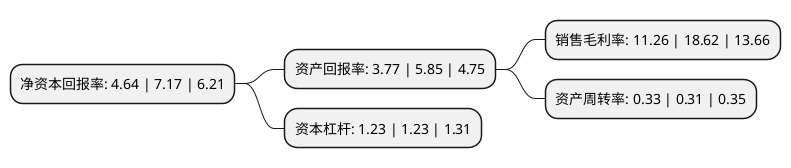

> 本页面由自动化程序生成于 2022年5月20日 01:07
> 内容可能存在错误，如有bug请提交issue至：https://github.com/Eroleice/doc-pi/issues
{.is-warning}

# 上市公司基本情况

## 基本资料

三力士股份有限公司（以下简称“三力士”）成立于2002年11月11日，绍兴市。于2008年04月25日在深交所中小板上市。

三力士注册资本72,958.663万元，公司主营业务为三角胶带(也称为橡胶V带)，橡胶制品的生产，开发，销售，主要产品为三角胶带和胶管。以下是详细信息：

- 公司名称: 三力士股份有限公司
- 股票代码: 002224.SZ
- 所在地: 浙江 - 绍兴市
- 成立日期: 2002年11月11日
- 注册资本: 72,958.663万元
- 法定代表人: 吴琼瑛
- 主营业务: 公司主营业务为三角胶带(也称为橡胶V带)，橡胶制品的生产，开发，销售，主要产品为三角胶带和胶管
- 公司官网: www.v-belt.com
- 公司介绍: 公司是一家专业生产各类橡胶V带的大型企业，是经浙江省人民政府批准的规范化股份制企业，其前身是绍兴三力士橡胶有限公司。公司主营业务为生产并销售各类橡胶V带、输送带、同步带等产品。主要产品为工业V带、农业V带、汽车V带、输送带、工业同步带等，广泛应用于工业、农业、汽车制造业等诸多领域。公司生产的橡胶V带(三角胶带)连续多年产销量、出口量居全国同行首位，连续多年荣获浙江名牌称号；公司分别通过了ISO9001：2000质量管理认证和ISO14001：1996环境管理认证。目前，三力士牌橡胶V带被国家质量检验检疫总局评为“中国名牌产品”、“国家免检产品”，三力士商标被国家工商行政管理总局认定为“中国驰名商标”。

## 股东及高管情况

上市公司第一大股东为吴培生，持股230,112,000股，占比31.54%，为上市公司实际控制人。

截至2022年03月31日，上市公司的前十大股东中，共有10名自然人股东，其中5%以上大股东共有1名。上市公司前十大股东明细如下：

> 截至2022年03月31日，上市公司前十大股东信息如下：

| 股东名称 | 持股数量（股） | 持股比例 |
| --- | --- | --- |
| 吴培生 | 230,112,000 | 31.54% |
| 吴琼瑛 | 18,895,940 | 2.59% |
| 吴兴荣 | 8,000,063 | 1.1% |
| 吴水炎 | 5,850,448 | 0.8% |
| 吴水源 | 4,907,800 | 0.67% |
| 黄凯军 | 3,920,252 | 0.54% |
| 陈柏忠 | 3,440,705 | 0.47% |
| 李月琴 | 3,210,000 | 0.44% |
| 赵晖 | 2,893,334 | 0.4% |
| 赖汉宣 | 2,299,900 | 0.32% |

## 利润表分析

上市公司2021年总收入为10.01亿元，净利润为1.12亿元，实现盈利。

## 杜邦分析

> 数据列示周期：2021年 | 2020年 | 2019年
{.is-info}

上市公司的净资产收益率在近一年有所下降，下降幅度为-35.29%，其变化情况分解如下：
- 上市公司的销售毛利率在近一年下降了-39.53%，可能是生产效率的下降、商品原材料价格上涨或商品价格的下跌所致。
- 上市公司的资产周转率在近一年上升了6.45%，可能是源自于更快的销售回款或库存管理效果提升。
- 上市公司的财务杠杆比率在近一年下降了0%，可能是减少负债降低财务费用。

