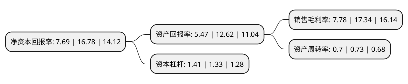

> 本页面由自动化程序生成于 2022年5月20日 01:08
> 内容可能存在错误，如有bug请提交issue至：https://github.com/Eroleice/doc-pi/issues
{.is-warning}

# 上市公司基本情况

## 基本资料

浙江双箭橡胶股份有限公司（以下简称“双箭股份”）成立于2001年11月13日，嘉兴市。于2010年04月02日在深交所中小板上市。

双箭股份注册资本41,157.226万元，主营业务:本公司主要从事输送带的生产和销售业务。主要产品:输送带。以下是详细信息：

- 公司名称: 浙江双箭橡胶股份有限公司
- 股票代码: 002381.SZ
- 所在地: 浙江 - 嘉兴市
- 成立日期: 2001年11月13日
- 注册资本: 41,157.226万元
- 法定代表人: 沈耿亮
- 主营业务: 主营业务:本公司主要从事输送带的生产和销售业务主要产品:输送带
- 公司官网: www.doublearrow.net
- 公司介绍: 公司是一家专业生产输送带，平胶带及胶管系列产品的管带行业骨干企业。公司主要从事橡胶输送带系列产品的研发、生产和销售。产品广泛应用于电力、港口、冶金、矿产、建材等需要物料输送的行业。公司生产的橡胶输送带产品按骨架材料分为棉帆布芯输送带、尼龙帆布芯输送带、聚酯帆布芯输送带、整芯输送带、钢丝绳芯输送带和芳纶输送带等，可根据客户需要定制，使产品具有耐高温、耐寒、耐酸碱、阻燃、节能、防撕裂等特殊性能，多项产品获得国家知识产权局发明和实用新型专利。公司具有一流的生产、检测设备，完善的质量保证体系。已通过IS09001质量体系、ISO14001环境体系、GB/T28001职业健康安全管理体系认证。公司在同行中享有较高声誉，被浙江省科技厅等部门认定为“高新技术企业”。公司为中国橡胶工业协会副会长单位，输送带产品国家标准、行业标准的主要起草单位之一。连续多年列入中国输送带行业十强榜首。

## 股东及高管情况

上市公司第一大股东为沈耿亮，持股86,110,293股，占比20.92%，**疑似为**上市公司实际控制人。

截至2022年03月31日，上市公司的前十大股东中，共有8名自然人股东，2名机构股东，其中5%以上大股东共有3名。上市公司前十大股东明细如下：

> 未能通过持股比例判定出上市公司实际控制人（持股30%以上）
> 可能存在通过间接持股、联合持股、协议控制等方式拥有实际控制权的主体，具体请参考上市公司定期公告！
{.is-warning}

> 截至2022年03月31日，上市公司前十大股东信息如下：

| 股东名称 | 持股数量（股） | 持股比例 |
| --- | --- | --- |
| 沈耿亮 | 86,110,293 | 20.92% |
| 虞炳英 | 22,611,200 | 5.49% |
| 桐乡市城市建设投资有限公司 | 21,000,000 | 5.1% |
| 沈会民 | 16,605,000 | 4.03% |
| 浙江双井投资有限公司 | 13,750,000 | 3.34% |
| 沈洪发 | 8,590,000 | 2.09% |
| 虞炳仁 | 5,683,100 | 1.38% |
| 俞明松 | 4,281,500 | 1.04% |
| 吴湘伟 | 4,100,000 | 1% |
| 沈林泉 | 3,665,822 | 0.89% |

## 利润表分析

上市公司2021年总收入为19.16亿元，净利润为1.49亿元，实现盈利。

## 杜邦分析

> 数据列示周期：2021年 | 2020年 | 2019年
{.is-info}

上市公司的净资产收益率在近一年有所下降，下降幅度为-54.17%，其变化情况分解如下：
- 上市公司的销售毛利率在近一年下降了-55.13%，可能是生产效率的下降、商品原材料价格上涨或商品价格的下跌所致。
- 上市公司的资产周转率在近一年下降了-4.11%，可能是源自于更慢的销售回款或库存管理效果下降。
- 上市公司的财务杠杆比率在近一年上升了6.02%，可能是增加负债扩大生产规模。

