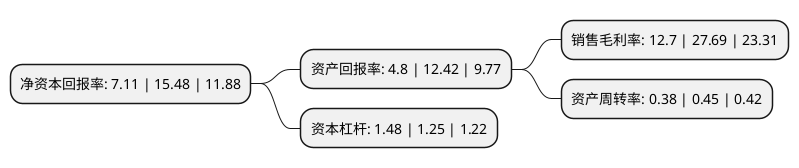

> 本页面由自动化程序生成于 2022年5月20日 01:20
> 内容可能存在错误，如有bug请提交issue至：https://github.com/Eroleice/doc-pi/issues
{.is-warning}

# 上市公司基本情况

## 基本资料

震安科技股份有限公司（以下简称“震安科技”）成立于2010年01月04日，昆明市。于2019年03月29日在深交所创业板上市。

震安科技注册资本20,217.073万元，主要从事建筑隔震橡胶支座的研发，生产，销售，并提供隔震咨询，隔震设计，隔震橡胶支座安装指导，更换，维护等相关技术服务。以下是详细信息：

- 公司名称: 震安科技股份有限公司
- 股票代码: 300767.SZ
- 所在地: 云南 - 昆明市
- 成立日期: 2010年01月04日
- 注册资本: 20,217.073万元
- 法定代表人: 李涛
- 主营业务: 主要从事建筑隔震橡胶支座的研发，生产，销售，并提供隔震咨询，隔震设计，隔震橡胶支座安装指导，更换，维护等相关技术服务
- 公司官网: www.zhenanpro.com
- 公司介绍: 公司成立于2010年1月4日，是国内领先的建筑隔震整体解决方案供应商，主要从事建筑隔震橡胶支座的研发、生产、销售，并提供隔震咨询，隔震设计，隔震橡胶支座安装指导、更换、维护等相关技术服务。目前，公司已经形成了以建筑隔震咨询及隔震设计为引导，建筑隔震产品为核心，隔震产品安装指导、更换、维护为外延服务的全周期产品服务体系。

## 股东及高管情况

上市公司第一大股东为北京华创三鑫投资管理合伙企业(有限合伙)，持股41,729,272股，占比20.64%，**疑似为**上市公司实际控制人。

截至2022年03月31日，上市公司的前十大股东中，共有1名自然人股东，2名机构股东，6个产品账户，1个海外主体，其中5%以上大股东共有3名。上市公司前十大股东明细如下：

> 未能通过持股比例判定出上市公司实际控制人（持股30%以上）
> 可能存在通过间接持股、联合持股、协议控制等方式拥有实际控制权的主体，具体请参考上市公司定期公告！
{.is-warning}

> 截至2022年03月31日，上市公司前十大股东信息如下：

| 股东名称 | 持股数量（股） | 持股比例 |
| --- | --- | --- |
| 北京华创三鑫投资管理合伙企业(有限合伙) | 41,729,272 | 20.64% |
| 李涛 | 39,796,760 | 19.68% |
| 香港中央结算有限公司(陆股通) | 11,373,932 | 5.63% |
| 中国建设银行股份有限公司-中欧悦享生活混合型证券投资基金 | 6,481,497 | 3.21% |
| 华夏人寿保险股份有限公司-自有资金 | 4,190,541 | 2.07% |
| 交通银行股份有限公司-华安策略优选混合型证券投资基金 | 3,643,141 | 1.8% |
| 中国工商银行股份有限公司-中欧消费主题股票型证券投资基金 | 2,799,481 | 1.38% |
| 上海浦东发展银行股份有限公司-华夏创新未来18个月封闭运作混合型证券投资基金 | 2,782,292 | 1.38% |
| 华夏基金管理有限公司-社保基金四二二组合 | 2,489,998 | 1.23% |
| 中国银行股份有限公司-华安优势企业混合型证券投资基金 | 2,292,846 | 1.13% |

## 利润表分析

上市公司2021年总收入为6.7亿元，净利润为0.85亿元，实现盈利。

## 杜邦分析

> 数据列示周期：2021年 | 2020年 | 2019年
{.is-info}

上市公司的净资产收益率在近一年有所下降，下降幅度为-54.07%，其变化情况分解如下：
- 上市公司的销售毛利率在近一年下降了-54.14%，可能是生产效率的下降、商品原材料价格上涨或商品价格的下跌所致。
- 上市公司的资产周转率在近一年下降了-15.56%，可能是源自于更慢的销售回款或库存管理效果下降。
- 上市公司的财务杠杆比率在近一年上升了18.4%，可能是增加负债扩大生产规模。

