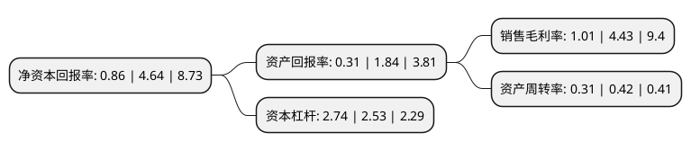

> 本页面由自动化程序生成于 2022年5月20日 01:02
> 内容可能存在错误，如有bug请提交issue至：https://github.com/Eroleice/doc-pi/issues
{.is-warning}

# 上市公司基本情况

## 基本资料

广东韶能集团股份有限公司（以下简称“韶能股份”）成立于1993年06月14日，韶关市。于1996年08月30日在深交所主板上市。

韶能股份注册资本108,055.167万元，主要产品:电力，非电制造业，其他业务包括加油充电站业务，贸易业务，售电业务。以下是详细信息：

- 公司名称: 广东韶能集团股份有限公司
- 股票代码: 000601.SZ
- 所在地: 广东 - 韶关市
- 成立日期: 1993年06月14日
- 注册资本: 108,055.167万元
- 法定代表人: 陈来泉
- 主营业务: 主要产品:电力，非电制造业，其他业务包括加油充电站业务，贸易业务，售电业务
- 公司官网: www.shaoneng.com.cn/www.sn0601.com
- 公司介绍: 公司是一家以电力为主业，兼有建材、环保产业等于一体的综合性集团企业。电力是公司的主导产业。目前公司从事生物质能发电业务的企业有两家，分别为日升生物质公司和旭能生物质公司；从事生态植物纤维制品业务的企业有两家，分别是绿洲公司和华丽达公司，绿洲公司生产各种环保纸餐具和健康环保本色消费类用纸等产品，华丽达公司生产健康环保本色消费类用纸等产品；从事精密(智能)制造业务的企业为宏大公司。此外，公司还从事加油充电站业务、贸易业务、售电业务等。公司地处粤北地区，具有丰富的水力资源，公司还是粤北地区最大的水泥生产企业，公司下属的乐昌锆制品厂是广东省生产锆制品龙头企业之一。目前公司对周边湖南、广东地区水资源已经进行了较为充分的开发利用，水电发展的空间有限。韶关市的生物质资源丰富，生物质发电项目建设的基础较好。

## 股东及高管情况

上市公司第一大股东为深圳华利通投资有限公司，持股215,561,897股，占比19.95%，**疑似为**上市公司实际控制人。

截至2022年04月01日，上市公司的前十大股东中，共有4名自然人股东，5名机构股东，1个海外主体，其中5%以上大股东共有3名。上市公司前十大股东明细如下：

> 未能通过持股比例判定出上市公司实际控制人（持股30%以上）
> 可能存在通过间接持股、联合持股、协议控制等方式拥有实际控制权的主体，具体请参考上市公司定期公告！
{.is-warning}

> 截至2022年04月01日，上市公司前十大股东信息如下：

| 股东名称 | 持股数量（股） | 持股比例 |
| --- | --- | --- |
| 深圳华利通投资有限公司 | 215,561,897 | 19.95% |
| 韶关市工业资产经营有限公司 | 155,949,490 | 14.43% |
| 深圳日昇创沅资产管理有限公司 | 76,379,302 | 7.07% |
| 李霞 | 22,058,292 | 2.04% |
| 香港中央结算有限公司(陆股通) | 18,395,237 | 1.7% |
| 深圳能源集团股份有限公司 | 16,629,750 | 1.54% |
| 葛万来 | 16,096,373 | 1.49% |
| 中国对外经济贸易信托有限公司-外贸信托·华资1号单一资金信托 | 9,036,987 | 0.84% |
| 杜影霞 | 7,462,000 | 0.69% |
| 何树华 | 7,438,800 | 0.69% |

## 利润表分析

上市公司2021年总收入为39.66亿元，净利润为0.4亿元，实现盈利。

## 杜邦分析

> 数据列示周期：2021年 | 2020年 | 2019年
{.is-info}

上市公司的净资产收益率在近一年有所下降，下降幅度为-81.47%，其变化情况分解如下：
- 上市公司的销售毛利率在近一年下降了-77.2%，可能是生产效率的下降、商品原材料价格上涨或商品价格的下跌所致。
- 上市公司的资产周转率在近一年下降了-26.19%，可能是源自于更慢的销售回款或库存管理效果下降。
- 上市公司的财务杠杆比率在近一年上升了8.3%，可能是增加负债扩大生产规模。

