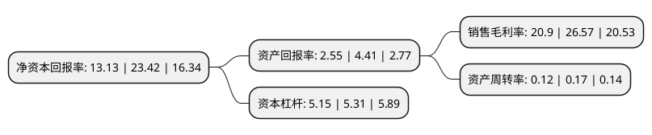

> 本页面由自动化程序生成于 2022年5月20日 01:05
> 内容可能存在错误，如有bug请提交issue至：https://github.com/Eroleice/doc-pi/issues
{.is-warning}

# 上市公司基本情况

## 基本资料

贵州黔源电力股份有限公司（以下简称“黔源电力”）成立于1993年10月12日，贵阳市。于2005年03月03日在深交所中小板上市。

黔源电力注册资本30,539.866万元，主营业务:水力，火力发电站的开发建设与经营管理。主要产品:电力。以下是详细信息：

- 公司名称: 贵州黔源电力股份有限公司
- 股票代码: 002039.SZ
- 所在地: 贵州 - 贵阳市
- 成立日期: 1993年10月12日
- 注册资本: 30,539.866万元
- 法定代表人: 罗涛
- 主营业务: 主营业务:水力，火力发电站的开发建设与经营管理主要产品:电力
- 公司官网: www.gzqydl.cn
- 公司介绍: 公司主要经营业务是水力、火力发电站(厂)的开发、建设与经营管理。公司积极抢抓“西电东送”，“黔电送粤”等发展契机，努力推进北盘江流域、芙蓉江流域、三岔河“两江一河”梯级水电项目的开发，面对未来发展，公司将进一步提高管理水平，科学、合理地调度电站水库来水，使水能资源发挥最大效用；进一步提高设备维护、运行能力，提高安全生产水平；立足于“防大汛、防早汛”，确保公司安全度汛。水电作为可再生的绿色清洁能源，长期以来得到国家政策的重点扶持，公司以精益调度为抓手，以远程控制为手段，对公司系统各水电站进行统筹协调，实施集约化梯级调度，实现精益管控目标。

## 股东及高管情况

上市公司第一大股东为中国华电集团有限公司，持股48,537,507股，占比15.89%，**疑似为**上市公司实际控制人。

截至2022年03月31日，上市公司的前十大股东中，共有2名自然人股东，4名机构股东，4个产品账户，其中5%以上大股东共有3名。上市公司前十大股东明细如下：

> 未能通过持股比例判定出上市公司实际控制人（持股30%以上）
> 可能存在通过间接持股、联合持股、协议控制等方式拥有实际控制权的主体，具体请参考上市公司定期公告！
{.is-warning}

> 截至2022年03月31日，上市公司前十大股东信息如下：

| 股东名称 | 持股数量（股） | 持股比例 |
| --- | --- | --- |
| 中国华电集团有限公司 | 48,537,507 | 15.89% |
| 贵州乌江水电开发有限责任公司 | 37,867,536 | 12.4% |
| 重庆乌江电力有限公司 | 30,539,918 | 10% |
| 贵州乌江能源投资有限公司 | 10,000,060 | 3.27% |
| 全国社保基金六零四组合 | 9,167,500 | 3% |
| 全国社保基金四一四组合 | 6,703,496 | 2.19% |
| 中国工商银行股份有限公司-前海开源新经济灵活配置混合型证券投资基金 | 6,408,607 | 2.1% |
| 基本养老保险基金一零零三组合 | 5,659,968 | 1.85% |
| 王佩华 | 4,398,773 | 1.44% |
| 谢竹林 | 4,330,047 | 1.42% |

## 利润表分析

上市公司2021年总收入为20.36亿元，净利润为4.25亿元，实现盈利。

## 杜邦分析

> 数据列示周期：2021年 | 2020年 | 2019年
{.is-info}

上市公司的净资产收益率在近一年有所下降，下降幅度为-43.94%，其变化情况分解如下：
- 上市公司的销售毛利率在近一年下降了-21.34%，可能是生产效率的下降、商品原材料价格上涨或商品价格的下跌所致。
- 上市公司的资产周转率在近一年下降了-29.41%，可能是源自于更慢的销售回款或库存管理效果下降。
- 上市公司的财务杠杆比率在近一年下降了-3.01%，可能是减少负债降低财务费用。

