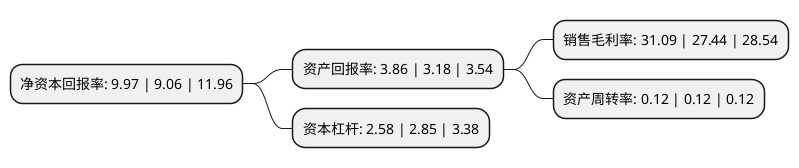

> 本页面由自动化程序生成于 2022年5月20日 01:23
> 内容可能存在错误，如有bug请提交issue至：https://github.com/Eroleice/doc-pi/issues
{.is-warning}

# 上市公司基本情况

## 基本资料

华能澜沧江水电股份有限公司（以下简称“华能水电”）成立于2001年02月08日，昆明市。于2017年12月15日在上交所主板上市。

华能水电注册资本1,800,000万元，主要业务:为水力发电项目的开发，投资，建设，运营与管理，主要收入来自于水力发电的销售收入。主要产品:电力。以下是详细信息：

- 公司名称: 华能澜沧江水电股份有限公司
- 股票代码: 600025.SH
- 所在地: 云南 - 昆明市
- 成立日期: 2001年02月08日
- 注册资本: 1,800,000万元
- 法定代表人: 袁湘华
- 主营业务: 为水力发电项目的开发，投资，建设，运营与管理，主要收入来自于水力发电的销售收入主要产品:电力
- 公司官网: www.hnlcj.cn
- 公司介绍: 公司是一家大型流域水电企业，是培育云南水电支柱产业和实施“西电东送”、“云电外送”的核心企业和龙头企业，“藏电外送”的主要参与者。公司主要经营水电开发、水力发电、发电销售、工程建设等业务，按照“流域、梯级、滚动、综合”开发的原则，在优先开发澜沧江下游、中游水电站的基础上逐步转向上游开发，目前已形成“运营一批、建设一批、储备一批”的流域梯级滚动开发态势。本公司目前的主要业务是对云南省澜沧江流域的水电项目投资建设和经营管理，对云南省境内澜沧江流域的水电资源实施流域、梯级、滚动、综合开发。由于在流域开发中取得的良好业绩，本公司先后荣获“全国五一劳动奖状”、“中国十佳责任企业”、“中国能源绿色企业50佳”、“首批电力行业AAA级信用企业”、“西部大开发突出贡献先进集体”、“中央企业思想政治工作先进单位”、“青年就业创业见习基地”等荣誉称号。

## 股东及高管情况

上市公司第一大股东为中国华能集团有限公司，持股9,072,000,000股，占比50.4%，为上市公司实际控制人。

截至2022年03月31日，上市公司的前十大股东中，共有2名自然人股东，4名机构股东，3个产品账户，1个海外主体，其中5%以上大股东共有3名。上市公司前十大股东明细如下：

> 截至2022年03月31日，上市公司前十大股东信息如下：

| 股东名称 | 持股数量（股） | 持股比例 |
| --- | --- | --- |
| 中国华能集团有限公司 | 9,072,000,000 | 50.4% |
| 云南省能源投资集团有限公司 | 5,086,800,000 | 28.26% |
| 云南合和(集团)股份有限公司 | 2,041,200,000 | 11.34% |
| 李海清 | 93,330,553 | 0.52% |
| 香港中央结算有限公司(陆股通) | 75,869,204 | 0.42% |
| 李福清 | 71,337,945 | 0.4% |
| 上海宁泉资产管理有限公司-宁泉致远39号私募证券投资基金 | 41,797,078 | 0.23% |
| 上海宁泉资产管理有限公司-宁泉致远58号私募证券投资基金 | 40,385,300 | 0.22% |
| 北京远通鑫海商贸有限公司 | 32,750,000 | 0.18% |
| 全国社保基金一零八组合 | 27,499,954 | 0.15% |

## 利润表分析

上市公司2021年总收入为202.01亿元，净利润为62.8亿元，实现盈利。

## 杜邦分析

> 数据列示周期：2021年 | 2020年 | 2019年
{.is-info}

上市公司的净资产收益率在近一年有所上升，上升幅度为10.04%，其变化情况分解如下：
- 上市公司的销售毛利率在近一年上升了13.3%，可能是生产效率的提升、商品原材料价格下跌或商品价格的上涨所致。
- 上市公司的资产周转率在近一年下降了0%，可能是源自于更慢的销售回款或库存管理效果下降。
- 上市公司的财务杠杆比率在近一年下降了-9.47%，可能是减少负债降低财务费用。

