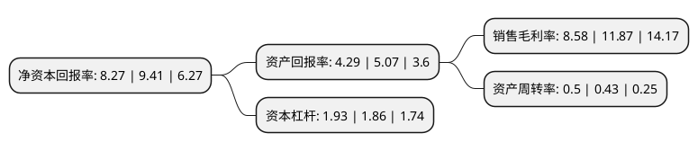

> 本页面由自动化程序生成于 2022年5月20日 01:24
> 内容可能存在错误，如有bug请提交issue至：https://github.com/Eroleice/doc-pi/issues
{.is-warning}

# 上市公司基本情况

## 基本资料

重庆三峡水利电力(集团)股份有限公司（以下简称“三峡水利”）成立于1994年04月28日，重庆市。于1997年08月04日在上交所主板上市。

三峡水利注册资本191,214.29万元，主要业务:发电，供电。以下是详细信息：

- 公司名称: 重庆三峡水利电力(集团)股份有限公司
- 股票代码: 600116.SH
- 所在地: 重庆 - 重庆市
- 成立日期: 1994年04月28日
- 注册资本: 191,214.29万元
- 法定代表人: 叶建桥
- 主营业务: 发电，供电
- 公司官网: www.cqsxsl.com
- 公司介绍: 公司是一家集电力开发、多种经营为一体的企业集团，主要从事发电、供电、电力设计勘察安装等业务，并参股重庆公交站台广告公司、三峡银行等企业。公司拥有鱼背山、双河、赶场、杨东河、长滩、瀼渡等水力发电站，并控股向家嘴水电站；拥有变电站多座，与湖北和重庆电网联网，已形成“十”字形110KV骨架网络，可实现110KV环网运行；公司年售电量大，是三峡库区重要的电力负荷支撑点。公司秉承“立足万州、面向全国，电为主业、多元发展”的发展战略，以打造一流售电企业为目标，以构建“运作规范、资产优质、效益优良”的能源、资源型企业为愿景。

## 股东及高管情况

上市公司第一大股东为中国长江电力股份有限公司，持股236,037,004股，占比12.34%，**疑似为**上市公司实际控制人。

截至2022年03月31日，上市公司的前十大股东中，共有9名机构股东，1名其他股东，其中5%以上大股东共有6名。上市公司前十大股东明细如下：

> 未能通过持股比例判定出上市公司实际控制人（持股30%以上）
> 可能存在通过间接持股、联合持股、协议控制等方式拥有实际控制权的主体，具体请参考上市公司定期公告！
{.is-warning}

> 截至2022年03月31日，上市公司前十大股东信息如下：

| 股东名称 | 持股数量（股） | 持股比例 |
| --- | --- | --- |
| 中国长江电力股份有限公司 | 236,037,004 | 12.34% |
| 重庆新禹能源科技(集团)有限公司 | 187,771,797 | 9.82% |
| 重庆涪陵能源实业集团有限公司 | 153,648,628 | 8.04% |
| 重庆两江新区开发投资集团有限公司 | 121,108,331 | 6.33% |
| 新华水利控股集团有限公司 | 111,000,453 | 5.81% |
| 水利部综合开发管理中心 | 98,208,000 | 5.14% |
| 嘉兴宝亨投资合伙企业(有限合伙) | 76,898,199 | 4.02% |
| 三峡电能有限公司 | 47,977,679 | 2.51% |
| 长电资本控股有限责任公司 | 43,137,793 | 2.26% |
| 三峡资本控股有限责任公司 | 40,530,783 | 2.12% |

## 利润表分析

上市公司2021年总收入为101.76亿元，净利润为8.73亿元，实现盈利。

## 杜邦分析

> 数据列示周期：2021年 | 2020年 | 2019年
{.is-info}

上市公司的净资产收益率在近一年有所下降，下降幅度为-12.11%，其变化情况分解如下：
- 上市公司的销售毛利率在近一年下降了-27.72%，可能是生产效率的下降、商品原材料价格上涨或商品价格的下跌所致。
- 上市公司的资产周转率在近一年上升了16.28%，可能是源自于更快的销售回款或库存管理效果提升。
- 上市公司的财务杠杆比率在近一年上升了3.76%，可能是增加负债扩大生产规模。

