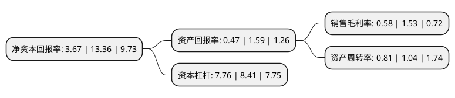

> 本页面由自动化程序生成于 2022年5月20日 01:25
> 内容可能存在错误，如有bug请提交issue至：https://github.com/Eroleice/doc-pi/issues
{.is-warning}

# 上市公司基本情况

## 基本资料

广西桂东电力股份有限公司（以下简称“桂东电力”）成立于1998年12月04日，贺州市。于2001年02月28日在上交所主板上市。

桂东电力注册资本122,142.56万元，主要产品:电能。以下是详细信息：

- 公司名称: 广西桂东电力股份有限公司
- 股票代码: 600310.SH
- 所在地: 广西 - 贺州市
- 成立日期: 1998年12月04日
- 注册资本: 122,142.56万元
- 法定代表人: 姚若军
- 主营业务: 主要产品:电能
- 公司官网: www.gdep.com.cn
- 公司介绍: 公司属于电力行业，以发供电为主业，涉足发供电、证券、石油贸易等行业。公司同时拥有电厂和电网，拥有完整的发、供电网络，是上市公司中少数拥有“厂网合一”电力企业。公司全资子公司钦州永盛为公司的贸易平台，专注于石化产品贸易经营，通过与上游客户建立紧密的战略合作，逐步形成从原料供应到成品生产直到销售终端的产业链，“供—产—销”三个环节共同发展，推动油品贸易产业链带来经济效益的增长。公司上市以后，大力发展电源和电网建设，供电营业范围包括桂东区域县市，并与广东郁南县、罗定市以及临近的湖南省江永县、江华县、永州市等进行互为网间电量交换，形成较完整的区域电网。

## 股东及高管情况

上市公司第一大股东为广西正润发展集团有限公司，持股414,147,990股，占比33.91%，为上市公司实际控制人。

截至2022年03月31日，上市公司的前十大股东中，共有7名机构股东，2个产品账户，1个海外主体，其中5%以上大股东共有2名。上市公司前十大股东明细如下：

> 截至2022年03月31日，上市公司前十大股东信息如下：

| 股东名称 | 持股数量（股） | 持股比例 |
| --- | --- | --- |
| 广西正润发展集团有限公司 | 414,147,990 | 33.91% |
| 广西广投能源集团有限公司 | 208,650,602 | 17.08% |
| 国泰君安证券股份有限公司 | 20,009,200 | 1.64% |
| 华泰证券股份有限公司 | 17,670,518 | 1.45% |
| 中国银河证券股份有限公司 | 16,500,000 | 1.35% |
| JPMORGAN CHASE BANK,NATIONAL   ASSOCIATION | 10,798,079 | 0.88% |
| 国海证券股份有限公司 | 10,500,000 | 0.86% |
| 国信证券股份有限公司 | 10,000,000 | 0.82% |
| 招商银行股份有限公司-华安安华灵活配置混合型证券投资基金 | 7,387,400 | 0.6% |
| 财通基金-华泰证券股份有限公司-财通基金君享永熙单一资产管理计划 | 6,558,479 | 0.54% |

## 利润表分析

上市公司2021年总收入为170.79亿元，净利润为0.99亿元，实现盈利。

## 杜邦分析

> 数据列示周期：2021年 | 2020年 | 2019年
{.is-info}

上市公司的净资产收益率在近一年有所下降，下降幅度为-72.53%，其变化情况分解如下：
- 上市公司的销售毛利率在近一年下降了-62.09%，可能是生产效率的下降、商品原材料价格上涨或商品价格的下跌所致。
- 上市公司的资产周转率在近一年下降了-22.12%，可能是源自于更慢的销售回款或库存管理效果下降。
- 上市公司的财务杠杆比率在近一年下降了-7.73%，可能是减少负债降低财务费用。

