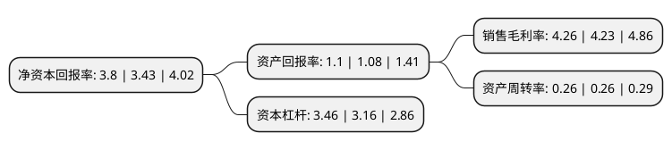

> 本页面由自动化程序生成于 2022年5月20日 01:27
> 内容可能存在错误，如有bug请提交issue至：https://github.com/Eroleice/doc-pi/issues
{.is-warning}

# 上市公司基本情况

## 基本资料

四川西昌电力股份有限公司（以下简称“西昌电力”）成立于1994年06月18日，凉山彝族自治州。于2002年05月30日在上交所主板上市。

西昌电力注册资本36,456.75万元，主营业务:电力销售。以下是详细信息：

- 公司名称: 四川西昌电力股份有限公司
- 股票代码: 600505.SH
- 所在地: 四川 - 凉山彝族自治州
- 成立日期: 1994年06月18日
- 注册资本: 36,456.75万元
- 法定代表人: 牟昊
- 主营业务: 主营业务:电力销售
- 公司官网: www.scxcdl.com
- 公司介绍: 公司是一家集发、输、配于一体的综合性水电企业。公司拥有直属水力发电厂和控股水力发电厂，瓦都水库，直属变电站等。目前公司电网以110千伏网络为主网架，以35千伏、10千伏为供配网络，形成连接西昌、昭觉、美姑、布拖、金阳、普格、木里、盐源等的地方电网。根据规划，公司将建成220千伏为骨干、110千伏及以下配电网络合理分布的输电网架，满足全州经济发展的需要。公司始终以促进全州经济发展为己任，不断加快自有电源点开发建设，推进城区配网、农网改造，规划、建设系列骨干输变电工程，力争提供更加安全、可靠、稳定的电力服务。

## 股东及高管情况

上市公司第一大股东为国网四川省电力公司，持股73,449,220股，占比20.15%，**疑似为**上市公司实际控制人。

截至2022年03月31日，上市公司的前十大股东中，共有5名自然人股东，4名机构股东，1个产品账户，其中5%以上大股东共有3名。上市公司前十大股东明细如下：

> 未能通过持股比例判定出上市公司实际控制人（持股30%以上）
> 可能存在通过间接持股、联合持股、协议控制等方式拥有实际控制权的主体，具体请参考上市公司定期公告！
{.is-warning}

> 截至2022年03月31日，上市公司前十大股东信息如下：

| 股东名称 | 持股数量（股） | 持股比例 |
| --- | --- | --- |
| 国网四川省电力公司 | 73,449,220 | 20.15% |
| 四川省水电投资经营集团有限公司 | 66,770,883 | 18.32% |
| 凉山州发展(控股)集团有限责任公司 | 61,578,420 | 16.89% |
| 罗明光 | 1,929,310 | 0.53% |
| 四川昭觉电力有限责任公司 | 1,800,000 | 0.53% |
| 薛小艳 | 1,308,800 | 0.36% |
| 宁波银行股份有限公司-金元顺安桉盛债券型证券投资基金 | 896,800 | 0.25% |
| 徐丽君 | 829,500 | 0.23% |
| 吕国文 | 720,900 | 0.2% |
| 许永昌 | 643,700 | 0.18% |

## 利润表分析

上市公司2021年总收入为10.81亿元，净利润为0.46亿元，实现盈利。

## 杜邦分析

> 数据列示周期：2021年 | 2020年 | 2019年
{.is-info}

上市公司的净资产收益率在近一年有所上升，上升幅度为10.79%，其变化情况分解如下：
- 上市公司的销售毛利率在近一年上升了0.71%，可能是生产效率的提升、商品原材料价格下跌或商品价格的上涨所致。
- 上市公司的资产周转率在近一年下降了0%，可能是源自于更慢的销售回款或库存管理效果下降。
- 上市公司的财务杠杆比率在近一年上升了9.49%，可能是增加负债扩大生产规模。

