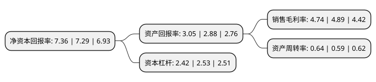

> 本页面由自动化程序生成于 2022年5月20日 01:28
> 内容可能存在错误，如有bug请提交issue至：https://github.com/Eroleice/doc-pi/issues
{.is-warning}

# 上市公司基本情况

## 基本资料

乐山电力股份有限公司（以下简称“乐山电力”）成立于1988年05月17日，乐山市。于1993年04月26日在上交所主板上市。

乐山电力注册资本53,840.066万元，主营业务:电力设施承装，承修，承试(三级)。地方电力开发，经营，本公司电力调度，房地产开发;销售输变电设备，电工器材，交流电动机，载波通信系统设备;公司管辖范围内发供电电能计量装置的检定，校准;电力工程勘察设计;限分公司经营住宿，中餐，卡拉OK歌舞，工艺美术品销售，干洗，糖，烟，酒零售。以下是详细信息：

- 公司名称: 乐山电力股份有限公司
- 股票代码: 600644.SH
- 所在地: 四川 - 乐山市
- 成立日期: 1988年05月17日
- 注册资本: 53,840.066万元
- 法定代表人: 林双庆
- 主营业务: 主营业务:电力设施承装，承修，承试(三级)地方电力开发，经营，本公司电力调度，房地产开发;销售输变电设备，电工器材，交流电动机，载波通信系统设备;公司管辖范围内发供电电能计量装置的检定，校准;电力工程勘察设计;限分公司经营住宿，中餐，卡拉OK歌舞，工艺美术品销售，干洗，糖，烟，酒零售
- 公司官网: www.lsdl600644.com
- 公司介绍: 公司是中国第一家电力股份制企业，乐山市利税大户之一，横跨电力、天然气、自来水以及酒店、光伏新能源等领域。公司拥有相对完整的电力系统，公司网上电站(厂)、用户分布在乐山市和眉山市的8个区、市、县。公司自创建以来，积极发挥体制、机制、人才、技术管理等方面的优势，以科学发展观统领全局，推进公司可持续发展。公司大力开发电源，加强电网建设和经营管理，加强多晶硅产业建设，加强燃气、自来水、煤业、宾馆业市场拓展和优质服务，不断提高公司的经济效益；公司严格按照股份制规范化运作，不断加强内部规范管理，使乐山电力实现了全面、协调、可持续发展。公司先后获得全国模范职工之家、四川省五一劳动奖状、四川省重合同守信誉企业、乐山市劳动模范单位、乐山市十大突出贡献企业等诸多荣誉称号，为乐山经济社会发展做出了应有的努力和贡献。

## 股东及高管情况

上市公司第一大股东为乐山国有资产投资运营(集团)有限公司，持股103,608,320股，占比19.24%，**疑似为**上市公司实际控制人。

截至2022年03月31日，上市公司的前十大股东中，共有5名自然人股东，4名机构股东，1个产品账户，其中5%以上大股东共有4名。上市公司前十大股东明细如下：

> 未能通过持股比例判定出上市公司实际控制人（持股30%以上）
> 可能存在通过间接持股、联合持股、协议控制等方式拥有实际控制权的主体，具体请参考上市公司定期公告！
{.is-warning}

> 截至2022年03月31日，上市公司前十大股东信息如下：

| 股东名称 | 持股数量（股） | 持股比例 |
| --- | --- | --- |
| 乐山国有资产投资运营(集团)有限公司 | 103,608,320 | 19.24% |
| 天津渤海信息产业结构调整股权投资基金有限公司 | 79,470,198 | 14.76% |
| 天津中环资产管理有限公司 | 79,470,198 | 14.76% |
| 国网四川省电力公司 | 78,149,858 | 14.52% |
| 梁晓环 | 2,858,700 | 0.53% |
| 王乐明 | 2,635,719 | 0.49% |
| 赵复生 | 2,163,283 | 0.4% |
| 上海晓光测绘工程技术有限公司 | 1,607,500 | 0.3% |
| 杨建华 | 1,100,000 | 0.2% |
| 徐开东 | 1,100,000 | 0.2% |

## 利润表分析

上市公司2021年总收入为25.71亿元，净利润为1.21亿元，实现盈利。

## 杜邦分析

> 数据列示周期：2021年 | 2020年 | 2019年
{.is-info}

上市公司的净资产收益率在近一年有所上升，上升幅度为0.96%，其变化情况分解如下：
- 上市公司的销售毛利率在近一年下降了-3.07%，可能是生产效率的下降、商品原材料价格上涨或商品价格的下跌所致。
- 上市公司的资产周转率在近一年上升了8.47%，可能是源自于更快的销售回款或库存管理效果提升。
- 上市公司的财务杠杆比率在近一年下降了-4.35%，可能是减少负债降低财务费用。

