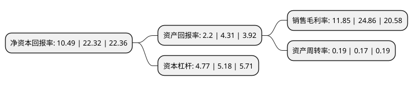

> 本页面由自动化程序生成于 2022年5月20日 01:29
> 内容可能存在错误，如有bug请提交issue至：https://github.com/Eroleice/doc-pi/issues
{.is-warning}

# 上市公司基本情况

## 基本资料

国投电力控股股份有限公司（以下简称“国投电力”）成立于1996年06月18日，北京市。于1996年01月18日在上交所主板上市。

国投电力注册资本745,417.98万元，电力的生产和供应。以下是详细信息：

- 公司名称: 国投电力控股股份有限公司
- 股票代码: 600886.SH
- 所在地: 北京 - 北京市
- 成立日期: 1996年06月18日
- 注册资本: 745,417.98万元
- 法定代表人: 朱基伟
- 主营业务: 电力的生产和供应
- 公司官网: www.sdicpower.com
- 公司介绍: 公司是一家以水电为主、水火并济、风光互补的综合电力上市公司，水电控股装机在国内上市公司中处于行业领先地位。公司经营范围主要包括投资建设、经营管理以电力生产为主的能源项目；开发及经营新能源项目、高新技术、环保产业；开发和经营电力配套产品及信息、咨询服务。其中，发电业务为公司的核心业务，占公司营业总收入95%以上。同时，为适应电力体制改革，公司正在开展以电为主的相关业务拓展。公司作为国家开发投资公司电力业务国内唯一资本运作平台，在公司的发展过程中，得到了国家开发投资公司的鼎力支持，通过资产注入，公司取得了雅砻江水电、国投大朝山等核心资产，实现公司快速做强做大。

## 股东及高管情况

上市公司第一大股东为国家开发投资集团有限公司，持股3,825,443,039股，占比51.32%，为上市公司实际控制人。

截至2022年03月31日，上市公司的前十大股东中，共有1名自然人股东，4名机构股东，3个产品账户，2个海外主体，其中5%以上大股东共有2名。上市公司前十大股东明细如下：

> 截至2022年03月31日，上市公司前十大股东信息如下：

| 股东名称 | 持股数量（股） | 持股比例 |
| --- | --- | --- |
| 国家开发投资集团有限公司 | 3,825,443,039 | 51.32% |
| 中国长江电力股份有限公司 | 1,038,080,914 | 13.93% |
| 长电投资管理有限责任公司 | 240,761,371 | 3.23% |
| 中国证券金融股份有限公司 | 203,657,917 | 2.73% |
| 香港中央结算有限公司(陆股通) | 109,201,892 | 1.46% |
| Citibank, National Association | 82,463,040 | 1.11% |
| 上海重阳战略投资有限公司-重阳战略聚智基金 | 75,687,364 | 1.02% |
| 上海重阳战略投资有限公司-重阳战略汇智基金 | 54,988,628 | 0.74% |
| 龚佑华 | 49,755,073 | 0.67% |
| 上海重阳战略投资有限公司-重阳战略才智基金 | 42,960,137 | 0.58% |

## 利润表分析

上市公司2021年总收入为436.81亿元，净利润为51.75亿元，实现盈利。

## 杜邦分析

> 数据列示周期：2021年 | 2020年 | 2019年
{.is-info}

上市公司的净资产收益率在近一年有所下降，下降幅度为-53%，其变化情况分解如下：
- 上市公司的销售毛利率在近一年下降了-52.33%，可能是生产效率的下降、商品原材料价格上涨或商品价格的下跌所致。
- 上市公司的资产周转率在近一年上升了11.76%，可能是源自于更快的销售回款或库存管理效果提升。
- 上市公司的财务杠杆比率在近一年下降了-7.92%，可能是减少负债降低财务费用。

