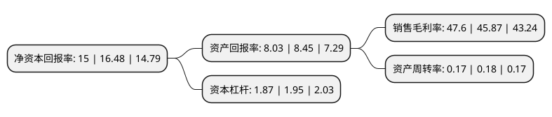

> 本页面由自动化程序生成于 2022年5月20日 01:29
> 内容可能存在错误，如有bug请提交issue至：https://github.com/Eroleice/doc-pi/issues
{.is-warning}

# 上市公司基本情况

## 基本资料

中国长江电力股份有限公司（以下简称“长江电力”）成立于2002年11月04日，北京市。于2003年11月18日在上交所主板上市。

长江电力注册资本2,274,185.923万元，主营业务:电力生产，经营和投资;电力生产技术咨询;水电工程检修维护以下是详细信息：

- 公司名称: 中国长江电力股份有限公司
- 股票代码: 600900.SH
- 所在地: 北京 - 北京市
- 成立日期: 2002年11月04日
- 注册资本: 2,274,185.923万元
- 法定代表人: 雷鸣山
- 主营业务: 主营业务:电力生产，经营和投资;电力生产技术咨询;水电工程检修维护
- 公司官网: www.cypc.com.cn
- 公司介绍: 公司是国内最大的电力上市公司之一，主要从事水力发电业务，运营管理或受托管理三峡电站、葛洲坝电站、溪洛渡电站、向家坝电站等长江流域梯级电站，为社会和经济发展提供优质、稳定、可靠的能源保障。公司秉承精益生产管理理念，以提升流域梯级电站运营管理能力为目标，积极开展梯级水库优化调度，滚动实施设备检修和技术改造，不断提高设备运行可靠性，加强电站在线状态监测，优化设备运行管理，努力提高电站安全稳定运行水平，充分发挥梯级电站综合效益。公司运营管理的流域电站群规模巨大，地位重要，安全生产既是经济需要，又是政治责任。公司紧紧围绕安全生产关键环节、薄弱环节，切实提高安全生产水平。

## 股东及高管情况

上市公司第一大股东为中国长江三峡集团有限公司，持股12,486,540,844股，占比54.91%，为上市公司实际控制人。

截至2022年03月31日，上市公司的前十大股东中，共有6名机构股东，3个产品账户，1个海外主体，其中5%以上大股东共有2名。上市公司前十大股东明细如下：

> 截至2022年03月31日，上市公司前十大股东信息如下：

| 股东名称 | 持股数量（股） | 持股比例 |
| --- | --- | --- |
| 中国长江三峡集团有限公司 | 12,486,540,844 | 54.91% |
| 香港中央结算有限公司(陆股通) | 1,780,876,803 | 7.83% |
| 中国平安人寿保险股份有限公司-传统-普通保险产品 | 988,076,143 | 4.34% |
| 中国三峡建工(集团)有限公司 | 880,000,000 | 3.87% |
| 四川省能源投资集团有限责任公司 | 844,862,100 | 3.72% |
| 云南省能源投资集团有限公司 | 726,053,158 | 3.19% |
| 中国证券金融股份有限公司 | 657,980,472 | 2.89% |
| 阳光人寿保险股份有限公司-吉利两全保险产品 | 420,000,000 | 1.85% |
| 中国核工业集团有限公司 | 261,594,750 | 1.15% |
| 阳光人寿保险股份有限公司-万能保险产品 | 250,000,000 | 1.1% |

## 利润表分析

上市公司2021年总收入为556.46亿元，净利润为264.85亿元，实现盈利。

## 杜邦分析

> 数据列示周期：2021年 | 2020年 | 2019年
{.is-info}

上市公司的净资产收益率在近一年有所下降，下降幅度为-8.98%，其变化情况分解如下：
- 上市公司的销售毛利率在近一年上升了3.77%，可能是生产效率的提升、商品原材料价格下跌或商品价格的上涨所致。
- 上市公司的资产周转率在近一年下降了-5.56%，可能是源自于更慢的销售回款或库存管理效果下降。
- 上市公司的财务杠杆比率在近一年下降了-4.1%，可能是减少负债降低财务费用。

