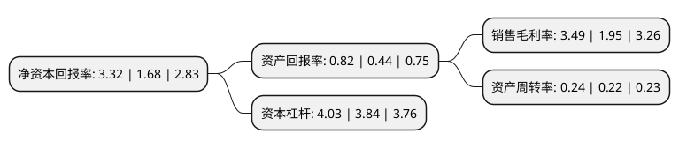

> 本页面由自动化程序生成于 2022年5月20日 01:30
> 内容可能存在错误，如有bug请提交issue至：https://github.com/Eroleice/doc-pi/issues
{.is-warning}

# 上市公司基本情况

## 基本资料

湖南郴电国际发展股份有限公司（以下简称“郴电国际”）成立于2000年12月26日，郴州市。于2004年04月08日在上交所主板上市。

郴电国际注册资本37,005.048万元，主营业务除电力供应外，还包括供水业务以及工业气体，余热发电，水力发电投资业务等。以下是详细信息：

- 公司名称: 湖南郴电国际发展股份有限公司
- 股票代码: 600969.SH
- 所在地: 湖南 - 郴州市
- 成立日期: 2000年12月26日
- 注册资本: 37,005.048万元
- 法定代表人: 范培顺
- 主营业务: 主营业务除电力供应外，还包括供水业务以及工业气体，余热发电，水力发电投资业务等
- 公司官网: www.chinacdi.com
- 公司介绍: 公司由原郴州、宜章、临武、汝城、永兴电力公司及联合国工发组织国际小水电中心，是联合国国际小水电中心设立的第一个世界范围内小水电示范基地“郴州基地”的承办方。公司主营电力供应、城市供水及工业气体生产，兼营中小水电综合开发和小水电国际交流及信息咨询。公司下辖郴州、宜章、临武、汝城、永兴等多个分公司，拥有郴州市自来水公司、汇银投资公司、水电投资公司、郴电科技、上海裕旺投资公司、云南临沧郴电水电投资公司、邯郸郴电电力能源有限责任公司等子公司，以及江苏常州、河北唐山、江西新余、德能水电、德能湘江等二级子公司，规模大。

## 股东及高管情况

上市公司第一大股东为郴州市发展投资集团有限公司，持股74,483,362股，占比20.13%，**疑似为**上市公司实际控制人。

截至2022年03月31日，上市公司的前十大股东中，共有2名自然人股东，7名机构股东，1个产品账户，其中5%以上大股东共有3名。上市公司前十大股东明细如下：

> 未能通过持股比例判定出上市公司实际控制人（持股30%以上）
> 可能存在通过间接持股、联合持股、协议控制等方式拥有实际控制权的主体，具体请参考上市公司定期公告！
{.is-warning}

> 截至2022年03月31日，上市公司前十大股东信息如下：

| 股东名称 | 持股数量（股） | 持股比例 |
| --- | --- | --- |
| 郴州市发展投资集团有限公司 | 74,483,362 | 20.13% |
| 汝城县水电有限责任公司 | 29,153,971 | 7.88% |
| 宜章县电力有限责任公司 | 22,101,684 | 5.97% |
| 永兴县水利电力有限责任公司 | 12,067,687 | 3.26% |
| 永兴银都投资发展集团有限公司 | 11,774,993 | 3.18% |
| 宁波宁聚资产管理中心(有限合伙)-融通5号证券投资基金 | 10,500,000 | 2.84% |
| 临武县水利电力有限责任公司 | 6,809,449 | 1.84% |
| 湖南省国有投资经营有限公司 | 4,599,784 | 1.24% |
| 彭伟燕 | 2,496,340 | 0.67% |
| 李福林 | 2,075,401 | 0.56% |

## 利润表分析

上市公司2021年总收入为34.11亿元，净利润为1.19亿元，实现盈利。

## 杜邦分析

> 数据列示周期：2021年 | 2020年 | 2019年
{.is-info}

上市公司的净资产收益率在近一年有所上升，上升幅度为97.62%，其变化情况分解如下：
- 上市公司的销售毛利率在近一年上升了78.97%，可能是生产效率的提升、商品原材料价格下跌或商品价格的上涨所致。
- 上市公司的资产周转率在近一年上升了9.09%，可能是源自于更快的销售回款或库存管理效果提升。
- 上市公司的财务杠杆比率在近一年上升了4.95%，可能是增加负债扩大生产规模。

