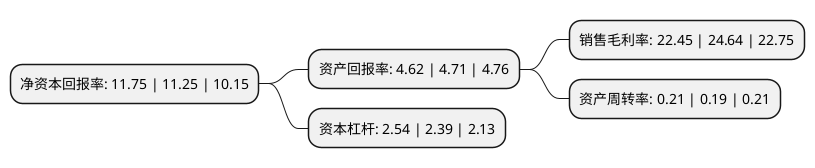

> 本页面由自动化程序生成于 2022年5月20日 01:02
> 内容可能存在错误，如有bug请提交issue至：https://github.com/Eroleice/doc-pi/issues
{.is-warning}

# 上市公司基本情况

## 基本资料

成都市兴蓉环境股份有限公司（以下简称“兴蓉环境”）成立于1996年05月26日，成都市。于1996年05月29日在深交所主板上市。

兴蓉环境注册资本298,621.86万元，主营业务:污水处理以下是详细信息：

- 公司名称: 成都市兴蓉环境股份有限公司
- 股票代码: 000598.SZ
- 所在地: 四川 - 成都市
- 成立日期: 1996年05月26日
- 注册资本: 298,621.86万元
- 法定代表人: 李本文
- 主营业务: 主营业务:污水处理
- 公司官网: www.cdxrec.com
- 公司介绍: 公司是中国大型水务环保综合服务商，主要从事自来水生产与供应、污水处理、中水利用、污泥处置、垃圾渗滤液处理和垃圾焚烧发电等业务，集投资、研发、设计、建设、运营于一体，拥有完善的产业链。公司以民生保障为己任、生态环境保护为目标，坚持可持续发展的理念，致力为客户提供先进的水务环保运营管理、废弃物处置、资源循环利用等综合解决方案。公司积极融入国家“一带一路”战略，坚定不移“走出去”，积极跟进境外水务环保投资项目，不断推进与印度、巴基斯坦、泰国、美国等国家的合资合作，逐步形成依托成都、辐射全国、面向海外，多点、多极协同发展的良好态势和业务版图。公司积极对标国际，所有生产厂均取得ISO9001、ISO14001、OHSAS18001资格认证，确保产品和服务符合国际和国家标准。

## 股东及高管情况

上市公司第一大股东为成都环境投资集团有限公司，持股1,259,605,494股，占比42.18%，为上市公司实际控制人。

截至2022年03月31日，上市公司的前十大股东中，共有2名自然人股东，4名机构股东，3个产品账户，1个海外主体，其中5%以上大股东共有2名。上市公司前十大股东明细如下：

> 截至2022年03月31日，上市公司前十大股东信息如下：

| 股东名称 | 持股数量（股） | 持股比例 |
| --- | --- | --- |
| 成都环境投资集团有限公司 | 1,259,605,494 | 42.18% |
| 三峡资本控股有限责任公司 | 357,409,205 | 11.97% |
| 长江生态环保集团有限公司 | 91,041,592 | 3.05% |
| 香港中央结算有限公司(陆股通) | 66,448,602 | 2.23% |
| 中央汇金资产管理有限责任公司 | 52,773,500 | 1.77% |
| 刘在京 | 32,515,773 | 1.09% |
| 刘志强 | 16,330,990 | 0.55% |
| 中国农业银行股份有限公司-中证500交易型开放式指数证券投资基金 | 8,524,540 | 0.29% |
| 中信证券股份有限公司-易方达中证长江保护主题交易型开放式指数证券投资基金 | 6,346,800 | 0.21% |
| 中国农业银行股份有限公司-南方中证长江保护主题交易型开放式指数证券投资基金 | 6,021,900 | 0.2% |

## 利润表分析

上市公司2021年总收入为67.32亿元，净利润为15.11亿元，实现盈利。

## 杜邦分析

> 数据列示周期：2021年 | 2020年 | 2019年
{.is-info}

上市公司的净资产收益率在近一年有所上升，上升幅度为4.44%，其变化情况分解如下：
- 上市公司的销售毛利率在近一年下降了-8.89%，可能是生产效率的下降、商品原材料价格上涨或商品价格的下跌所致。
- 上市公司的资产周转率在近一年上升了10.53%，可能是源自于更快的销售回款或库存管理效果提升。
- 上市公司的财务杠杆比率在近一年上升了6.28%，可能是增加负债扩大生产规模。

