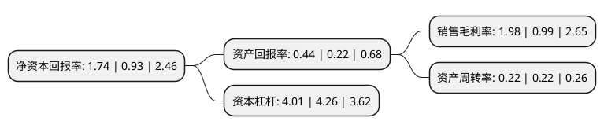

> 本页面由自动化程序生成于 2022年5月20日 01:02
> 内容可能存在错误，如有bug请提交issue至：https://github.com/Eroleice/doc-pi/issues
{.is-warning}

# 上市公司基本情况

## 基本资料

渤海水业股份有限公司（以下简称“渤海股份”）成立于1996年09月10日，北京市。于1996年09月13日在深交所主板上市。

渤海股份注册资本35,265.86万元，主营业务:水务相关业务。以下是详细信息：

- 公司名称: 渤海水业股份有限公司
- 股票代码: 000605.SZ
- 所在地: 北京 - 北京市
- 成立日期: 1996年09月10日
- 注册资本: 35,265.86万元
- 法定代表人: 王立林
- 主营业务: 主营业务:水务相关业务
- 公司官网: www.bohai-water.com
- 公司介绍: 公司主营原水与自来水供应、水环境治理等水务类业务，具体包括原水开发供应、区域间调水、粗质水、自来水生产及输送、优质地下水高附加值经营、直饮水、海水淡化利用、水环境治理、河道水资源化、城镇集中式供水、水务新技术研发应用、水务基础设施投资建设及运营管理等。在污水处理领域，公司与嘉诚环保实现了在市场、区域、团队方面的高效协同，迅速完成公司在污水处理领域的产业延伸和布局，扩大了公司的业务覆盖区域，快速提升了公司的业务规模，现公司的污水处理业务主要分布在天津、河北和广西等地。

## 股东及高管情况

上市公司第一大股东为天津兴津企业管理有限公司，持股79,200,321股，占比22.46%，**疑似为**上市公司实际控制人。

截至2022年03月31日，上市公司的前十大股东中，共有2名自然人股东，5名机构股东，1个产品账户，1个海外主体，1名其他股东，其中5%以上大股东共有3名。上市公司前十大股东明细如下：

> 未能通过持股比例判定出上市公司实际控制人（持股30%以上）
> 可能存在通过间接持股、联合持股、协议控制等方式拥有实际控制权的主体，具体请参考上市公司定期公告！
{.is-warning}

> 截至2022年03月31日，上市公司前十大股东信息如下：

| 股东名称 | 持股数量（股） | 持股比例 |
| --- | --- | --- |
| 天津兴津企业管理有限公司 | 79,200,321 | 22.46% |
| 天津泰达投资控股有限公司 | 45,868,731 | 13.01% |
| 李华青 | 20,019,883 | 5.68% |
| 天津市水利经济管理办公室 | 16,990,862 | 4.82% |
| 北京宏儒和愉投资管理有限公司-苏州弘德源投资管理中心(有限合伙) | 14,012,200 | 3.97% |
| 天津渤海发展股权投资基金有限公司 | 10,986,742 | 3.12% |
| 石家庄合力投资咨询中心(有限合伙) | 6,444,444 | 1.83% |
| JPMORGAN CHASE BANK,NATIONAL ASSOCIATION | 2,063,293 | 0.59% |
| 翟育豹 | 1,674,500 | 0.47% |
| 中国国际金融香港资产管理有限公司-客户资金2 | 1,554,535 | 0.44% |

## 利润表分析

上市公司2021年总收入为18.12亿元，净利润为0.35亿元，实现盈利。

## 杜邦分析

> 数据列示周期：2021年 | 2020年 | 2019年
{.is-info}

上市公司的净资产收益率在近一年有所上升，上升幅度为87.1%，其变化情况分解如下：
- 上市公司的销售毛利率在近一年上升了100%，可能是生产效率的提升、商品原材料价格下跌或商品价格的上涨所致。
- 上市公司的资产周转率在近一年下降了0%，可能是源自于更慢的销售回款或库存管理效果下降。
- 上市公司的财务杠杆比率在近一年下降了-5.87%，可能是减少负债降低财务费用。

