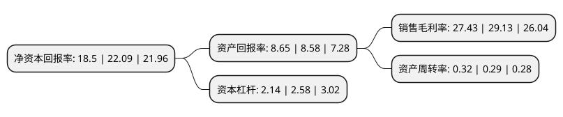

> 本页面由自动化程序生成于 2022年5月20日 01:14
> 内容可能存在错误，如有bug请提交issue至：https://github.com/Eroleice/doc-pi/issues
{.is-warning}

# 上市公司基本情况

## 基本资料

广东顺控发展股份有限公司（以下简称“顺控发展”）成立于1992年09月23日，佛山市。于2021年03月08日在深交所中小板上市。

顺控发展注册资本61,751.873万元，主营业务为自来水制售，供排水管网工程和垃圾焚烧发电。以下是详细信息：

- 公司名称: 广东顺控发展股份有限公司
- 股票代码: 003039.SZ
- 所在地: 广东 - 佛山市
- 成立日期: 1992年09月23日
- 注册资本: 61,751.873万元
- 法定代表人: 陈海燕
- 主营业务: 主营业务为自来水制售，供排水管网工程和垃圾焚烧发电
- 公司官网: www.gdskfz.com
- 公司介绍: 公司自成立以来专注于自来水制售业务，并在供水区域内提供配套的供排水管网工程服务。为扩展业务范围、践行城市综合环境服务商的发展战略，公司报告期内依法取得了垃圾焚烧发电项目的特许经营权。2018年9月以来，随着该项目逐步试运营，公司新增垃圾焚烧发电业务收入。公司主营业务为自来水制售、供排水管网工程和垃圾焚烧发电。其中，公司自来水制售业务由母公司顺控发展及子公司水业控股实施，供排水管网工程服务主要围绕自来水制售业务开展；垃圾焚烧发电业务由子公司顺控环投负责。报告期内，公司主营业务收入占各期营业收入比例均超过96%，主营业务突出且呈逐年增长态势。

## 股东及高管情况

上市公司第一大股东为广东顺德控股集团有限公司，持股488,203,155股，占比79.06%，为上市公司实际控制人。

截至2022年03月31日，上市公司的前十大股东中，共有4名自然人股东，4名机构股东，1个产品账户，1个海外主体，其中5%以上大股东共有1名。上市公司前十大股东明细如下：

> 截至2022年03月31日，上市公司前十大股东信息如下：

| 股东名称 | 持股数量（股） | 持股比例 |
| --- | --- | --- |
| 广东顺德控股集团有限公司 | 488,203,155 | 79.06% |
| 广东省科技创业投资有限公司 | 27,377,521 | 4.43% |
| 广东粤科路赢创业投资合伙企业(有限合伙) | 17,848,312 | 2.89% |
| 横琴粤科鑫泰专项壹号股权投资基金(有限合伙) | 11,880,100 | 1.92% |
| 佛山市顺德区顺合公路建设有限公司 | 6,796,845 | 1.1% |
| 吴汉忠 | 1,787,600 | 0.29% |
| 何云敏 | 1,678,841 | 0.27% |
| 王成 | 680,057 | 0.11% |
| 香港中央结算有限公司(陆股通) | 661,058 | 0.11% |
| 彭文祥 | 449,200 | 0.07% |

## 利润表分析

上市公司2021年总收入为13.38亿元，净利润为3.67亿元，实现盈利。

## 杜邦分析

> 数据列示周期：2021年 | 2020年 | 2019年
{.is-info}

上市公司的净资产收益率在近一年有所下降，下降幅度为-16.25%，其变化情况分解如下：
- 上市公司的销售毛利率在近一年下降了-5.84%，可能是生产效率的下降、商品原材料价格上涨或商品价格的下跌所致。
- 上市公司的资产周转率在近一年上升了10.34%，可能是源自于更快的销售回款或库存管理效果提升。
- 上市公司的财务杠杆比率在近一年下降了-17.05%，可能是减少负债降低财务费用。

