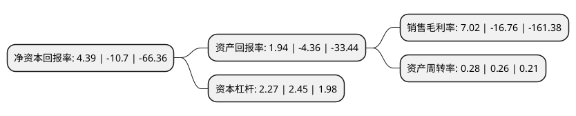

> 本页面由自动化程序生成于 2022年5月20日 01:16
> 内容可能存在错误，如有bug请提交issue至：https://github.com/Eroleice/doc-pi/issues
{.is-warning}

# 上市公司基本情况

## 基本资料

天津膜天膜科技股份有限公司（以下简称“津膜科技”）成立于2003年05月21日，天津市。于2012年07月05日在深交所创业板上市。

津膜科技注册资本30,206.536万元，主要产品:本公司的主要产品包括:PVDF，PES，PS，PAN，PE等材质的中空纤维内，外压型膜组件及成套装置，适用于市政，电力，钢铁，石化，纺织，食品等领域污水深度处理回用，市政给水，食品，生物制药等领域净化，浓缩及分离处理等。以下是详细信息：

- 公司名称: 天津膜天膜科技股份有限公司
- 股票代码: 300334.SZ
- 所在地: 天津 - 天津市
- 成立日期: 2003年05月21日
- 注册资本: 30,206.536万元
- 法定代表人: 范宁
- 主营业务: 主要产品:本公司的主要产品包括:PVDF，PES，PS，PAN，PE等材质的中空纤维内，外压型膜组件及成套装置，适用于市政，电力，钢铁，石化，纺织，食品等领域污水深度处理回用，市政给水，食品，生物制药等领域净化，浓缩及分离处理等
- 公司官网: www.motimo.com
- 公司介绍: 公司是一家拥有膜产品研发、生产、膜设备制造、膜应用工程设计施工和运营服务完整产业链的高科技企业。公司主要从事超、微滤膜及膜组件的研发、生产和销售，并以此为基础向客户提供专业膜法水资源化整体解决方案，包括技术方案设计、工艺设计、咨询与实施、膜单元装备集成及系统集成、运营技术支持与售后服务等。公司承担了包括国家“863”计划“高性能聚烯烃中空纤维超/微滤膜制备关键技术”项目在内的多项国家和省部级技术研究项目和产业化项目，并主持了“中空纤维帘式膜组件”国家标准、“帘式中空纤维膜组件”和“连续膜过滤水处理装置”海洋行业等标准的制订。

## 股东及高管情况

上市公司第一大股东为天津膜天膜工程技术有限公司，持股64,004,465股，占比21.19%，**疑似为**上市公司实际控制人。

截至2022年03月31日，上市公司的前十大股东中，共有5名自然人股东，5名机构股东，其中5%以上大股东共有3名。上市公司前十大股东明细如下：

> 未能通过持股比例判定出上市公司实际控制人（持股30%以上）
> 可能存在通过间接持股、联合持股、协议控制等方式拥有实际控制权的主体，具体请参考上市公司定期公告！
{.is-warning}

> 截至2022年03月31日，上市公司前十大股东信息如下：

| 股东名称 | 持股数量（股） | 持股比例 |
| --- | --- | --- |
| 天津膜天膜工程技术有限公司 | 64,004,465 | 21.19% |
| 华益科技国际(英属维尔京群岛)有限公司 | 31,409,000 | 10.4% |
| 高新投资发展有限公司 | 30,750,200 | 10.18% |
| 寿稚岗 | 6,859,500 | 2.27% |
| 河北建投水务投资有限公司 | 4,489,435 | 1.49% |
| 盛达金属资源股份有限公司 | 1,736,372 | 0.57% |
| 芦卫娟 | 1,100,000 | 0.36% |
| 蔡维津 | 1,090,800 | 0.36% |
| 李新民 | 930,400 | 0.31% |
| 寿刚 | 923,900 | 0.31% |

## 利润表分析

上市公司2021年总收入为4.73亿元，净利润为0.33亿元，实现盈利。

## 杜邦分析

> 数据列示周期：2021年 | 2020年 | 2019年
{.is-info}

上市公司的净资产收益率在近一年有所下降，下降幅度为-141.03%，其变化情况分解如下：
- 上市公司的销售毛利率在近一年下降了-141.89%，可能是生产效率的下降、商品原材料价格上涨或商品价格的下跌所致。
- 上市公司的资产周转率在近一年上升了7.69%，可能是源自于更快的销售回款或库存管理效果提升。
- 上市公司的财务杠杆比率在近一年下降了-7.35%，可能是减少负债降低财务费用。

