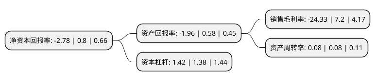

> 本页面由自动化程序生成于 2022年5月20日 01:24
> 内容可能存在错误，如有bug请提交issue至：https://github.com/Eroleice/doc-pi/issues
{.is-warning}

# 上市公司基本情况

## 基本资料

黑龙江国中水务股份有限公司（以下简称“国中水务”）成立于1998年11月03日，哈尔滨市。于1998年11月11日在上交所主板上市。

国中水务注册资本165,393.513万元，主营业务:城市市政供排水以下是详细信息：

- 公司名称: 黑龙江国中水务股份有限公司
- 股票代码: 600187.SH
- 所在地: 黑龙江 - 哈尔滨市
- 成立日期: 1998年11月03日
- 注册资本: 165,393.513万元
- 法定代表人: 张彦
- 主营业务: 主营业务:城市市政供排水
- 公司官网: www.interchinawater.com
- 公司介绍: 公司主要从事建设、经营城市市政工程、生态环境治理工程；相关技术和设备的开发、生产与销售；并提供水务工程领域的技术咨询服务。凭借先入优势，公司较早形成了水务行业高质量的战略联盟，以及独特的企业法权结构、综合成本、专业团队等竞争优势，通过与国内行业居领导地位的翘楚合作,借助其市场渠道快速扩张水务投资业务，业务遍布河北、山西、内蒙古、青海、陕西、安徽、山东等全国各地。公司拥有一支优秀的领导班子和专业团队，吸纳了几十名高级环保工程、工控和给排水专业人才，积累了丰富的项目运营和管理经验。旗下控股子公司“中科国益环保工程有限公司”是国内最具实力的工业污水处理解决方案和服务提供商之一，尤其在化工／石化领域拥有多个发明专利和专有技术。公司成功实施超过40个大型的Turn-key(向客户提供的总体解决方案)项目，以及多个BOT、TOT项目。

## 股东及高管情况

上市公司第一大股东为国中(天津)水务有限公司，持股227,312,500股，占比13.74%，**疑似为**上市公司实际控制人。

截至2022年03月31日，上市公司的前十大股东中，共有5名自然人股东，3名机构股东，2个产品账户，其中5%以上大股东共有2名。上市公司前十大股东明细如下：

> 未能通过持股比例判定出上市公司实际控制人（持股30%以上）
> 可能存在通过间接持股、联合持股、协议控制等方式拥有实际控制权的主体，具体请参考上市公司定期公告！
{.is-warning}

> 截至2022年03月31日，上市公司前十大股东信息如下：

| 股东名称 | 持股数量（股） | 持股比例 |
| --- | --- | --- |
| 国中(天津)水务有限公司 | 227,312,500 | 13.74% |
| 拉萨经济技术开发区厚康实业有限公司 | 158,648,700 | 9.59% |
| 黑龙江国中水务股份有限公司回购专用证券账户 | 40,154,025 | 2.43% |
| 拉萨经济技术开发区永冠贸易有限公司 | 39,662,200 | 2.4% |
| 陈开同 | 17,074,927 | 1.03% |
| 倪滨江 | 7,500,000 | 0.45% |
| 陈言上 | 7,493,850 | 0.45% |
| 乐小妹 | 7,470,500 | 0.45% |
| 上海方圆达创投资合伙企业(有限合伙)-方圆-东方11号私募投资基金 | 7,409,700 | 0.45% |
| 陈慧 | 5,968,600 | 0.36% |

## 利润表分析

上市公司2021年总收入为3.84亿元，净利润为-0.94亿元，**未实现盈利**。

## 杜邦分析

> 数据列示周期：2021年 | 2020年 | 2019年
{.is-info}

上市公司的净资产收益率在近一年有所下降，下降幅度为-447.5%，其变化情况分解如下：
- 上市公司的销售毛利率在近一年下降了-437.92%，可能是生产效率的下降、商品原材料价格上涨或商品价格的下跌所致。
- 上市公司的资产周转率在近一年下降了0%，可能是源自于更慢的销售回款或库存管理效果下降。
- 上市公司的财务杠杆比率在近一年上升了2.9%，可能是增加负债扩大生产规模。

