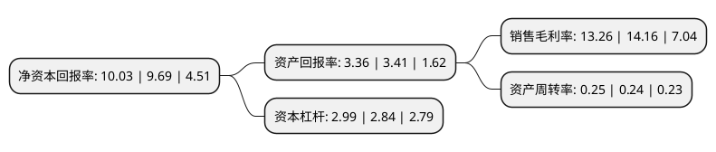

> 本页面由自动化程序生成于 2022年5月20日 01:25
> 内容可能存在错误，如有bug请提交issue至：https://github.com/Eroleice/doc-pi/issues
{.is-warning}

# 上市公司基本情况

## 基本资料

钱江水利开发股份有限公司（以下简称“钱江水利”）成立于1998年12月30日，杭州市。于2000年10月18日在上交所主板上市。

钱江水利注册资本35,299.576万元，主要业务:水的生产，供应及水力发电。以下是详细信息：

- 公司名称: 钱江水利开发股份有限公司
- 股票代码: 600283.SH
- 所在地: 浙江 - 杭州市
- 成立日期: 1998年12月30日
- 注册资本: 35,299.576万元
- 法定代表人: 叶建桥
- 主营业务: 水的生产，供应及水力发电
- 公司官网: www.qjwater.com
- 公司介绍: 公司是浙江省水利系统龙头企业，以城市供水和水力发电为主营业务，兼顾房地产开发，形成了水务投资运营、房地产开发、创业投资等业务体系，涉及水务产业链从原水、制水、配水到污水处理。多年来，公司积极拓宽水务主业发展思路，加快水务主业发展步伐，扎实推进重大项目建设管理，努力提升公司水务主业的规模及管理水平，加强房地产和创投业务的风险管理，同时深化内部管理工作，促进公司稳步规范发展。公司主要从事自来水的生产和供应，同时经营污水处理和市政自来水管道安装业务。公司供水业务涵盖供水服务全产业链，包括原水、制水、输水到终端客户服务。

## 股东及高管情况

上市公司第一大股东为中国水务投资有限公司，持股118,436,629股，占比33.55%，为上市公司实际控制人。

截至2022年03月31日，上市公司的前十大股东中，共有4名自然人股东，4名机构股东，1个产品账户，1个海外主体，其中5%以上大股东共有3名。上市公司前十大股东明细如下：

> 截至2022年03月31日，上市公司前十大股东信息如下：

| 股东名称 | 持股数量（股） | 持股比例 |
| --- | --- | --- |
| 中国水务投资有限公司 | 118,436,629 | 33.55% |
| 浙江省新能源投资集团股份有限公司 | 89,802,172 | 25.44% |
| 钱江硅谷控股有限责任公司 | 22,729,832 | 6.44% |
| 浙江省水电实业公司 | 16,077,044 | 4.55% |
| 中国建设银行股份有限公司-广发科技创新混合型证券投资基金 | 2,842,600 | 0.81% |
| 刘桂琴 | 2,099,400 | 0.59% |
| 叶德资 | 1,769,642 | 0.5% |
| 高建勇 | 1,542,105 | 0.44% |
| 钱荣光 | 1,309,900 | 0.37% |
| JPMORGAN CHASE BANK,NATIONAL ASSOCIATION | 1,260,594 | 0.36% |

## 利润表分析

上市公司2021年总收入为15.38亿元，净利润为2.03亿元，实现盈利。

## 杜邦分析

> 数据列示周期：2021年 | 2020年 | 2019年
{.is-info}

上市公司的净资产收益率在近一年有所上升，上升幅度为3.51%，其变化情况分解如下：
- 上市公司的销售毛利率在近一年下降了-6.36%，可能是生产效率的下降、商品原材料价格上涨或商品价格的下跌所致。
- 上市公司的资产周转率在近一年上升了4.17%，可能是源自于更快的销售回款或库存管理效果提升。
- 上市公司的财务杠杆比率在近一年上升了5.28%，可能是增加负债扩大生产规模。

