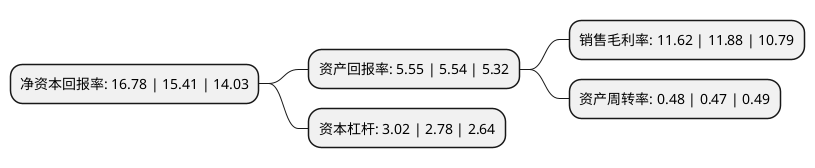

> 本页面由自动化程序生成于 2022年5月20日 01:26
> 内容可能存在错误，如有bug请提交issue至：https://github.com/Eroleice/doc-pi/issues
{.is-warning}

# 上市公司基本情况

## 基本资料

江西洪城环境股份有限公司（以下简称“洪城环境”）成立于2001年01月22日，南昌市。于2004年06月01日在上交所主板上市。

洪城环境注册资本95,283.814万元，主营业务:自来水的生产和销售，城市污水处理，燃气能源，工程及其他业务以下是详细信息：

- 公司名称: 江西洪城环境股份有限公司
- 股票代码: 600461.SH
- 所在地: 江西 - 南昌市
- 成立日期: 2001年01月22日
- 注册资本: 95,283.814万元
- 法定代表人: 邵涛
- 主营业务: 主营业务:自来水的生产和销售，城市污水处理，燃气能源，工程及其他业务
- 公司官网: www.jxhcsy.com
- 公司介绍: 公司为一家主要从事自来水供应的企业，经营自来水供应、纯净水与水质净化剂生产与销售、城市污水处理等业务，拥有青云水厂、朝阳水厂、下正街水厂、长堎水厂四个水厂，在南昌市拥有垄断的供水业务。目前公司拥有国内外先进的制水工艺设施和自动化控制系统，同时拥有一流的水质监控手段和完善的质量保证体系，其水质稳定达到和超过国家生活饮用水标准。

## 股东及高管情况

上市公司第一大股东为南昌水业集团有限责任公司，持股365,431,172股，占比35.16%，为上市公司实际控制人。

截至2022年04月18日，上市公司的前十大股东中，共有1名自然人股东，6名机构股东，3个产品账户，其中5%以上大股东共有5名。上市公司前十大股东明细如下：

> 截至2022年04月18日，上市公司前十大股东信息如下：

| 股东名称 | 持股数量（股） | 持股比例 |
| --- | --- | --- |
| 南昌水业集团有限责任公司 | 365,431,172 | 35.16% |
| 南昌水业集团有限责任公司 | 278,959,551 | 29.28% |
| 南昌市政公用投资控股有限责任公司 | 175,132,822 | 16.85% |
| 南昌市政公用投资控股有限责任公司 | 175,132,822 | 18.38% |
| 上海星河数码投资有限公司 | 50,105,336 | 5.26% |
| 南昌市政投资集团有限公司 | 39,473,385 | 4.14% |
| 兴业银行股份有限公司-天弘永利债券型证券投资基金 | 9,087,200 | 0.95% |
| 招商银行股份有限公司-兴业兴睿两年持有期混合型证券投资基金 | 7,000,000 | 0.73% |
| 任毅 | 4,711,849 | 0.49% |
| 中国太平洋人寿保险股份有限公司-中国太平洋人寿股票红利型产品(寿自营)委托投资(长江养老) | 4,400,000 | 0.46% |

## 利润表分析

上市公司2021年总收入为81.74亿元，净利润为9.49亿元，实现盈利。

## 杜邦分析

> 数据列示周期：2021年 | 2020年 | 2019年
{.is-info}

上市公司的净资产收益率在近一年有所上升，上升幅度为8.89%，其变化情况分解如下：
- 上市公司的销售毛利率在近一年下降了-2.19%，可能是生产效率的下降、商品原材料价格上涨或商品价格的下跌所致。
- 上市公司的资产周转率在近一年上升了2.13%，可能是源自于更快的销售回款或库存管理效果提升。
- 上市公司的财务杠杆比率在近一年上升了8.63%，可能是增加负债扩大生产规模。

