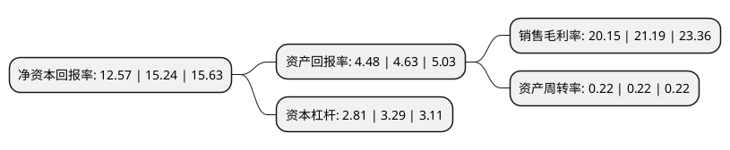

> 本页面由自动化程序生成于 2022年5月20日 01:35
> 内容可能存在错误，如有bug请提交issue至：https://github.com/Eroleice/doc-pi/issues
{.is-warning}

# 上市公司基本情况

## 基本资料

海天水务集团股份公司（以下简称“海天股份”）成立于2008年03月07日，成都市。于2021年03月26日在上交所主板上市。

海天股份注册资本31,200万元，主要从事供水及污水处理业务。以下是详细信息：

- 公司名称: 海天水务集团股份公司
- 股票代码: 603759.SH
- 所在地: 四川 - 成都市
- 成立日期: 2008年03月07日
- 注册资本: 31,200万元
- 法定代表人: 费俊杰
- 主营业务: 主要从事供水及污水处理业务
- 公司官网: www.haitianshuiwu.com
- 公司介绍: 公司是以供水业务及污水处理业务为主营业务的综合环境服务运营商，公司秉持“海天水务，为民服务”的理念和“改善环境，造福社会”的宗旨，形成了集科研、供排水、资源循环利用为一体的现代综合服务产业链，在四川、河南、云南、新疆等地拥有多家控股子公司，公司在特许经营权范围内提供供水及污水处理设施的投资建设、运营管理及维护等服务，通过对项目的长期运营，在特许经营期内获得持续的投资回报和稳定的现金流入。供水业务主要包括自来水销售和户表安装，污水处理业务主要负责对城市及乡镇管网收集的污水进行集中处理，达标后排放。公司从成立至今，一直专注于水务行业投资建设、运营管理及维护。海天集团坚持通过良好管理和持续研发创新提升运营质量和稳定性，已赢得了良好的市场口碑，先后获得了由国家发改委颁发的“国家认定企业技术中心”，国家人力资源和社会保障部、全国博士后管委会颁发的“国家级博士后科研工作站”，国家科技部颁发的“国家技术转移示范机构”，经四川省发展和改革委员会确认的“四川省城镇污水处理技术工程实验室”，四川省人力资源和社会保障厅颁发的“博士后创新实践基地”等荣誉称号。

## 股东及高管情况

上市公司第一大股东为四川海天投资有限责任公司，持股171,297,230股，占比54.9%，为上市公司实际控制人。

截至2022年03月31日，上市公司的前十大股东中，共有4名自然人股东，6名机构股东，其中5%以上大股东共有2名。上市公司前十大股东明细如下：

> 截至2022年03月31日，上市公司前十大股东信息如下：

| 股东名称 | 持股数量（股） | 持股比例 |
| --- | --- | --- |
| 四川海天投资有限责任公司 | 171,297,230 | 54.9% |
| 四川和邦投资集团有限公司 | 30,000,000 | 9.62% |
| 李勇 | 10,445,100 | 3.35% |
| 成都鼎建新材料合伙企业(有限合伙) | 9,137,470 | 2.93% |
| 费伟 | 5,780,200 | 1.85% |
| 成都大昭添澄企业管理中心(有限合伙) | 3,000,000 | 0.96% |
| 彭本平 | 2,340,000 | 0.75% |
| 四川巨星企业集团有限公司 | 1,000,000 | 0.32% |
| 量石投资有限公司 | 1,000,000 | 0.32% |
| 刘雅琴 | 400,039 | 0.13% |

## 利润表分析

上市公司2021年总收入为10.83亿元，净利润为2.18亿元，实现盈利。

## 杜邦分析

> 数据列示周期：2021年 | 2020年 | 2019年
{.is-info}

上市公司的净资产收益率在近一年有所下降，下降幅度为-17.52%，其变化情况分解如下：
- 上市公司的销售毛利率在近一年下降了-4.91%，可能是生产效率的下降、商品原材料价格上涨或商品价格的下跌所致。
- 上市公司的资产周转率在近一年下降了0%，可能是源自于更慢的销售回款或库存管理效果下降。
- 上市公司的财务杠杆比率在近一年下降了-14.59%，可能是减少负债降低财务费用。

