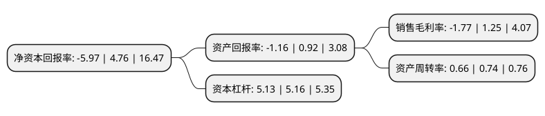

> 本页面由自动化程序生成于 2022年5月20日 01:01
> 内容可能存在错误，如有bug请提交issue至：https://github.com/Eroleice/doc-pi/issues
{.is-warning}

# 上市公司基本情况

## 基本资料

深圳市天地(集团)股份有限公司（以下简称“深天地A”）成立于1984年11月16日，深圳市。于1993年04月29日在深交所主板上市。

深天地A注册资本13,875.624万元，主要产品:商品混凝土，碎石以下是详细信息：

- 公司名称: 深圳市天地(集团)股份有限公司
- 股票代码: 000023.SZ
- 所在地: 广东 - 深圳市
- 成立日期: 1984年11月16日
- 注册资本: 13,875.624万元
- 法定代表人: 林宏润
- 主营业务: 主要产品:商品混凝土，碎石
- 公司官网: www.sztiandi.com
- 公司介绍: 公司是全国第一家以商品混凝土为主业的上市公司，主要业务涉及商品混凝土、房地产开发及物业管理等，目前业务已扩展至湖南、陕西、江苏等地。公司在深圳和湖南均建有专业商品混凝土生产基地，可生产各种强度等级的普通混凝土和特种混凝土以及预拌砂浆，其中在预拌砂浆技术方面位居领先地位。长期以来，为深圳许多重点工程、地标建筑提供了大量优质商品混凝土，产品已覆盖整个深圳市，进入湖南株洲市场后，为当地的重点和样板工程提供了优质混凝土。市场占有率居深圳、株洲地区前列。公司秉承“一流的产品质量，一流的服务水平”的宗旨，规范和加强内部管理，培育优秀的企业文化，充分发挥资源、设备、技术、品牌共享的优势，进一步拓展新的生产基地，扩大市场占有率，拓展房地产开发项目，步入了良性、稳健发展的快车道。

## 股东及高管情况

上市公司第一大股东为广东君浩股权投资控股有限公司，持股38,000,000股，占比27.39%，**疑似为**上市公司实际控制人。

截至2022年03月31日，上市公司的前十大股东中，共有4名自然人股东，6名机构股东，其中5%以上大股东共有3名。上市公司前十大股东明细如下：

> 未能通过持股比例判定出上市公司实际控制人（持股30%以上）
> 可能存在通过间接持股、联合持股、协议控制等方式拥有实际控制权的主体，具体请参考上市公司定期公告！
{.is-warning}

> 截至2022年03月31日，上市公司前十大股东信息如下：

| 股东名称 | 持股数量（股） | 持股比例 |
| --- | --- | --- |
| 广东君浩股权投资控股有限公司 | 38,000,000 | 27.39% |
| 深圳科杰斯投资有限公司 | 13,875,708 | 10% |
| 深圳市投资控股有限公司 | 9,593,716 | 6.91% |
| 昌都市高腾企业管理股份有限公司 | 6,300,000 | 4.54% |
| 佳兆业捷信物流(深圳)有限公司 | 3,927,775 | 2.83% |
| 刘晓聪 | 2,992,263 | 2.16% |
| 孙蕾 | 2,203,590 | 1.59% |
| 孟庆亮 | 1,941,300 | 1.4% |
| 深圳洛克特医用供应链有限公司 | 1,707,709 | 1.23% |
| 黄木标 | 1,626,498 | 1.17% |

## 利润表分析

上市公司2021年总收入为14.79亿元，净利润为-0.27亿元，**未实现盈利**。

## 杜邦分析

> 数据列示周期：2021年 | 2020年 | 2019年
{.is-info}

上市公司的净资产收益率在近一年有所下降，下降幅度为-225.42%，其变化情况分解如下：
- 上市公司的销售毛利率在近一年下降了-241.6%，可能是生产效率的下降、商品原材料价格上涨或商品价格的下跌所致。
- 上市公司的资产周转率在近一年下降了-10.81%，可能是源自于更慢的销售回款或库存管理效果下降。
- 上市公司的财务杠杆比率在近一年下降了-0.58%，可能是减少负债降低财务费用。

