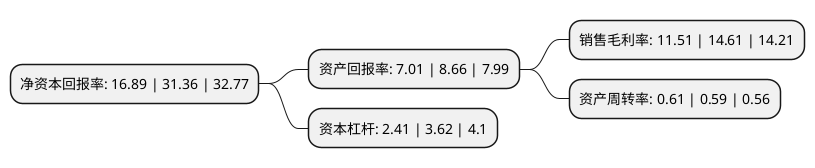

> 本页面由自动化程序生成于 2022年5月20日 01:01
> 内容可能存在错误，如有bug请提交issue至：https://github.com/Eroleice/doc-pi/issues
{.is-warning}

# 上市公司基本情况

## 基本资料

唐山冀东水泥股份有限公司（以下简称“冀东水泥”）成立于1994年05月08日，唐山市。于1996年06月14日在深交所主板上市。

冀东水泥注册资本265,821.283万元，主要业务:硅酸盐水泥制造，销售。主要产品:“盾石”牌42。5R，32。5R低碱高品质硅酸盐水泥。以下是详细信息：

- 公司名称: 唐山冀东水泥股份有限公司
- 股票代码: 000401.SZ
- 所在地: 河北 - 唐山市
- 成立日期: 1994年05月08日
- 注册资本: 265,821.283万元
- 法定代表人: 孔庆辉
- 主营业务: 硅酸盐水泥制造，销售主要产品:“盾石”牌425R，325R低碱高品质硅酸盐水泥
- 公司官网: www.jdsn.com.cn
- 公司介绍: 公司是一家综合型建材企业，集水泥、混凝土业务平台，集水泥、混凝土、砂石骨料、干混砂浆、外加剂、环保、耐火材料、物流、矿粉等为一体，形成上下游配套的完整建材产业链，布局京、津、冀、辽、吉、黑、蒙、陕、晋、鲁、豫、湘、渝等多个省。公司始终坚持以“绿色发展、循环发展、低碳发展”的理念为指导，以自主创新的知识产权为依托，全面促进集团水泥产业环保转型的步伐。公司为中国水泥行业的发展做出了突出贡献，被誉为“中国新型干法水泥工业的摇篮”和“中国水泥工业排头兵”，业务底子扎实、技术装备水平高、水泥专业人力资源丰富、产业布局广泛，拥有显著的比较优势。

## 股东及高管情况

上市公司第一大股东为北京金隅集团股份有限公司，持股1,178,645,057股，占比44.34%，为上市公司实际控制人。

截至2022年03月31日，上市公司的前十大股东中，共有3名自然人股东，5名机构股东，1个产品账户，1个海外主体，其中5%以上大股东共有2名。上市公司前十大股东明细如下：

> 截至2022年03月31日，上市公司前十大股东信息如下：

| 股东名称 | 持股数量（股） | 持股比例 |
| --- | --- | --- |
| 北京金隅集团股份有限公司 | 1,178,645,057 | 44.34% |
| 冀东发展集团有限责任公司 | 457,868,301 | 17.22% |
| 中建材投资有限公司 | 44,642,857 | 1.68% |
| 芜湖信达降杠杆投资管理合伙企业(有限合伙) | 44,642,857 | 1.68% |
| 北京国有资本运营管理有限公司 | 44,642,857 | 1.68% |
| 全国社保基金一零六组合 | 28,328,798 | 1.07% |
| 香港中央结算有限公司(陆股通) | 20,520,508 | 0.77% |
| 万忠波 | 19,314,985 | 0.73% |
| 许育金 | 17,314,493 | 0.65% |
| 董敏 | 16,480,000 | 0.62% |

## 利润表分析

上市公司2021年总收入为363.37亿元，净利润为41.81亿元，实现盈利。

## 杜邦分析

> 数据列示周期：2021年 | 2020年 | 2019年
{.is-info}

上市公司的净资产收益率在近一年有所下降，下降幅度为-46.14%，其变化情况分解如下：
- 上市公司的销售毛利率在近一年下降了-21.22%，可能是生产效率的下降、商品原材料价格上涨或商品价格的下跌所致。
- 上市公司的资产周转率在近一年上升了3.39%，可能是源自于更快的销售回款或库存管理效果提升。
- 上市公司的财务杠杆比率在近一年下降了-33.43%，可能是减少负债降低财务费用。

