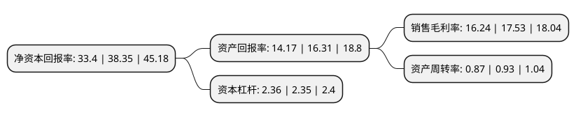

> 本页面由自动化程序生成于 2022年5月20日 01:03
> 内容可能存在错误，如有bug请提交issue至：https://github.com/Eroleice/doc-pi/issues
{.is-warning}

# 上市公司基本情况

## 基本资料

江西万年青水泥股份有限公司（以下简称“万年青”）成立于1997年09月05日，上饶市。于1997年09月23日在深交所主板上市。

万年青注册资本79,740.235万元，主要业务:硅酸盐水泥熟料及硅酸盐水泥的生产和销售。主要产品:水泥，熟料。以下是详细信息：

- 公司名称: 江西万年青水泥股份有限公司
- 股票代码: 000789.SZ
- 所在地: 江西 - 上饶市
- 成立日期: 1997年09月05日
- 注册资本: 79,740.235万元
- 法定代表人: 林榕
- 主营业务: 硅酸盐水泥熟料及硅酸盐水泥的生产和销售主要产品:水泥，熟料
- 公司官网: www.wnq.com.cn
- 公司介绍: 公司是全国最早采用国产新型干法水泥工艺线的厂家，主要从事硅酸盐水泥、商品混凝土以及新型墙材的生产和销售，技术力量雄厚，产品质量稳定，在华东地区拥有较高的品牌知名度和美誉度，产品广泛用于高楼、机场、桥梁、隧道、高等级公路等国家大型重点工程建设，公司生产的“万年青”牌系列硅酸盐水泥广泛用于机场、高楼、桥梁、隧道、高等级公路等国家大型重点工程建设中，在华东地区拥有较高的品牌知名度及客户认知度，受到了业主、工程设计和建造者的一直好评，荣获“全国建材行业先进集体”，“全国建材行业用户满意产品”、“江西名牌产品”等荣誉称号。

## 股东及高管情况

上市公司第一大股东为江西水泥有限责任公司，持股339,553,321股，占比42.58%，为上市公司实际控制人。

截至2022年03月31日，上市公司的前十大股东中，共有3名自然人股东，3名机构股东，3个产品账户，1个海外主体，其中5%以上大股东共有1名。上市公司前十大股东明细如下：

> 截至2022年03月31日，上市公司前十大股东信息如下：

| 股东名称 | 持股数量（股） | 持股比例 |
| --- | --- | --- |
| 江西水泥有限责任公司 | 339,553,321 | 42.58% |
| 中建材投资有限公司 | 39,000,000 | 4.89% |
| 香港中央结算有限公司(陆股通) | 10,601,773 | 1.33% |
| 中国工商银行股份有限公司-富国中证红利指数增强型证券投资基金 | 4,686,360 | 0.59% |
| 胡倩倩 | 4,255,000 | 0.53% |
| 国寿安保基金-中国人寿保险股份有限公司-万能险-国寿股份委托国寿安保红利增长股票组合单一资产管理计划 | 4,111,718 | 0.52% |
| 卢德俊 | 3,390,430 | 0.43% |
| 扬州东方集团有限公司 | 2,927,900 | 0.37% |
| 韩志国 | 2,811,900 | 0.35% |
| 中国建设银行股份有限公司-大成中证红利指数证券投资基金 | 2,494,400 | 0.31% |

## 利润表分析

上市公司2021年总收入为142.04亿元，净利润为23.07亿元，实现盈利。

## 杜邦分析

> 数据列示周期：2021年 | 2020年 | 2019年
{.is-info}

上市公司的净资产收益率在近一年有所下降，下降幅度为-12.91%，其变化情况分解如下：
- 上市公司的销售毛利率在近一年下降了-7.36%，可能是生产效率的下降、商品原材料价格上涨或商品价格的下跌所致。
- 上市公司的资产周转率在近一年下降了-6.45%，可能是源自于更慢的销售回款或库存管理效果下降。
- 上市公司的财务杠杆比率在近一年上升了0.43%，可能是增加负债扩大生产规模。

