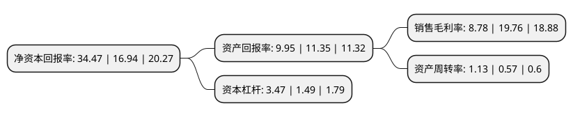

> 本页面由自动化程序生成于 2022年5月20日 01:04
> 内容可能存在错误，如有bug请提交issue至：https://github.com/Eroleice/doc-pi/issues
{.is-warning}

# 上市公司基本情况

## 基本资料

新疆天山水泥股份有限公司（以下简称“天山股份”）成立于1998年11月18日，乌鲁木齐市。于1999年01月07日在深交所主板上市。

天山股份注册资本866,342.281万元，主要产品:水泥，商品混凝土。以下是详细信息：

- 公司名称: 新疆天山水泥股份有限公司
- 股票代码: 000877.SZ
- 所在地: 新疆 - 乌鲁木齐市
- 成立日期: 1998年11月18日
- 注册资本: 866,342.281万元
- 法定代表人: 肖家祥
- 主营业务: 主要产品:水泥，商品混凝土
- 公司官网: www.sinoma-tianshan.cn
- 公司介绍: 公司是1998年在原新疆水泥厂的基础上改制设立,1999年在深圳证券交易所上市的股份制企业,隶属于国务院国资委所属大型企业-中国建材集团有限公司。公司主营业务为水泥、熟料、商品混凝土的生产及销售,已发展成为以水泥、商混为主体,积极实施循环经济的跨地区企业集团。公司拥有国家级企业技术中心和博士后工作站,先后研制开发了多个系列多个水泥品种,是国内拥有水泥品种最多的企业之一。公司拥有代表世界水泥工艺先进水平的窑外分解工艺线,公司通过了国家建材质量体系认证中心ISO9002质量体系认证,是取得产品质量和质量体系双认证的水泥生产企业,公司生产油井水泥通过美国油井API花押字的认证。公司“天山”牌水泥、混凝土产品广泛用于工业、农业、水利、交通、民用和市政等各类建设工程,水泥制品以及各种预应力和自应力钢筋混凝土构件等。公司生产的各标号常规商品混凝土和高强度混凝土可满足普通建筑、高层建筑、公路、隧道、高架桥、地铁和地下矿井等工程项目的需求。公司秉承创新、绩效、和谐、责任的企业核心价值观,打造熟料、水泥和商品混凝土全产业链发展模式,致力于精细管理全面实施高质量发展,以高品质的产品和高质量的服务回报社会！

## 股东及高管情况

上市公司第一大股东为中国建材股份有限公司，持股7,322,283,976股，占比84.52%，为上市公司实际控制人。

截至2022年03月31日，上市公司的前十大股东中，共有10名机构股东，其中5%以上大股东共有1名。上市公司前十大股东明细如下：

> 截至2022年03月31日，上市公司前十大股东信息如下：

| 股东名称 | 持股数量（股） | 持股比例 |
| --- | --- | --- |
| 中国建材股份有限公司 | 7,322,283,976 | 84.52% |
| 交银金融资产投资有限公司 | 180,419,962 | 2.08% |
| 安徽海螺水泥股份有限公司 | 74,074,074 | 0.86% |
| 江西万年青水泥股份有限公司 | 48,091,895 | 0.56% |
| 农银金融资产投资有限公司 | 46,685,382 | 0.54% |
| 河北金隅鼎鑫水泥有限公司 | 37,037,037 | 0.43% |
| 浙江尖峰集团股份有限公司 | 36,068,921 | 0.42% |
| 北京华辰世纪投资有限公司 | 30,057,434 | 0.35% |
| 芜湖信达降杠杆投资管理合伙企业(有限合伙) | 29,629,629 | 0.34% |
| 浙江上峰建材有限公司 | 22,222,222 | 0.26% |

## 利润表分析

上市公司2021年总收入为1,699.78亿元，净利润为149.22亿元，实现盈利。

## 杜邦分析

> 数据列示周期：2021年 | 2020年 | 2019年
{.is-info}

上市公司的净资产收益率在近一年有所上升，上升幅度为103.48%，其变化情况分解如下：
- 上市公司的销售毛利率在近一年下降了-55.57%，可能是生产效率的下降、商品原材料价格上涨或商品价格的下跌所致。
- 上市公司的资产周转率在近一年上升了98.25%，可能是源自于更快的销售回款或库存管理效果提升。
- 上市公司的财务杠杆比率在近一年上升了132.89%，可能是增加负债扩大生产规模。

