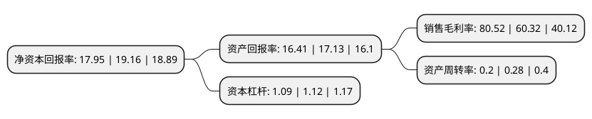

> 本页面由自动化程序生成于 2022年5月20日 01:04
> 内容可能存在错误，如有bug请提交issue至：https://github.com/Eroleice/doc-pi/issues
{.is-warning}

# 上市公司基本情况

## 基本资料

四川和谐双马股份有限公司（以下简称“四川双马”）成立于1998年10月20日，绵阳市。于1999年08月24日在深交所主板上市。

四川双马注册资本76,344.033万元，主要产品:水泥，电力。以下是详细信息：

- 公司名称: 四川和谐双马股份有限公司
- 股票代码: 000935.SZ
- 所在地: 四川 - 绵阳市
- 成立日期: 1998年10月20日
- 注册资本: 76,344.033万元
- 法定代表人: 谢建平
- 主营业务: 主要产品:水泥，电力
- 公司官网: www.sc-shuangma.com
- 公司介绍: 公司是一家综合性企业，主要经营水泥产品的生产与销售，同时涉及私募股权投资管理以及体育培训等业务。公司水泥年生产能力大，同时从事私募股权投资基金的管理业务，并积极致力于青少年足球后备人才的培养。公司秉承可持续发展理念，以绿色低碳为己任，将健康安全放在首位，坚持创造价值、保护环境、节约能源的战略方针。公司坚持合规经营的理念，除遵守相关法律、法规及行业标准外，更是在协同处置、控制气体排放、噪音治理以及矿山植被恢复等方面积极投入，力图在最大程度减少企业对环境的影响。公司先后荣获全国用户满意企业、全国质量管理先进单位、全国建材系统先进集体、全国520户重合同守信用先进单位、四川省最佳文明单位等荣誉称号。

## 股东及高管情况

上市公司第一大股东为北京和谐恒源科技有限公司，持股202,446,032股，占比26.52%，**疑似为**上市公司实际控制人。

截至2022年03月31日，上市公司的前十大股东中，共有1名自然人股东，2名机构股东，5个产品账户，2个海外主体，其中5%以上大股东共有3名。上市公司前十大股东明细如下：

> 未能通过持股比例判定出上市公司实际控制人（持股30%以上）
> 可能存在通过间接持股、联合持股、协议控制等方式拥有实际控制权的主体，具体请参考上市公司定期公告！
{.is-warning}

> 截至2022年03月31日，上市公司前十大股东信息如下：

| 股东名称 | 持股数量（股） | 持股比例 |
| --- | --- | --- |
| 北京和谐恒源科技有限公司 | 202,446,032 | 26.52% |
| 天津赛克环企业管理中心(有限合伙) | 190,877,024 | 25% |
| LAFARGE CHINA OFFSHORE HOLDING COMPANY (LCOHC) LTD. | 133,952,761 | 17.55% |
| 兴业银行股份有限公司-南方金融主题灵活配置混合型证券投资基金 | 6,198,041 | 0.81% |
| 基本养老保险基金一零零三组合 | 6,123,307 | 0.8% |
| 香港中央结算有限公司(陆股通) | 5,627,887 | 0.74% |
| 中国银行股份有限公司-嘉实金融精选股票型发起式证券投资基金 | 4,230,119 | 0.55% |
| 中国工商银行股份有限公司-广发多因子灵活配置混合型证券投资基金 | 4,195,587 | 0.55% |
| 胡燕英 | 3,596,800 | 0.47% |
| 嘉实基业长青股票型养老金产品-中国工商银行股份有限公司 | 3,292,141 | 0.43% |

## 利润表分析

上市公司2021年总收入为12.23亿元，净利润为9.85亿元，实现盈利。

## 杜邦分析

> 数据列示周期：2021年 | 2020年 | 2019年
{.is-info}

上市公司的净资产收益率在近一年有所下降，下降幅度为-6.32%，其变化情况分解如下：
- 上市公司的销售毛利率在近一年上升了33.49%，可能是生产效率的提升、商品原材料价格下跌或商品价格的上涨所致。
- 上市公司的资产周转率在近一年下降了-28.57%，可能是源自于更慢的销售回款或库存管理效果下降。
- 上市公司的财务杠杆比率在近一年下降了-2.68%，可能是减少负债降低财务费用。

