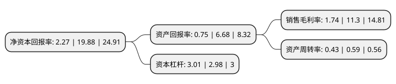

> 本页面由自动化程序生成于 2022年5月20日 01:25
> 内容可能存在错误，如有bug请提交issue至：https://github.com/Eroleice/doc-pi/issues
{.is-warning}

# 上市公司基本情况

## 基本资料

西藏天路股份有限公司（以下简称“西藏天路”）成立于1999年03月29日，拉萨市。于2001年01月16日在上交所主板上市。

西藏天路注册资本91,855.733万元，主营业务:公路工程施工的基础设施建设。以下是详细信息：

- 公司名称: 西藏天路股份有限公司
- 股票代码: 600326.SH
- 所在地: 西藏 - 拉萨市
- 成立日期: 1999年03月29日
- 注册资本: 91,855.733万元
- 法定代表人: 陈林
- 主营业务: 主营业务:公路工程施工的基础设施建设
- 公司官网: www.xztianlu.com
- 公司介绍: 公司是以基础设施建设为主业的上市公司，具有公路路面、桥梁工程专业承包一级资质，公路路基、公路工程总承包、市政公用工程施工总承包和房屋建筑工程施工总承包二级资质，铁路工程施工总承包三级资质。公司主营为公路工程施工的基础设施建设，主要承担西藏自治区内的公路、桥梁的建设任务。公司公路及桥梁施工能力、公路建设市场占有率、工程机械设备的先进程度及拥有量在西藏自治区内一直处于领先地位。公司先后荣膺全国“五一”劳动奖状、全国优秀施工企业、全国守合同重信用企业、全国“安康杯”竞赛优胜班组、自治区“十一五”重点建设项目工作突出贡献单位、“全区吸纳高校毕业生就业先进集体”等多项国家、自治区级荣誉称号。

## 股东及高管情况

上市公司第一大股东为西藏建工建材集团有限公司，持股196,200,592股，占比21.36%，**疑似为**上市公司实际控制人。

截至2022年03月31日，上市公司的前十大股东中，共有7名自然人股东，2名机构股东，1个海外主体，其中5%以上大股东共有1名。上市公司前十大股东明细如下：

> 未能通过持股比例判定出上市公司实际控制人（持股30%以上）
> 可能存在通过间接持股、联合持股、协议控制等方式拥有实际控制权的主体，具体请参考上市公司定期公告！
{.is-warning}

> 截至2022年03月31日，上市公司前十大股东信息如下：

| 股东名称 | 持股数量（股） | 持股比例 |
| --- | --- | --- |
| 西藏建工建材集团有限公司 | 196,200,592 | 21.36% |
| 西藏天海集团有限责任公司 | 44,726,675 | 4.87% |
| 杨三彩 | 42,460,080 | 4.62% |
| 傅扬 | 11,015,000 | 1.2% |
| 赵旭 | 8,041,943 | 0.88% |
| 陈冠生 | 5,987,719 | 0.65% |
| 香港中央结算有限公司(陆股通) | 4,134,590 | 0.45% |
| 郭俊君 | 3,624,429 | 0.39% |
| 潘玉秋 | 3,537,175 | 0.39% |
| 关文儒 | 3,098,200 | 0.34% |

## 利润表分析

上市公司2021年总收入为57.76亿元，净利润为1亿元，实现盈利。

## 杜邦分析

> 数据列示周期：2021年 | 2020年 | 2019年
{.is-info}

上市公司的净资产收益率在近一年有所下降，下降幅度为-88.58%，其变化情况分解如下：
- 上市公司的销售毛利率在近一年下降了-84.6%，可能是生产效率的下降、商品原材料价格上涨或商品价格的下跌所致。
- 上市公司的资产周转率在近一年下降了-27.12%，可能是源自于更慢的销售回款或库存管理效果下降。
- 上市公司的财务杠杆比率在近一年上升了1.01%，可能是增加负债扩大生产规模。

