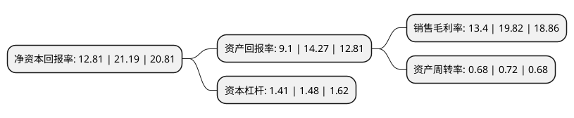

> 本页面由自动化程序生成于 2022年5月20日 01:28
> 内容可能存在错误，如有bug请提交issue至：https://github.com/Eroleice/doc-pi/issues
{.is-warning}

# 上市公司基本情况

## 基本资料

甘肃祁连山水泥集团股份有限公司（以下简称“祁连山”）成立于1996年07月17日，兰州市。于1996年07月16日在上交所主板上市。

祁连山注册资本77,629.028万元，主营业务:水泥生产，销售及商砼业务。主要产品:水泥，商品熟料，商品混凝土。以下是详细信息：

- 公司名称: 甘肃祁连山水泥集团股份有限公司
- 股票代码: 600720.SH
- 所在地: 甘肃 - 兰州市
- 成立日期: 1996年07月17日
- 注册资本: 77,629.028万元
- 法定代表人: 脱利成
- 主营业务: 主营业务:水泥生产，销售及商砼业务主要产品:水泥，商品熟料，商品混凝土
- 公司官网: www.qlssn.com
- 公司介绍: 公司中国建材集团旗下企业，国家支持的12户重点水泥企业之一，西北地区特种水泥生产基地。经过多年的发展，公司构建了以水泥系列产品为主，发展商品混凝土和骨料，延伸上下游的产业链格局，实现了由单一生产向生产经营、兼并重组和资本运营综合一体化的转变。公司先后荣获“五一劳动奖状”“全国文明单位”“全国建材百强企业”“中国企业信息化500强”“水泥行业信息化和工业化融合示范企业”“甘肃省优秀企业”等荣誉称号，公司系列产品多次被认定为“国家免检产品”“甘肃名牌产品”，“祁连山”商标荣获“中国驰名商标”，并入选“中国水泥十大品牌”。

## 股东及高管情况

上市公司第一大股东为中国建材股份有限公司，持股115,872,822股，占比14.93%，**疑似为**上市公司实际控制人。

截至2022年04月22日，上市公司的前十大股东中，共有4名自然人股东，1名机构股东，4个产品账户，1个海外主体，其中5%以上大股东共有1名。上市公司前十大股东明细如下：

> 未能通过持股比例判定出上市公司实际控制人（持股30%以上）
> 可能存在通过间接持股、联合持股、协议控制等方式拥有实际控制权的主体，具体请参考上市公司定期公告！
{.is-warning}

> 截至2022年04月22日，上市公司前十大股东信息如下：

| 股东名称 | 持股数量（股） | 持股比例 |
| --- | --- | --- |
| 中国建材股份有限公司 | 115,872,822 | 14.93% |
| 王勇 | 15,111,478 | 1.95% |
| 中国建设银行股份有限公司-浙商丰利增强债券型证券投资基金 | 10,000,000 | 1.29% |
| 香港中央结算有限公司(陆股通) | 6,465,981 | 0.83% |
| 国寿安保基金-中国人寿保险股份有限公司-万能险-国寿股份委托国寿安保红利增长股票组合单一资产管理计划 | 4,322,526 | 0.56% |
| 国寿安保基金-中国人寿保险股份有限公司-万能险-国寿股份委托国寿安保红利增长股票组合单一资产管理计划 | 4,322,526 | 0.56% |
| 张子文 | 3,406,163 | 0.44% |
| 张子文 | 3,406,163 | 0.44% |
| 张琪 | 3,148,216 | 0.41% |
| 中国农业银行股份有限公司-浙商聚潮产业成长混合型证券投资基金 | 3,000,000 | 0.39% |

## 利润表分析

上市公司2021年总收入为76.72亿元，净利润为10.27亿元，实现盈利。

## 杜邦分析

> 数据列示周期：2021年 | 2020年 | 2019年
{.is-info}

上市公司的净资产收益率在近一年有所下降，下降幅度为-39.55%，其变化情况分解如下：
- 上市公司的销售毛利率在近一年下降了-32.39%，可能是生产效率的下降、商品原材料价格上涨或商品价格的下跌所致。
- 上市公司的资产周转率在近一年下降了-5.56%，可能是源自于更慢的销售回款或库存管理效果下降。
- 上市公司的财务杠杆比率在近一年下降了-4.73%，可能是减少负债降低财务费用。

