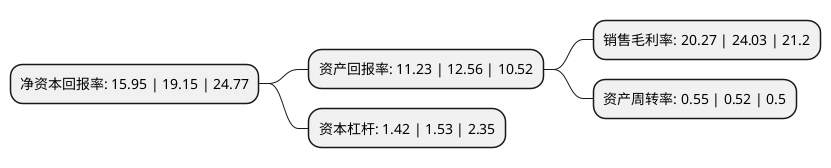

> 本页面由自动化程序生成于 2022年5月20日 01:28
> 内容可能存在错误，如有bug请提交issue至：https://github.com/Eroleice/doc-pi/issues
{.is-warning}

# 上市公司基本情况

## 基本资料

宁波富达股份有限公司（以下简称“宁波富达”）成立于1993年03月22日，宁波市。于1996年07月16日在上交所主板上市。

宁波富达注册资本144,524.107万元，吸尘器，小家电，水泥，自来水。以下是详细信息：

- 公司名称: 宁波富达股份有限公司
- 股票代码: 600724.SH
- 所在地: 浙江 - 宁波市
- 成立日期: 1993年03月22日
- 注册资本: 144,524.107万元
- 法定代表人: 钟建波
- 主营业务: 吸尘器，小家电，水泥，自来水
- 公司官网: www.fuda.com
- 公司介绍: 公司是一家以城市商业地产运营管理和住宅开发为主业、兼营新型建材的国有控股上市公司。公司立足宁波，以多元化地产开发、专业化商业经营为产业主导，以新型建材生产和新兴产业投资为产业补充，致力于成为管理科学、业绩卓越、具备核心竞争能力和持续发展动力的优秀上市公司。2018年，公司将原有房地产相关的资产全部出售，保留盈利能力较强的水泥业务以及具有发展潜力的商业地产租赁业务，有利于公司更好的发展现有业务、拓展新的业务领域。

## 股东及高管情况

上市公司第一大股东为宁波城建投资控股有限公司，持股1,112,148,455股，占比76.95%，为上市公司实际控制人。

截至2022年03月31日，上市公司的前十大股东中，共有8名自然人股东，1名机构股东，1名其他股东，其中5%以上大股东共有1名。上市公司前十大股东明细如下：

> 截至2022年03月31日，上市公司前十大股东信息如下：

| 股东名称 | 持股数量（股） | 持股比例 |
| --- | --- | --- |
| 宁波城建投资控股有限公司 | 1,112,148,455 | 76.95% |
| 宁波市银河综合服务管理中心 | 20,103,747 | 1.39% |
| 王成 | 6,028,008 | 0.42% |
| 王跃旦 | 5,871,169 | 0.41% |
| 陈胤铭 | 4,828,700 | 0.33% |
| 方水旺 | 4,006,681 | 0.28% |
| 张志汉 | 3,394,030 | 0.23% |
| 李春华 | 3,236,100 | 0.22% |
| 王建飞 | 2,951,102 | 0.2% |
| 吴慧瑜 | 2,668,600 | 0.18% |

## 利润表分析

上市公司2021年总收入为23.4亿元，净利润为4.74亿元，实现盈利。

## 杜邦分析

> 数据列示周期：2021年 | 2020年 | 2019年
{.is-info}

上市公司的净资产收益率在近一年有所下降，下降幅度为-16.71%，其变化情况分解如下：
- 上市公司的销售毛利率在近一年下降了-15.65%，可能是生产效率的下降、商品原材料价格上涨或商品价格的下跌所致。
- 上市公司的资产周转率在近一年上升了5.77%，可能是源自于更快的销售回款或库存管理效果提升。
- 上市公司的财务杠杆比率在近一年下降了-7.19%，可能是减少负债降低财务费用。

