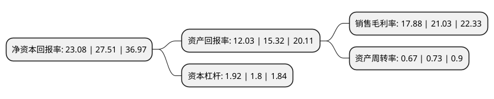

> 本页面由自动化程序生成于 2022年5月20日 01:29
> 内容可能存在错误，如有bug请提交issue至：https://github.com/Eroleice/doc-pi/issues
{.is-warning}

# 上市公司基本情况

## 基本资料

华新水泥股份有限公司（以下简称“华新水泥”）成立于1993年11月30日，黄石市。于1994年01月03日在上交所主板上市。

华新水泥注册资本209,659.986万元，主营业务;水泥及其制品生产，销售。以下是详细信息：

- 公司名称: 华新水泥股份有限公司
- 股票代码: 600801.SH
- 所在地: 湖北 - 黄石市
- 成立日期: 1993年11月30日
- 注册资本: 209,659.986万元
- 法定代表人: 李叶青
- 主营业务: 主营业务;水泥及其制品生产，销售
- 公司官网: www.huaxincem.com
- 公司介绍: 公司始创于1907年，被誉为中国水泥工业的摇篮。近年来，公司在水泥行业率先推动并开展可替代原、燃料的研发与应用，形成具有国际先进水平的水泥窑协同处置废物技术和环保解决方案，成功实现从传统水泥生产企业向绿色环保企业的转型。企业也从一家单纯从事水泥生产的企业发展成为集水泥、混凝土、骨料、环保处置、装备制造及EPC工程、高新建材等业务的全球化建材集团，在全国十余个省市及海外拥有150余家分子公司，名列中国制造业500强和财富中国500强，规模稳居国内同业前列。公司是国内水泥行业中率先通过GB/T19001—ISO9001质量体系认证的企业，企业资信为“AAA”级，“华新堡垒”牌水泥产品荣获国家著名商标证书。

## 股东及高管情况

上市公司第一大股东为香港中央结算(代理人)有限公司，持股734,720,000股，占比35.04%，为上市公司实际控制人。

截至2022年03月31日，上市公司的前十大股东中，共有2名自然人股东，2名机构股东，3个产品账户，3个海外主体，其中5%以上大股东共有3名。上市公司前十大股东明细如下：

> 截至2022年03月31日，上市公司前十大股东信息如下：

| 股东名称 | 持股数量（股） | 持股比例 |
| --- | --- | --- |
| 香港中央结算(代理人)有限公司 | 734,720,000 | 35.04% |
| HOLCHIN   B.V. | 451,333,201 | 21.53% |
| 华新集团有限公司 | 338,060,739 | 16.12% |
| 香港中央结算有限公司(陆股通) | 62,104,186 | 2.96% |
| 华新水泥股份有限公司-2020-2022年核心员工持股计划 | 21,039,361 | 1% |
| 中国铁路武汉局集团有限公司 | 11,289,600 | 0.54% |
| 代德明 | 8,850,000 | 0.42% |
| 全国社保基金四一三组合 | 8,310,000 | 0.4% |
| 黄建军 | 7,213,571 | 0.34% |
| 中国工商银行股份有限公司-华安媒体互联网混合型证券投资基金 | 6,417,272 | 0.31% |

## 利润表分析

上市公司2021年总收入为324.64亿元，净利润为58.04亿元，实现盈利。

## 杜邦分析

> 数据列示周期：2021年 | 2020年 | 2019年
{.is-info}

上市公司的净资产收益率在近一年有所下降，下降幅度为-16.1%，其变化情况分解如下：
- 上市公司的销售毛利率在近一年下降了-14.98%，可能是生产效率的下降、商品原材料价格上涨或商品价格的下跌所致。
- 上市公司的资产周转率在近一年下降了-8.22%，可能是源自于更慢的销售回款或库存管理效果下降。
- 上市公司的财务杠杆比率在近一年上升了6.67%，可能是增加负债扩大生产规模。

