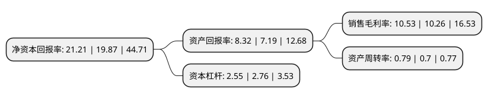

> 本页面由自动化程序生成于 2022年5月20日 01:29
> 内容可能存在错误，如有bug请提交issue至：https://github.com/Eroleice/doc-pi/issues
{.is-warning}

# 上市公司基本情况

## 基本资料

福建水泥股份有限公司（以下简称“福建水泥”）成立于1993年11月27日，福州市。于1994年01月03日在上交所主板上市。

福建水泥注册资本45,824.84万元，主要产品:水泥，商品熟料以下是详细信息：

- 公司名称: 福建水泥股份有限公司
- 股票代码: 600802.SH
- 所在地: 福建 - 福州市
- 成立日期: 1993年11月27日
- 注册资本: 45,824.84万元
- 法定代表人: 王金星
- 主营业务: 主要产品:水泥，商品熟料
- 公司官网: www.fjcement.com
- 公司介绍: 公司是国有控股大型水泥生产企业，福建省首批规范上市的5家上市公司之一，为福建省最大的水泥生产企业，被国家发改委确定为全国60家重点扶持水泥企业之一，主营水泥、商品熟料。公司坚持质量领先的品牌战略，以“客户满意是我们质量的标准”为第一核心价值观。公司按照ISO9001、ISO14001、OHSAS18001和ISO10012等国际标准建立一体化管理体系，获得产品、质量、环境、职业健康安全和计量的五项认证，在体系的建设及认证上均走在全国同行的前列。公司主导产品“建福牌”、“炼石牌”普通硅酸盐水泥为国家首批免检产品。公司的产品先后运用于水口水电站、长乐国际机场、厦门机场、青州大桥、厦门大桥、安砂水电站、五里亭立交桥、高速公路等众多标志性建筑及重点工程项目中。

## 股东及高管情况

上市公司第一大股东为福建省建材(控股)有限责任公司，持股131,895,707股，占比28.78%，**疑似为**上市公司实际控制人。

截至2022年03月31日，上市公司的前十大股东中，共有4名自然人股东，4名机构股东，1个产品账户，1个海外主体，其中5%以上大股东共有1名。上市公司前十大股东明细如下：

> 未能通过持股比例判定出上市公司实际控制人（持股30%以上）
> 可能存在通过间接持股、联合持股、协议控制等方式拥有实际控制权的主体，具体请参考上市公司定期公告！
{.is-warning}

> 截至2022年03月31日，上市公司前十大股东信息如下：

| 股东名称 | 持股数量（股） | 持股比例 |
| --- | --- | --- |
| 福建省建材(控股)有限责任公司 | 131,895,707 | 28.78% |
| 福建煤电股份有限公司 | 14,521,000 | 3.17% |
| 香港中央结算有限公司(陆股通) | 4,792,499 | 1.05% |
| 赵向军 | 2,472,280 | 0.54% |
| 赵静 | 2,436,589 | 0.53% |
| 柳迎春 | 1,965,020 | 0.43% |
| 中国国际金融香港资产管理有限公司-客户资金2 | 1,877,000 | 0.41% |
| 华泰证券股份有限公司 | 1,653,488 | 0.36% |
| 朱巍晨 | 1,627,800 | 0.36% |
| 上海瓦洛兰投资管理有限公司-上海瓦洛兰未来之星甲午私募证券投资基金 | 1,600,000 | 0.35% |

## 利润表分析

上市公司2021年总收入为36.16亿元，净利润为3.8亿元，实现盈利。

## 杜邦分析

> 数据列示周期：2021年 | 2020年 | 2019年
{.is-info}

上市公司的净资产收益率在近一年有所上升，上升幅度为6.74%，其变化情况分解如下：
- 上市公司的销售毛利率在近一年上升了2.63%，可能是生产效率的提升、商品原材料价格下跌或商品价格的上涨所致。
- 上市公司的资产周转率在近一年上升了12.86%，可能是源自于更快的销售回款或库存管理效果提升。
- 上市公司的财务杠杆比率在近一年下降了-7.61%，可能是减少负债降低财务费用。

