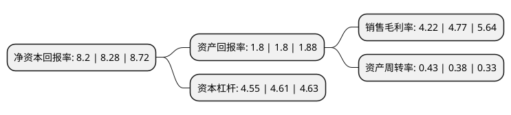

> 本页面由自动化程序生成于 2022年5月20日 01:32
> 内容可能存在错误，如有bug请提交issue至：https://github.com/Eroleice/doc-pi/issues
{.is-warning}

# 上市公司基本情况

## 基本资料

北京金隅集团股份有限公司（以下简称“金隅集团”）成立于2005年12月22日，北京市。于2011年03月01日在上交所主板上市。

金隅集团注册资本1,067,777.113万元，主营业务包括水泥，新型建筑材料，房地产开发和物业投资及管理。以下是详细信息：

- 公司名称: 北京金隅集团股份有限公司
- 股票代码: 601992.SH
- 所在地: 北京 - 北京市
- 成立日期: 2005年12月22日
- 注册资本: 1,067,777.113万元
- 法定代表人: 曾劲
- 主营业务: 主营业务包括水泥，新型建筑材料，房地产开发和物业投资及管理
- 公司官网: www.bbmg.com.cn/listco
- 公司介绍: 公司是全国最大的建筑材料生产企业之一，是北京地区领先的房地产开发企业。公司的经营范围是建材制造、房地产开发和不动产经营产业，主要产品是高标号水泥、家具、矿棉吸声板、加气混凝土、耐火材料、房地产开发经营、物业管理、销售自产产品等。公司持有及与独立第三方共同拥有多项先进技术的专利权，并已起草或审阅超过多项建筑材料业界的国家及行业标准。公司的“金隅”牌水泥被认定为中国驰名商标、中国名牌产品和北京名牌产品，公司连续多年获得“中国房地产百强企业”称号。

## 股东及高管情况

上市公司第一大股东为北京国有资本运营管理有限公司，持股4,797,357,572股，占比44.93%，为上市公司实际控制人。

截至2022年03月31日，上市公司的前十大股东中，共有1名自然人股东，4名机构股东，3个产品账户，2个海外主体，其中5%以上大股东共有2名。上市公司前十大股东明细如下：

> 截至2022年03月31日，上市公司前十大股东信息如下：

| 股东名称 | 持股数量（股） | 持股比例 |
| --- | --- | --- |
| 北京国有资本运营管理有限公司 | 4,797,357,572 | 44.93% |
| 香港中央结算(代理人)有限公司 | 2,338,764,870 | 21.9% |
| 中建材投资有限公司 | 402,940,000 | 3.77% |
| 中国证券金融股份有限公司 | 320,798,573 | 3% |
| 香港中央结算有限公司(陆股通) | 125,677,011 | 1.18% |
| 润丰投资集团有限公司 | 75,140,000 | 0.7% |
| 王健 | 63,936,100 | 0.6% |
| 国信证券-中建材投资有限公司-国信证券鼎信掘金2号单一资产管理计划 | 57,000,000 | 0.53% |
| 北京京国发股权投资基金(有限合伙) | 43,115,900 | 0.4% |
| 中欧基金-农业银行-中欧中证金融资产管理计划 | 27,123,562 | 0.25% |

## 利润表分析

上市公司2021年总收入为1,236.34亿元，净利润为52.12亿元，实现盈利。

## 杜邦分析

> 数据列示周期：2021年 | 2020年 | 2019年
{.is-info}

上市公司的净资产收益率在近一年有所下降，下降幅度为-0.97%，其变化情况分解如下：
- 上市公司的销售毛利率在近一年下降了-11.53%，可能是生产效率的下降、商品原材料价格上涨或商品价格的下跌所致。
- 上市公司的资产周转率在近一年上升了13.16%，可能是源自于更快的销售回款或库存管理效果提升。
- 上市公司的财务杠杆比率在近一年下降了-1.3%，可能是减少负债降低财务费用。

